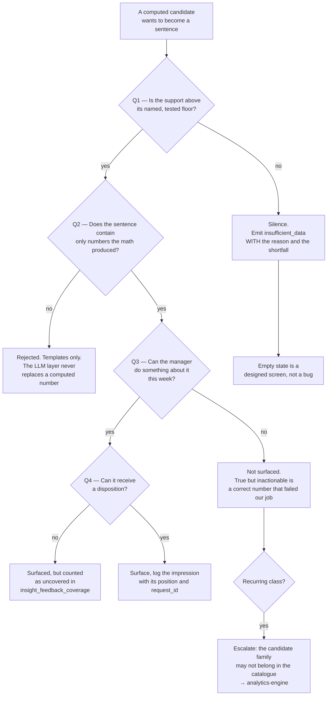

# Insight & Narrative Generation — Directive

How *this* team decides. The shape is a **speech gate**: the default is silence, and each
test is a reason to break it. That inversion is deliberate — a team whose default is to
speak will always find a reason to.

## Decision rights

| Decision | Held by | Notes |
|---|---|---|
| Whether an insight is surfaced at all | This team | Correctness is AB-1's; worth-saying is ours |
| Ranking and scoring weights | This team, **against mechanism, not against a rate** | [[insight-narrative-generation-premortem]] M5 |
| Sentence wording and templates | This team | Templates only. Every number traces to the math (`insight-verbalizer.ts:1-11`) |
| The empty state | This team | `insufficient_data` is a designed screen we ship, not an outage |
| Enabling the consultant layer for a restaurant | This team, **with a named human and an expiry** | A demo is not a reason |
| Whether a support floor may be lowered | **Not unilaterally.** Requires a changed spec case | Constant owned by [[analytics-engine-directive]] rule 5 |
| Whether the arithmetic behind a sentence is right | **Not ours** — [[analytics-engine-charter]] | We decline to publish; we do not fix |
| Whether a published sentence is *true as a claim* | **Not ours** — [[metric-contract-truth-assurance-charter]] | AB-3 audits our sentences and can call one false |

## Standing rules

1. **Silence is the default.** A candidate that clears no floor produces
   `insufficient_data` with its shortfall stated ("3 of 7 weeks"), never a softened
   sentence. Precedent: `insight-verbalizer.ts` already returns `null`
   (`insight-catalog.spec.ts:94-101`); we ship the screen that renders it.

2. **Every number in a sentence came from the math.** The consultant layer adds
   *interpretation*, never *quantities* — `consultants.service.ts:14-15`, *"the prompt
   forbids inventing numbers"*, and the evidence pack is marked *"authoritative; do not
   contradict"* (`:130+`). Weakening either is a decision, not a prompt tweak.

3. **A rate is never published without its denominator.** Today the honest form is:
   *acceptance over **8 recommendation rules**; **573 insight types** have no disposition
   path* (`analytics_insights`, baseline `:2194-2209`, has no disposition column).

4. **A scoring change is justified by a mechanism, never by a rate movement.** At 11
   restaurants, a week-over-week acceptance change is noise
   (`AGENT_NATIVE_UI_DECISION.md:190-192`, `:332-337`). Acceptable justification: *"this
   rule fired on 3 data points and should not have."* Unacceptable: *"acceptance went up
   4%."*

5. **Consultant enablement expires.** Named owner + expiry, reviewed weekly. Unowned rows
   revert to OFF, which is the code's own default (`consultants.service.ts:18`), so
   reverting needs no approval.

6. **We do not demo the consultant layer while OD-20 stands.** The toggle
   (`analytics.controller.ts:516`) and the Opus call (`:531`) are unguarded.
   [[security-charter]] owns the fix; refusing the demo is the pressure this team can apply.

7. **Coverage travels with acceptance.** Distinct rules served vs distinct rules acted on,
   and `top_rank_ignore_rate`, are published in the same table as the acceptance rate —
   the counter-pressure to a feed narrowing onto three reflexively-clicked rules
   ([[insight-narrative-generation-premortem]] M4).

## Escalation trigger

- **A candidate family repeatedly clears the floors but is never actionable** → escalate to
  [[analytics-engine-charter]]: the family may not belong in the catalogue. Silence here
  turns into 573 types nobody uses.
- **A support floor is contested** → `OPEN-DECISIONS.md`. Lowering a floor changes what the
  product asserts about a customer's business; that is not an engineering preference.
- **A consultant claim is found to contradict its evidence pack** → immediate escalation to
  [[metric-contract-truth-assurance-charter]] as a claim retraction, and the layer reverts
  to OFF for that restaurant pending review. Not a bug ticket.
- **F-3** — the operator has no `subject_type` in the neural footprint
  (`intelligence.md:519`), so this team's primary signal has nowhere to live. Not
  resolvable in-team; interacts with OD-11.
- **OD-20** — escalated every close-time until closed, with the consultant demo refusal
  restated each time so the cost of the open decision stays visible.
