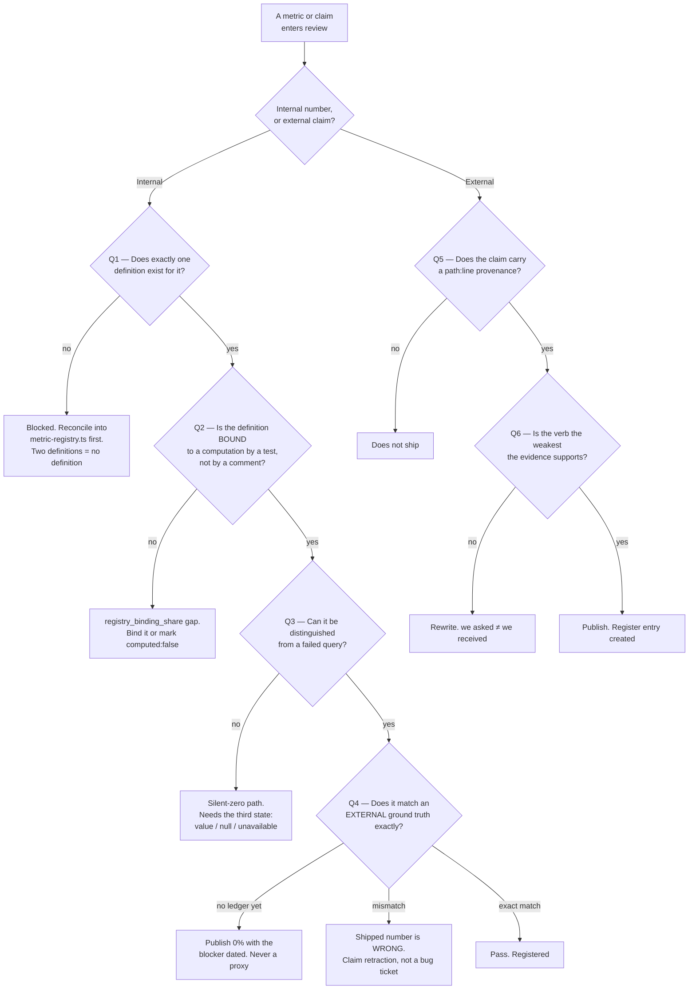

# Metric Contract & Truth Assurance — Directive

How *this* team decides. The shape is a **two-track gate**: one track for numbers moving
*inside* the product, one for claims moving *outside* it. They are separate because they
fail differently — an internal number fails silently, an external claim fails publicly and
permanently.

## Decision rights

| Decision | Held by | Notes |
|---|---|---|
| What a metric **means** — the single definition | This team | Two definitions is the failure state, not a disagreement to be balanced |
| Whether a shipped number is wrong | This team, **against both siblings** | The independence that justifies the team ([[ORG_STRUCTURE]] §3, applied in-line) |
| Whether an external analytics claim may be published | This team, **veto** | Against Marketing, Sales, and the founder ([[analytics-bi-directive]]) |
| How a divergence is closed | This team | Structurally, or not at all — rule 2 below |
| Whether `computed: true` may be set on a registry entry | This team, **derived from a binding** | Never hand-set |
| Whether the arithmetic is right | **Not ours** — [[analytics-engine-charter]] | We say it disagrees with the ledger; they find out why |
| Whether the insight is useful | **Not ours** — [[insight-narrative-generation-charter]] | Perfectly defined and worthless is their problem |
| Grading nondeterministic model output | **Not ours** — [[agent-evaluation-gates-charter]] | *"They share vocabulary, not work"* (`intelligence.md:464`) |

## Standing rules

1. **Exact equality. There is no threshold.** Our pass condition is that the shipped number
   equals the ledger. Approximate agreement is RM-2's technique for a different class of
   problem (`intelligence.md:460-464`), and borrowing it here would be
   [[metric-contract-truth-assurance-premortem]] M1 arriving through the front door.

2. **A divergence closes as a runtime derivation or a CI assertion — never as an edit.**
   Editing a markdown file, a `.tsx` string, or an OpenAPI description "fixes" a symptom
   whose cause is untouched. Standing example: `insight-catalog.spec.ts:9-10` asserts
   `>= 200`, and `GET /analytics/insight-catalog` already returns `totalCandidateTypes`
   derived at runtime (`insight-generator.service.ts:41-45`). The count on
   `apps/web/src/pages/InsightCatalog.tsx:2` should come from that endpoint, and the spec
   should pin the exact number.

3. **Nothing in our suite may import the code it grades.** A check whose expected value is
   produced inside `apps/api-gateway/src/analytics/` is a determinism test wearing a truth
   suite's name. Hand-computed fixtures are the interim ground truth until §44.7 ships;
   they are never *called* §44.10.

4. **The 0% is published, monthly, unchanged, with its blocker dated.** It may not be
   substituted with a proxy, a self-consistency percentage, or a "coverage" number. Three
   consecutive unchanged restatements escalate to the founder
   ([[decision-office-charter]]).

5. **Every registry key is bound to a computation by a test.** `engineFns` becomes an
   import that fails to compile when a function is renamed, not a documentation string.
   `analytics.registry_binding_share` is **0%** today across 33 keys, all of which declare
   `computed: true`.

6. **A metric must be distinguishable from a failed query.** Every computed metric carries
   `value | null | unavailable`; `unavailable` renders as `insufficient_data`. Eight
   `allSettled` sites across 5 files currently collapse failure into empty
   ([[metric-contract-truth-assurance-premortem]] M4).

7. **Weakest defensible verb.** `YC_WEDGE_PLAN.md:31-33` — *"dollars recovered"* means **we
   asked** until a credit memo (812) is modelled. Register entry #1. The same test applies
   to *saved*, *found*, *prevented*, and *improved*.

8. **A wrong shipped number is a claim retraction, not a bug fix.** It generates a decision
   record, because *how it got published* matters more than the patch. Precedent:
   `analytics.service.ts:57-66` — every inventory metric silently reported 0/null for every
   restaurant, and it was found by reading code, not by a test.

## Escalation trigger

- **§44.7 SimPOS has not shipped** → monthly, dated, to [[decision-office-charter]]. Three
  consecutive restatements make it a founder decision:
  `analytics.kpi_ground_truth_agreement` is either scheduled to become measurable, or it is
  permanently 0% and the board says so.
- **A sibling disputes a definition** → we decide. If they dispute our *right* to decide,
  that is a department-level escalation, and it is the argument the team exists to have.
- **An external claim is published without a register entry** → `OPEN-DECISIONS.md`, not a
  correction email. The process failed, and the process is the deliverable.
- **INTEL-F6 (new)** — which insight-type count is canonical, and what assertion pins it? The
  answer must be a test. **INTEL-F7 (new)** — is `ANALYTICS_FEATURE_CATALOG.md` a plan or a
  contract? `metric-registry.ts:53` binds metrics to its `catalogIds` while the file itself
  carries an untiered 100-feature batch and a `"status": "planned"` export. It cannot be
  both.
