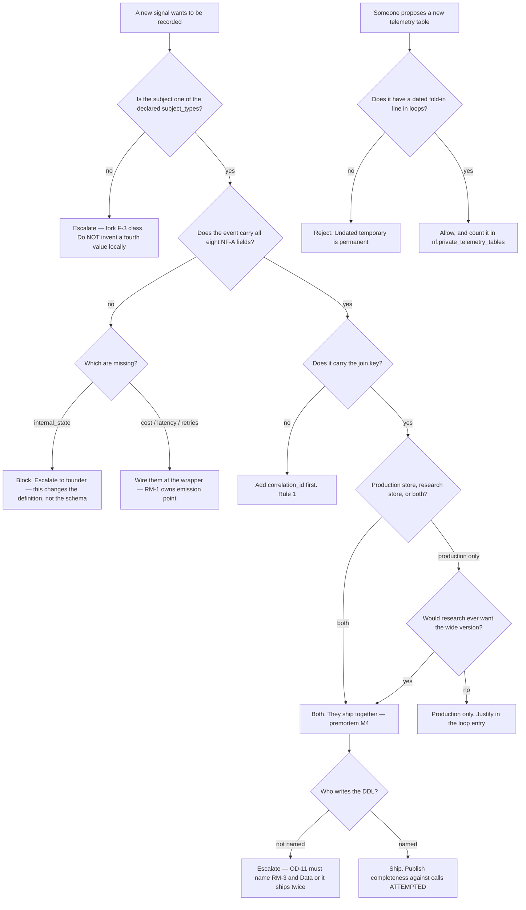

# Neural Footprint Instrumentation (RM-3) — Directive

Inherits the department's three rules ([[research-math-directive]]). This team's own shape
is a **contract gate**: the questions it answers are all versions of *"does this event
still describe why a decision was made, and can it be joined to everything else?"*

## The three local rules

1. **Join key before schema.** A field that lets two rows be related ships ahead of the
   perfect column list. Two tables that can be joined are one footprint with a bad shape;
   two that cannot are two footprints
   ([[neural-footprint-instrumentation-premortem]] M1).
2. **Completeness is all-or-nothing across the eight NF-A fields.** Six of eight is not
   75%; it is an incomplete event. This exists to stop the cheap fields crowding out
   `internal_state`, which is the one that makes this a *neural footprint* rather than a
   billing log.
3. **Fail soft, count loudly.** Telemetry never crashes a pipeline
   (`spend_logger.py:83-86` is right). But a suppressed emission increments a counter
   emitted by a **different** path, and completeness is computed against **model calls
   attempted** — never against events written, which would make the metric its own
   denominator.

## Decision graph

## Decision rights

**Decides alone:**

- **The event contract** — fields, semantics, join keys, `subject_type` vocabulary,
  the shape of the research log.
- **What counts as a complete event.** Nobody outside this team may redefine completeness
  downward.
- **Rejecting an undated temporary telemetry table.** Temporary is fine; undated is not.
- **Declaring `nf_a.event_completeness` at 0%.** Publishing an honest zero is a decision
  this team makes and no one may overwrite with an estimate.
- **Declaring the NF-C entry trigger met** — once its wording is confirmed by the founder.

**Decides with a counterpart:**

| Decision | Counterpart | Form |
|---|---|---|
| Physical table, migration, indexes | [[data-charter]] | **OD-11 names both owners** — contract here, DDL there |
| Emission points and wrapper hooks | [[harness-model-routing-charter]] | They emit into our contract at the call boundary |
| Verdict field semantics | [[evaluation-doneability-charter]] | They define what a verdict means; we carry it |
| Subject attribution for unauthenticated calls | [[security-charter]] SEC-3 | We record "no authenticated subject" as a value, not as a null |
| Operator signal (`recommendation_actions`) | [[analytics-bi-charter]] AB-2 | Fork F-3 — decided in the OD-11 session |

**Cannot decide — escalates to the founder:**

- **OD-11** — production columns, index strategy, retention/rollup.
- **F-3** — `operator` as a fourth `subject_type`, or routed outside NF.
- **Making `internal_state` optional.** This changes the meaning of "neural footprint"
  ([[0006-neural-footprint-architecture]]), so it is not a schema decision.
- **Retention horizon on the research log.** Append-only forever is a storage cost and a
  privacy surface; the horizon is a founder number.
- **The NF-C entry trigger's wording.**

## Escalation trigger

Same day:

1. **A second table holding token counts appears.** Count is 1. This is the single most
   important watch this team has.
2. **An NF schema draft makes `internal_state` optional while `cost` is required.**
3. **An OD-11 output contains a production column list and no research-log shape.**
4. **The provider invoice diverges from the summed NF events for a period.**
5. **An analytics query joins `recommendation_actions` to NF through a hand-written
   mapping** — F-3 answering itself badly.
6. **A `subject_type` value is added anywhere but in the contract.**

## The standard this team holds

A row that records the choice and not the state is not a footprint. `api_spend` and
`decision_log` each fail that standard in opposite directions, and the team's whole job is
that they stop failing it separately. When a proposal arrives that would make the event
cheaper by dropping reasoning, the answer is not "no" — it is *"then it is a spend log,
and we already have one."*
