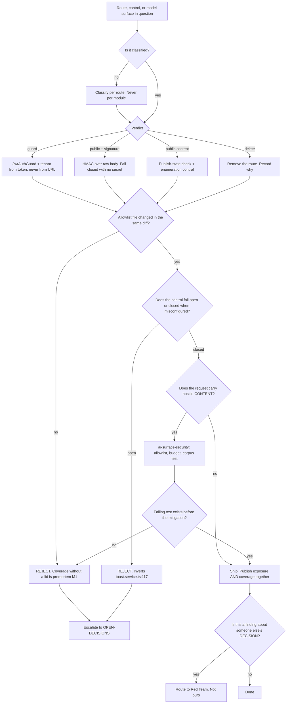

# Security — Directive

How *this* department decides. Shape differs per unit by design.

Security's decision graph is organised around one question no other department has to ask
first: **when this control is uncertain, which way does it fail?** Every other department
optimises an outcome; this one chooses a default for the unknown case. The repo already
contains both answers to that question — `toast.service.ts:112-121` fails closed with no
secret, `tenant.guard.ts:38-46` fails open with no user — so the graph splits on it, and
the split is the department's whole character.

## The four standing rules

**1 · Fail closed, or it is not a control.** A control that permits the request when its
own configuration is missing is a logging statement. This is not an aspiration — the repo
contains the correct shape (`toast.service.ts:112-121`, `pos-hub.service.ts:87-95`,
`dev-bypass.util.ts:46-52`) and the incorrect shape (`tenant.guard.ts:38-46`, and the
three `|| "your-secret-key-change-in-production"` fallbacks at `jwt.strategy.ts:12-13`,
`auth.service.ts:64-66`, `auth.module.ts:28-30`). Any new control matching the second
shape is rejected at team level, not debated at department level.

**2 · Classify per route, never per module.** A module label prescribes a control for
routes it has not looked at. It has already been wrong twice in this repo's own census —
`vendor-portal` was labelled "webhook, verify signatures" when it is public content
(now corrected), and `simpos` is *still* labelled a webhook module when it is an
unauthenticated simulator control surface whose `close` route makes our own server sign a
stock movement on an anonymous caller's behalf (`simpos.service.ts:489-520`). A per-module
verdict is not a small inaccuracy; it points the audit at the wrong control.

**3 · No coverage number without its exposure twin.** `routes carrying a guard` and
`routes reachable without authentication` are different numbers that diverge exactly when
`@Public()` becomes a workaround. They are published in the same table, always
([[security-agenda-board]]). Reporting one alone is [[security-premortem]] M2 happening.

**4 · Mitigation requires a failing test first.** Applies to the whole department but
bites hardest on [[ai-surface-security-directive]]: a prompt-injection defense with no
adversarial case that fails without it is a hypothesis with good intentions. The existing
tests illustrate the gap precisely — `inbound-responder.service.spec.ts:248-263` proves
that *given* `injection_suspected: true` the reply is skipped, and proves nothing about
whether the flag ever fires.

## Decision rights

| Level | Decides | Examples |
|---|---|---|
| **Team** | A route's classification verdict; which control implements it; corpus contents; anything reversible inside one charter | `GET /dashboard/health` → `public`; add an HMAC to a webhook; add 30 injection cases |
| **Department** | Any verdict that changes *which team's* control applies; the definition of any `sec.*` metric; anything crossing the SEC-1/SEC-2 charter line while they share a team | `simpos`; `vendor-portal`'s enumeration control; whether `@Public()` on a new module is legitimate |
| **Founder / OPEN-DECISIONS** | Deleting a shipped route; accepting a known exposure; the merged-vs-split team shape; anything that trades a security default for velocity | The nine `communications/test/e2e/*` routes; tokens in `localStorage`; F-4; OD-20 |

**The first-instance rule.** For any exception class, the **first** request escalates, not
the tenth. The first `@Public()` outside the known set, the first control that fails open
"just for now", the first mitigation shipped without a failing test. By the tenth the
exception is the convention and the escalation is an argument rather than a decision.
[[engineering-charter]]'s premortem reached the same rule independently for the same
decorator, which is corroboration.

**The classification-severity rule.** Classification and remediation are normally
sequential — classify all, then fix all. **A route whose classification reveals a live
exploitable path jumps the queue immediately** and is remediated before the sweep
continues. `/analytics/consult` is the worked instance: found during census, fixed in
seven lines, and it would have been wrong to leave it queued behind ninety-three others.
`simpos` is the open instance.

## Escalation trigger

Escalate to `OPEN-DECISIONS.md` when **any** of these holds:

1. A classification verdict cannot be reached within one close-time from
   [[security-loops]] — usually because the route's *intended* consumer is unknown.
2. A control must ship fail-open, for any reason, in any environment.
3. A remediation would break a live integration (a webhook behind a JWT is the canonical
   version of this, and it is why the two charters sit on one team).
4. An exposure is knowingly accepted rather than closed. Accepting is legitimate;
   accepting silently is not.
5. A `sec.*` metric is proposed for redefinition while its value is non-zero. Redefining a
   metric mid-campaign is how a number reaches zero without the exposure moving.
6. A finding concerns **personal data handling** rather than reachability — that is
   [[compliance-charter]]'s call, and we hand it over rather than ruling on it.

## What we hand to Red Team, and why

[[red-team-charter]] attacks *decisions* and runs premortems; it sits outside the line so
it can attack what this department builds ([[ORG_STRUCTURE]] §3). Advisory is
**findings-only** — it does not approve or block.

Concretely, we route to Red Team rather than answering ourselves:

- Any objection to a *decision* another unit made, as opposed to a control another unit
  shipped.
- The premortem review of our own classification: specifically, *"which of the 94 verdicts
  is most likely wrong, and what would we see first?"* We should not be the only reader of
  our own verdicts, and the `simpos` mislabel is the standing argument for why.
- Adversarial review of the injection corpus's **coverage** — the corpus is ours to build,
  and its blind spots are exactly what an independent attacker is for.

We do **not** hand over: building controls, classifying routes, or maintaining the corpus.
A department that hands those over has become a second advisory function, which is
[[security-premortem]] M5.
