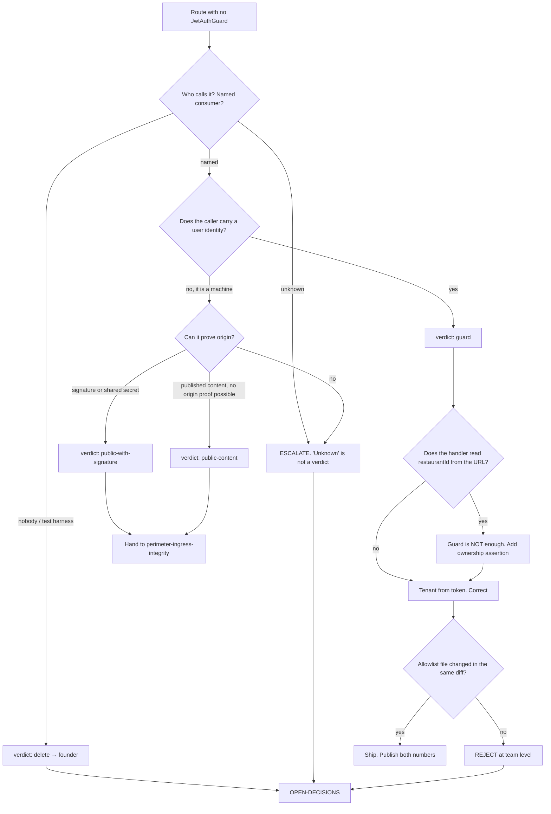

# Access Control & Tenant Isolation — Directive

How *this* team decides. Shape differs per unit by design.

This team's decision graph is a **classification** graph, because every question it faces
reduces to one route and one verdict. It inherits the department's four standing rules
([[security-directive]]) and adds one of its own: **a guard is not a verdict.** A route is
complete when identity is *required* and the tenant is *derived from the token* — either
half alone is [[access-control-tenant-isolation-premortem]] M3.

## The team's own rule: a guard is not a verdict

94 of the routes in scope are `/:restaurantId`-shaped. `TenantGuard` sets
`request.tenantId` only when a user is present (`tenant.guard.ts:49-50`) and never
compares it to the path. So adding `@UseGuards(JwtAuthGuard)` to a `/:restaurantId`
controller converts *"anyone on the internet"* into *"any authenticated user of any
restaurant"* — a real improvement that the census metric scores as **done**.

The completion criterion is therefore two-part, and the reference implementation already
exists in this repo: `one-tap-actions.controller.ts:64` (class-level guard), `:80`
(`assertOwnRestaurant` 403s when the path names another tenant), `:92` (the API
description states the rule so a client author reads it). Copy that. Do not redesign it.

**Diff heuristic, usable in review:** a PR that adds `@UseGuards` to a `/:restaurantId`
controller and touches **no handler body** is incomplete by construction.

## Decision rights

| Level | Decides | Examples |
|---|---|---|
| **Team** | Any verdict where the consumer is named and the control is standard | `GET /dashboard/stats/:id` → `guard` + token tenant; `GET /analytics/health` → `public-content` |
| **Department** | Verdicts that change which team's control applies; anything on the charter boundary | `simpos`; `vendor-portal`'s enumeration control; whether a route is a webhook at all |
| **Founder / OPEN-DECISIONS** | `delete` verdicts; knowingly accepting an exposure; breaking a live integration | The nine `communications/test/e2e/*` routes; leaving `contacts` open pending network facts |

**Severity jumps the queue.** Classification is otherwise strictly sequential — classify
all, then remediate. A route whose classification reveals a **live exploitable path** is
remediated immediately, out of order. `/analytics/consult` is the worked instance: found
during census, fixed in seven lines, and leaving it queued behind ninety-three others
would have been indefensible. `simpos` is the open instance and should be resolved before
the long tail.

**Reversibility asymmetry, stated plainly.** Adding a guard wrongly breaks a client and is
fixed by a revert within minutes. Leaving a route open wrongly leaks data or money and
cannot be un-leaked. **When the consumer is unknown and the clock is running, guard first
and let the break identify the consumer.** This is the one place the team is permitted to
act before classifying — and the break itself becomes the missing evidence.

## Escalation trigger

Escalate to [[security-charter]], and onward to `OPEN-DECISIONS.md` where it says so, when:

1. **A route's consumer cannot be named.** Not "probably the web app" — named, with a
   `path:line`. This is the single most common escalation and it should stay that way.
2. **The verdict is `delete`.** We do not remove shipped routes on our own authority.
3. **A remediation would break a live integration** — the classic being a webhook behind a
   JWT. This is why the sibling charter shares this team today.
4. **A control must ship fail-open** in any environment, for any reason.
5. **`sec.unguarded_authenticated_surface` falls in a week when
   `sec.recurrence_guard_present` is still `false`.** The metric improved and the process
   failed; that is an escalation, not a win (premortem M1).
6. **A finding is about personal data rather than reachability** — hand to
   [[compliance-charter]] rather than ruling on it. `contacts`' 8 routes are the likely
   first instance.
7. **A verdict is challenged by [[red-team-charter]]** and we disagree. Advisory is
   findings-only; a disagreement we cannot close ourselves is a decision, and decisions go
   to the queue.

## What we hand over

- **To [[perimeter-ingress-integrity-charter]]:** every `public-with-signature` and
  `public-content` verdict. Today that is an internal handoff within one team; after the
  split it is a real one, and writing the verdicts down now is what makes the split cheap.
- **To [[platform-api-charter]]:** the specification for the guard mechanism and the
  allowlist. We say what must hold; Engineering authors and owns the code.
- **To [[ai-surface-security-charter]]:** any route whose verdict is `guard` **and** which
  reaches a model. Guarding it closes anonymous access and does nothing about an
  authenticated caller burning the inference budget — `/analytics/consult` is exactly this
  case, and it is the reason both teams read the same route list from opposite ends.
- **To [[red-team-charter]]:** the completed verdict list, quarterly, with one question —
  *which of these is most likely wrong?*
