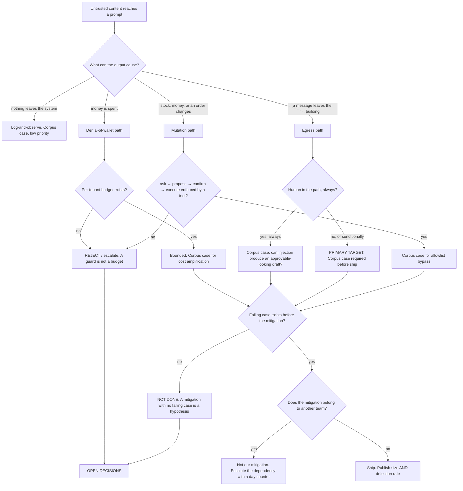

# AI Surface Security — Directive

How *this* team decides. Shape differs per unit by design.

Both sibling charters decide about **requests**. This team decides about **content and
consequence**, so its graph starts after every other control has already said yes. The
opening question is not "should this be admitted" — it was, correctly — but **what can
this text cause, and who sees it before it happens?**

## The three standing rules

**1 · A guard is not a budget.** Closing anonymous access converts *anyone* into *any
authenticated tenant*. That is a large improvement and not a bound. Any claim that a spend
exposure is closed must name the **ceiling**, not the guard.
`/analytics/consult` is the worked case: `claude-opus-4-8`, `max_tokens: 4096`
(`consultants.service.ts:154-176`), behind a rate limit that is per-process in-memory
(`rate-limit.guard.ts:65-70`) and therefore *20 × instance count*.

**2 · A control owned by another team is never our mitigation.** We may depend on it, cite
it, and escalate it — but we may not count it. This is the direct counter to
[[ai-surface-security-premortem]] M2 and M3, the two mechanisms where the team's own metric
improves because someone else shipped. Corollary: when a dependency is the only thing
between us and a bound, we ship the crude bound ourselves and keep escalating.

**3 · The mitigation is not done until a case fails without it.** Inherited from
[[security-directive]] rule 4 and binding hardest here. The existing tests are the
cautionary example: `inbound-responder.service.spec.ts:248-263` proves that *given*
`injection_suspected: true` the reply is skipped, and proves nothing about whether the flag
fires. Plumbing tests are necessary and are not evidence of defense.

## What "attacker-steered" means, versus "bad"

Stated explicitly because this boundary with
[[evaluation-doneability-charter]] will be tested by the first shared corpus.

| | RM-2 · Evaluation & Doneability | This team |
|---|---|---|
| Question | Was the output **good**? | Was the output **steered**? |
| Wanted result | High score | **A failing case** |
| A confidently wrong extraction | Their finding | Not ours |
| A correct extraction produced because the document told the model what to say | Passes their gate | **Our finding** |

Same corpus format, opposite pass condition. A corpus in which everything passes on the
first run was written by someone imagining the attacker — the failure
`scripts/eval_guest_merge_policies.py` names as *"a policy self-graded against probes its
own author imagined."* [[red-team-charter]] reviews our coverage quarterly for exactly this
reason.

## Decision rights

| Level | Decides | Examples |
|---|---|---|
| **Team** | Corpus contents and pass conditions; which callsite is audited next; the shape of a prompt-hygiene finding | Add 20 indirect-injection cases for `vendor-page-extractor`; quarantine a new input class |
| **Department** | Any control that changes another team's route behaviour; the definition of `nf_a.unauthenticated_inference_spend` | A 429 on a paid analytics route; declaring a callsite out of scope |
| **Founder / OPEN-DECISIONS** | The per-tenant spend ceiling's value; whether the autonomous send path stays; accepting an unbounded inference surface | The two-minute undo window; the acceptable daily tenant spend |

**The autonomous path is the primary target, not the edge case.** Where a human always
reads the draft, a successful injection still has to survive a person. Where
`willAutoSend = autonomyFull && !flags.needs_approval` (`inbound-responder.service.ts:509-513`)
holds, it does not. Corpus effort goes there first, in inverse proportion to how the system
is usually described.

**Doc-versus-code divergence is a security finding, not a documentation chore.** The
"never sends" docstring (`:156-157`) propagated into a planning document as evidence
(`intelligence.md:318-320`). A wrong description of a control is how three downstream threat
models end up wrong, and this team treats it with the severity of a wrong control.

## Escalation trigger

Escalate when:

1. **A spend path has no ceiling** and the proposed mitigation is a guard.
2. **A mitigation would be someone else's control.** Escalate the dependency with a day
   count — never absorb it (premortem M3).
3. **A corpus case cannot be written** because the input channel is not reachable in a test
   harness. That is a testability defect and it belongs in the queue, not in a backlog note.
4. **The docstring and the code disagree** about a human-in-the-loop guarantee. Record which
   is wrong; both remedies have owners.
5. **Guest or personal data is found in a prompt or a log.** Hand the lawful-basis question
   to [[compliance-charter]]; keep the leak-path question here. A false guest merge is
   already priced as *"a DISCLOSURE"* (`eval_guest_merge_policies.py:28-30`), so the
   severity precedent exists.
6. **`sec.corpus_detection_rate` rises while `sec.injection_corpus_size` is flat.** The
   corpus is being tuned to the model rather than the attacker.

## What we hand over

- **To [[neural-footprint-instrumentation-charter]]:** the eight-field cost-event ask for
  seven callsites. Filed with a date; L-AIS-3 counts the days.
- **To [[access-control-tenant-isolation-charter]]:** any route that reaches a model and
  lacks a guard. They close anonymous; we bound authenticated.
- **To [[perimeter-ingress-integrity-charter]]:** any verified ingress route whose payload
  reaches a model — `inbound-email` is the standing case. A perfect signature over hostile
  content is still hostile content.
- **To [[evaluation-doneability-charter]]:** the corpus format, and any case where the
  failure turns out to be quality rather than steering.
- **To [[red-team-charter]]:** the corpus, quarterly, with one question — *what attack is
  not in here?* The corpus is ours to build; its blind spots are what an independent
  attacker is for.
