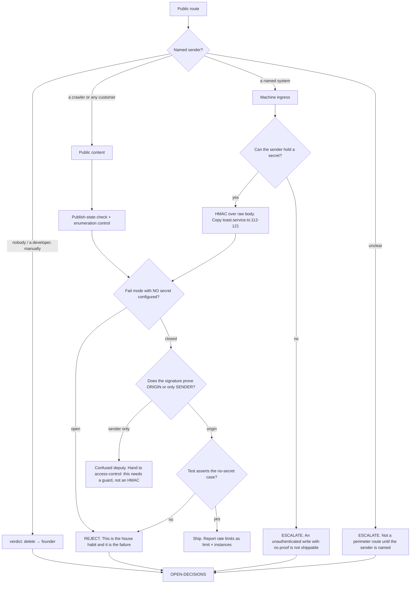

# Perimeter & Ingress Integrity — Directive

How *this* team decides. Shape differs per unit by design.

The graph opens with a question the sibling charter never has to ask, and it is the
question `simpos` fails: **who sends this request?** Not "is it authenticated" — a
perimeter route is unauthenticated by definition. Named sender first, then proof, then fail
mode. Reversing that order is how a correct HMAC ends up guarding the wrong thing.

## The team's own rule: prove origin, not transport

`simpos` is the reason this rule is written down. `POST /simpos/:id/check/:id/close` is
unauthenticated; it calls `sendSignedWebhook` (`simpos.service.ts:489-520`), where **our
own server** signs with `POS_HUB_WEBHOOK_SECRET` and POSTs to `pos-hub`, which verifies
correctly, fails closed, and — per its own API description (`pos-hub.controller.ts:57`) —
depletes stock on a closed check.

Every individual control there is correct. The signature proves the request came from our
server. It proves nothing about who asked our server to send it. **A signature that
authenticates the transport rather than the originator is a confused deputy**, and the
verdict is not "add a better signature" — it is "this route needs a guard", which hands to
[[access-control-tenant-isolation-charter]].

That handoff crossing a team boundary mid-verdict is precisely why the two charters share
one team today.

## The four shipping conditions

A perimeter control ships only when all four hold. Any one missing is a team-level
rejection, not a discussion.

1. **Named sender.** In the verdict, with a `path:line` or a named integration.
2. **Fail closed.** Missing secret ⇒ reject. The repo's habit is `logger.warn` and
   continue — `tenant.guard.ts:38-46` and three JWT fallbacks
   (`jwt.strategy.ts:12-13`, `auth.service.ts:64-66`, `auth.module.ts:28-30`). Matching that
   habit is the single most likely way this team fails.
3. **A test for the no-secret case.** `pos-hub.service.spec.ts:239` is the template. An
   untested fail-closed branch is a fail-open branch that has not been observed yet.
4. **Origin, not transport.** See above.

## Decision rights

| Level | Decides | Examples |
|---|---|---|
| **Team** | Which proof mechanism a named sender uses; verdicts where sender and proof are both clear | `toast` stays HMAC; add HMAC to a new POS bridge; tighten a publish-state check |
| **Department** | Verdicts that reclassify a route into the sibling charter; anything the module label got wrong | `simpos`; whether `vendor-portal` needs enumeration resistance or is fine as-is |
| **Founder / OPEN-DECISIONS** | `delete` verdicts; removing the `?secret=` path (breaks a provider); scoping the CORS regex; accepting a known exposure | The nine `test/e2e` routes; whether `simpos` ships in production at all |

**Integration-break rule.** Changing a perimeter control on a live integration can break a
third party silently — a rejected webhook does not page us, it just stops arriving. So:
**a control change on a live ingress route ships in observe-then-enforce order** — log what
*would* have been rejected for one close-time, read the log, then enforce. This is the one
place this charter deliberately moves slower than the sibling, and the asymmetry is
intentional: an over-eager guard 401s a user who complains within minutes; an over-eager
signature check drops vendor data nobody notices for a month.

**Exception — no observe period when the route has no control at all.** There is nothing to
observe on `simpos`, and a route with zero proof does not earn a grace window.

## Escalation trigger

Escalate when:

1. **The sender cannot be named.** The most common escalation, by design.
2. **A control would have to ship fail-open** in any environment, for any reason.
3. **The proof authenticates transport rather than origin** — hand to the sibling charter
   and record it as an instance of the `simpos` pattern.
4. **A verdict is `delete`.** Removing a shipped route is a founder call.
5. **A change would break a live integration** — the observe-then-enforce path is the
   normal route; escalate when the observation shows real traffic that would be rejected.
6. **A rate limit is cited as a mitigation while
   `sec.distributed_rate_limit_present` = `false`** and the instance count is unknown. The
   citation is unsupported, and unsupported mitigations are how an incident review closes
   early.
7. **A secret is found in a URL, a bundle, or a log.** Two are known
   (`?secret=`, `VITE_DEV_AUTH_BYPASS_SECRET`); a third means the inventory is the problem,
   not the secret.

## What we hand over

- **To [[access-control-tenant-isolation-charter]]:** any route whose "public" status turns
  out to be an omission, and any confused-deputy case. `simpos` is instance one.
- **To [[platform-api-charter]]:** the specification for the distributed rate-limit store,
  the CORS scope, and the fail-closed startup check. We specify; Engineering authors.
- **To [[integration-engineering-charter]]:** the protocol-level work of adding a signature
  to a third party's webhook. We say what must be proven; they speak the protocol.
- **To [[ai-surface-security-charter]]:** every verified ingress route whose payload reaches
  a model. A perfect signature over hostile content is still hostile content —
  `inbound-email` is exactly that route.
- **To [[compliance-privacy-charter|compliance-charter]]:** whether an unpublished vendor page leaking is a
  contractual matter as well as a security one.
