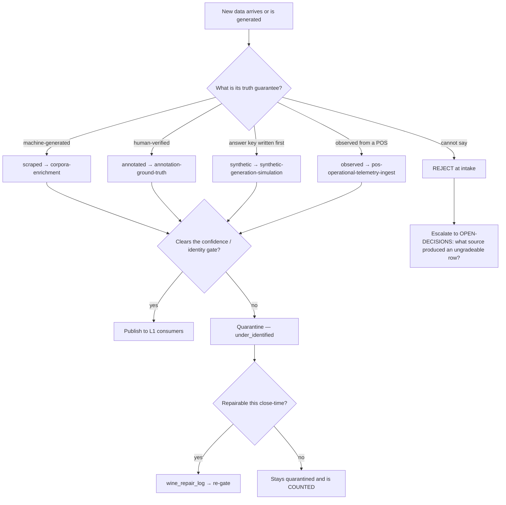
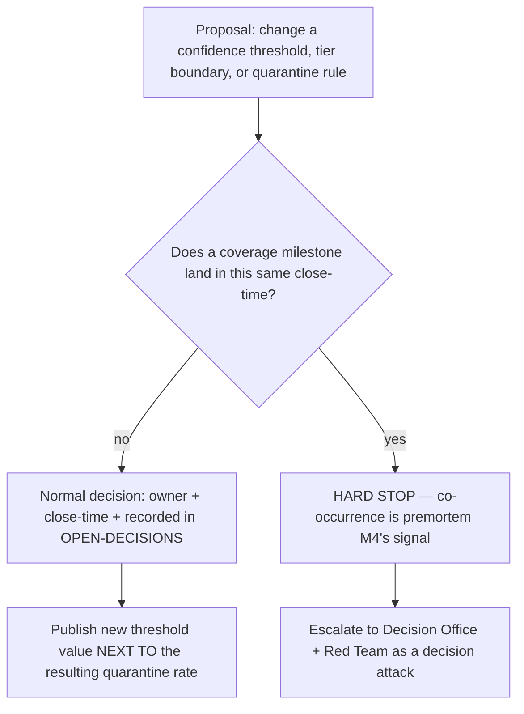

# Data — Directive

How *this* department decides. The shape is a **provenance router with a publish gate**,
because Data's characteristic decision is not "should we build this" — it is "**what kind
of truth is this row, and is it fit to be seen**".

## The intake decision

**Rule 0 — a row with no provenance is not data.** `cannot say` is a rejection, not a
default bucket. This is the whole department's load-bearing invariant
([[data-premortem]] M2).

## The threshold decision — deliberately harder than the intake decision

A threshold change is **a decision, never a configuration edit**. The migration ladder
`data_quality_confidence` → `data_quality_rescale` shows this system already rescales;
what it has never had is a record of *why*.

## Decision rights

| Decision | Who decides | Who cannot |
|---|---|---|
| What gets enriched next | `enrichment_demand_priority` function output — **the queue is data, not opinion** | Nobody hand-picks a batch without recording why |
| Whether a row publishes | [[substrate-quality-coverage-charter]] gate | The producing team may not override its own grade |
| What a threshold value **is** | Department, via `OPEN-DECISIONS.md` | The auditor cannot move it alone; the producer cannot move it at all |
| Whether a document is gold | [[annotation-ground-truth-charter]] only | No enriched or synthetic row is ever promoted to gold |
| What the answer key says | [[synthetic-generation-simulation-charter]] (`scripts/docgen/truth.py`) | Nothing downstream may edit truth to match a model |
| Whether a POS line resolved | [[pos-operational-telemetry-ingest-charter]] | Fleet averages do not decide; per-restaurant rates do |
| Whether a webhook was *delivered* | [[integration-engineering-charter]] — **not us** | We do not debug transport; we report fitness (`technology.md:859`) |
| Which model is trained on a set | Research & Math *(Intelligence)* | We assemble, they fit (`technology.md:613-616`) |
| The coverage number's **denominator** | Department, once, in writing | Not re-chosen per report |

**The auditor is never measured on producer milestones.** Stated here because it is the
single mechanism that keeps [[substrate-quality-coverage-charter]] independent, and because
the pressure to do it will be sincere and reasonable-sounding.

## Escalation trigger

Escalate to `OPEN-DECISIONS.md` — with an owner and a close-time — when any of these fire:

1. A threshold change is proposed in the same close-time as a coverage milestone.
2. Rows-without-provenance is non-zero at the weekly audit (**hard count, any value > 0**).
3. Wine coverage moves while dish and sales coverage are flat for three close-times.
4. A single restaurant's line-resolution rate sits >20 points under the fleet median for
   two close-times.
5. Backtest fidelity gap widens across two consecutive model changes.
6. A deferral ([[data-premortem]] M3) survives three reviews without a date — the escalation
   is *"drop it or fund it"*, never *"defer again"*.
7. A consumer above L0 is discovered maintaining its own private corpus — that is an
   architecture-layer violation and goes to [[architecture-review-charter]] as a finding.

Advisory functions produce **findings, not vetoes** ([[ORG_STRUCTURE]] §3). A finding
against this department lands in `questions.md` and, if it implies a decision, in
`OPEN-DECISIONS.md`. [[decision-office-charter]] owns that those decisions actually close.
