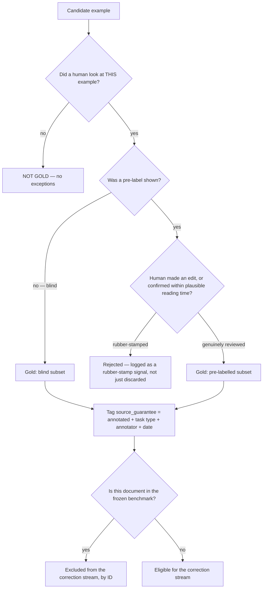
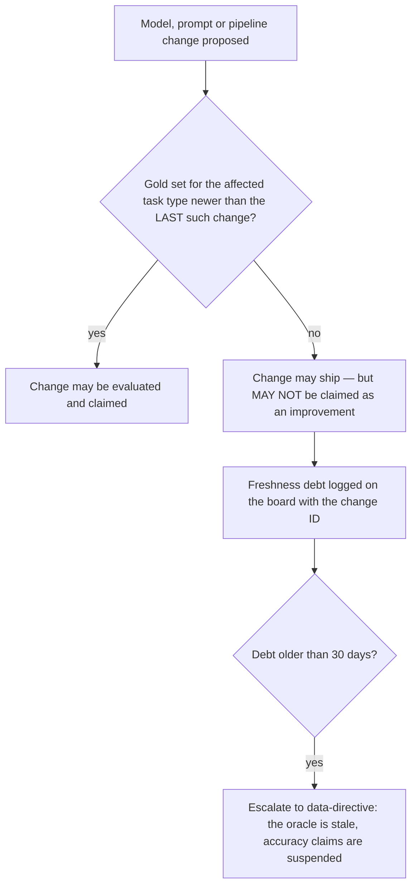

# Annotation & Ground Truth — Directive

How *this* team decides. The shape is an **admission gate**: the team's characteristic
decision is not what to build, it is **what is allowed to be called true**.

## The gold-admission decision

**Rule 0 — a pre-label a human never looked at is not gold**, however accurate. This is the
whole of [[annotation-ground-truth-premortem]] M2 in one sentence.

**Rule 1 — rejections are data.** A rubber-stamped example is discarded *and counted*. The
count is the only inside-view signal that verification has decayed into confirmation.

## The freshness decision

Shipping is not blocked. **Claiming** is. That asymmetry is deliberate: blocking releases on
annotation would get the gate removed within a month, while suspending accuracy *claims*
costs nothing operationally and is exactly the harm being prevented.

## Decision rights

| Decision | This team | Not this team |
|---|---|---|
| What is gold | **Yes, exclusively** | No sibling may write here ([[data-directive]]) |
| Whether an example was genuinely reviewed | Yes | — |
| Labelling guidelines and convention calls | Yes — and must write them down | — |
| Benchmark membership and its freeze | Yes | The rule learner never sees held-out members |
| Which examples enter a training set | Yes (assembly) | Research & Math fits the model (`technology.md:613-616`) |
| What "correct extraction" means methodologically | Proposes | Research & Math defines doneability |
| Whether a *row* publishes to the product | No | [[substrate-quality-coverage-charter]] |
| Whether an accuracy claim may be made | **Yes — via the freshness gate** | — |
| The synthetic-share cap | Proposes | Department decides, before pressure arrives |

**The unusual power here is a veto on claims, not on work.** It is the smallest authority
that actually prevents the failure mode.

## Escalation trigger

Escalate to [[data-directive]] / `OPEN-DECISIONS.md` when:

1. `annotation.gold_set_freshness_days` > **30** for any task type.
2. A model or prompt change ships with freshness debt, and the debt is not cleared within
   one close-time.
3. Human-override rate on pre-labels approaches the model's own error rate (M2).
4. Benchmark ∩ correction-stream intersection is non-empty — **any** value (M4).
5. Benchmark accuracy improves monotonically across five consecutive merges with zero
   regressions — real learning regresses sometimes.
6. Synthetic share of any real-accuracy evaluation set exceeds the cap (M5).
7. The weekly quota is missed twice consecutively — this is a **capacity** escalation, and
   the honest resolution is usually to cut task types, not to try harder.
