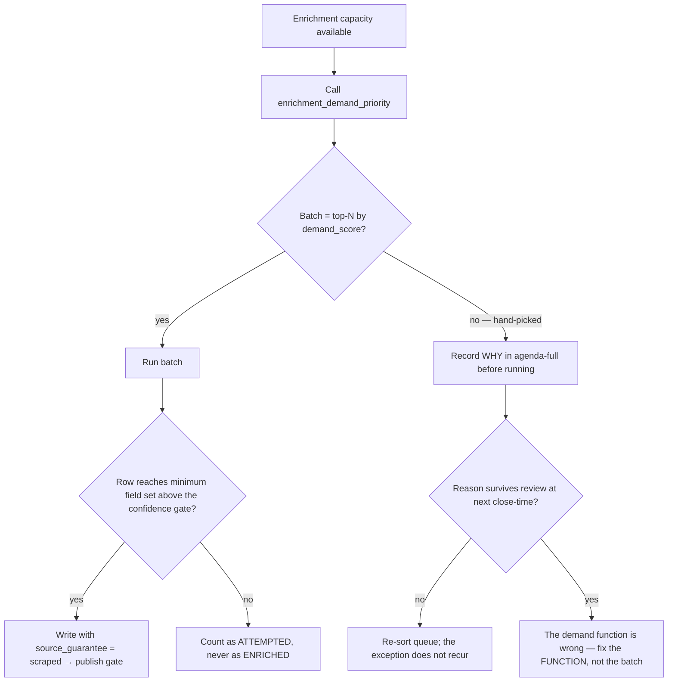
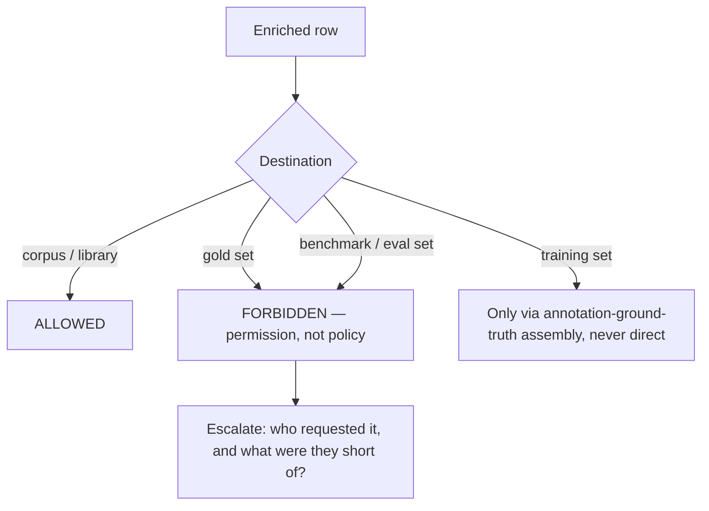

# Corpora & Enrichment — Directive

How *this* team decides. The shape is a **queue-order rule plus a write-permission rule**,
because the two decisions this team makes constantly are *what do we enrich next* and
*where is this row allowed to land*.

## What gets enriched next

**Rule 1 — the queue is data, not opinion.** Hand-picking is allowed and is logged. An
exception that is right twice means the demand function is wrong, and the correct response
is to change the function.

**Rule 2 — attempted ≠ enriched.** A shallow row does not increment coverage. This is the
structural counter to [[corpora-enrichment-premortem]] M2: shallowness shows up as a flat
coverage number, not as free speed.

## Where a row may land

The escalation matters more than the block. Someone tries this when a benchmark run is
short of examples under time pressure — the useful output is *"the gold set is too small"*,
routed to [[annotation-ground-truth-charter]], not a denied write and silence.

## Decision rights

| Decision | This team | Not this team |
|---|---|---|
| Batch composition | Yes — from `demand_score` | — |
| Whether a row published | No | [[substrate-quality-coverage-charter]] |
| The minimum field set ("what enriched means") | Proposes | Department + auditor decide jointly |
| Which model runs an enrichment call | States job + required depth | [[model-routing-inference-economics-charter]] prices and routes |
| Taking a scraper offline when its canary fails | **Yes, unilaterally and immediately** | — |
| Whether two enriched wines are the same wine | No | [[catalogue-identity-charter]] |
| Whether a row is gold | No, ever | [[annotation-ground-truth-charter]] |
| Retiring a corpus from the mandate | Proposes | Founder decides ([[data-agenda-full]] Q2) |

**The one unilateral power is destructive, not creative:** this team can pull a source out
of the pipeline on its own authority. A broken scraper writes wrong rows every hour it stays
live, and speed matters more than review in that direction only.

## Escalation trigger

Escalate to [[data-directive]] / `OPEN-DECISIONS.md` when:

1. A coverage figure is reported without its denominator — **once** is enough.
2. `corpora.field_confidence_median` falls while `corpora.library_coverage` rises.
3. A hand-picked batch reason recurs — the demand function needs changing.
4. Any request to write into a gold or benchmark set.
5. A per-source output distribution breaks band, or a canary fails.
6. Dish/beverage coverage is exactly zero for three consecutive close-times.
7. Cost per enriched record moves more than a set band with no depth change to explain it.
