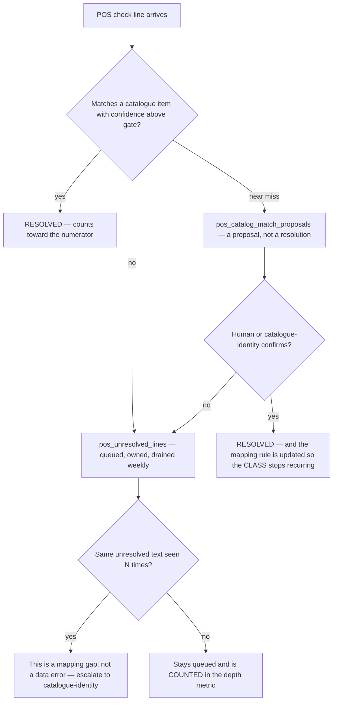
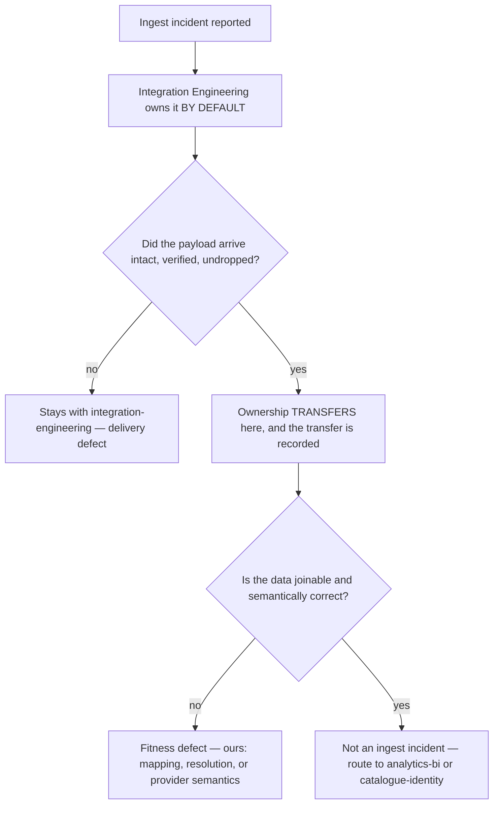

# POS & Operational Telemetry Ingest — Directive

How *this* team decides. Two decision graphs, because this team has two characteristic
decisions and they are unrelated: **is this line resolved**, and **whose incident is this**.

## Decision 1 — is a check line resolved?

**Rule 0 — a proposal is not a resolution.** `pos_catalog_match_proposals` rows do not count
toward `pos.line_resolution_rate` until confirmed. Counting proposals is the single easiest
way to make M1 invisible while it happens.

**Rule 1 — repeated unresolved text is a mapping gap, not a queue item.** The output of a
drain is a *rule change*, not a cleared row. A drain that only clears rows is a treadmill,
and the queue refills at exactly the rate it was cleared.

## Decision 2 — the seam with Integration Engineering

Default ownership sits with Integration because *"did it arrive intact?"* is the **upstream
and cheaper** question. This resolves the seam **before** diagnosis rather than after, which
is the whole point — the line at `technology.md:859` is clear on paper and useless at 9pm
unless someone owns the first question by default.

**Neither team may hold an incident jointly. A seam with two owners has none.**

## Decision rights

| Decision | This team | Not this team |
|---|---|---|
| Whether a line resolved | **Yes** | — |
| Whether two items are the same product | Proposes (`pos_catalog_match_proposals`) | [[catalogue-identity-charter]] decides |
| Mapping-rule changes | Yes | — |
| Whether the payload arrived intact | **No** | [[integration-engineering-charter]] (`technology.md:859`) |
| Whether a provider changed its schema | Detects semantically | Integration detects contractually — neither sees both |
| Raw-payload retention window | Proposes | Founder decides; it is the only recovery path |
| Whether an insight may be published on thin data | No | [[analytics-bi-charter]] + founder density floor |
| Whether a row publishes | No | [[substrate-quality-coverage-charter]] |
| Excluding a restaurant from `demand_score` | **Yes** — below the resolution threshold | Protects a sibling's metric from our bad accounts |
| Blocking onboarding completion on first-week resolution rate | **Yes** | The one preventive control this team holds |

## Escalation trigger

Escalate to [[data-directive]] / `OPEN-DECISIONS.md` when:

1. `pos.unresolved_queue_depth` and ingest volume rise **together** for two close-times (M1).
2. Any restaurant sits >20 points below the fleet median resolution rate for two close-times
   (M2).
3. A provider distribution steps on a named date — line count, modifier rate, category mix,
   void rate, check value (M3). **Same day**, because the data cannot be re-fetched.
4. Raw-payload retention is about to expire on a window under investigation. This is an
   irreversibility escalation and outranks the others.
5. `sales.density` falls below the floor for any restaurant feeding published insights (M4).
6. An incident write-up contains an argument about which team owned it (M5).
7. A second POS provider is proposed — the registry abstraction has never been exercised, and
   discovering that during an integration is expensive.
