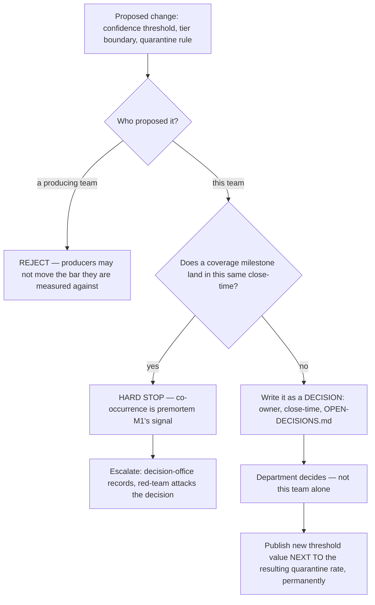
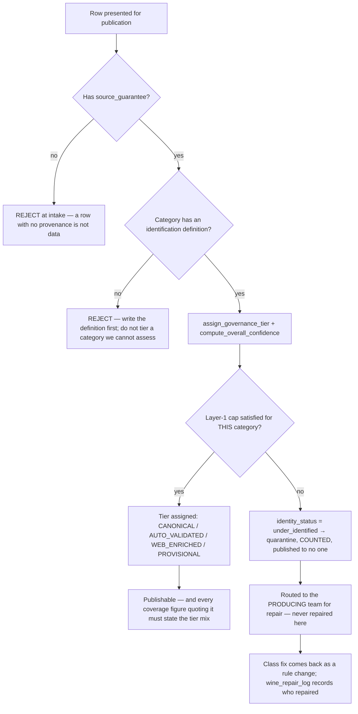

# Substrate Quality & Coverage — Directive

How *this* team decides. The shape is **a gate and a lock**: a gate on rows, and a lock on
the gate's own settings. The second is the unusual one — an auditor that can move its own bar
is not an auditor.

## Gate 1 — the lock on our own thresholds

**We measure and propose; the department decides.** The repo already holds one exemplary
recalibration (`…20260814000000_data_quality_rescale.sql:1-15`) — a rule written against 195
rows over-firing at 2,443, flagged correctly, fixed correctly, documented in the migration
itself. The protocol is not distrust of that change; it is the thing that keeps the fourth one
honest.

## Gate 2 — the gate on rows

**Rule 0 — no provenance, not data.** Load-bearing for the whole department
([[data-premortem]] M2).

**Rule 1 — no category definition, no tiering.** `governance.py:29-39` is **wine's** Layer-1
field set. Applying it to a dish, a spirit or a non-vintage sparkling either rejects valid rows
or waves them through ungated ([[substrate-quality-coverage-premortem]] M4).

**Rule 2 — we quarantine, they repair.** This team's name appearing in `wine_repair_log`'s
repairer column is a finding against itself (M3).

**Rule 3 — the gate is a state transition, not a flag.** Enforced at read. A flag that
travels with a row as advisory metadata is M2.

## Decision rights

| Decision | This team | Not this team |
|---|---|---|
| Whether a row publishes | **Yes** — and it must be structurally enforceable | — |
| What a threshold **value** is | Proposes and measures | Department decides; [[decision-office-charter]] records |
| What "identified" means per category | Proposes | Research & Math advises on method; department ratifies |
| Repairing a quarantined row | **No** | [[corpora-enrichment-charter]] and the producing teams |
| Grading agent tasks | No | [[agent-evaluation-gates-charter]] (`technology.md:862`) |
| What the daily substrate report says | **Yes** — three numbers, denominators named, tiers stated | Nobody may ask for a single scalar |
| Whether a consumer above L0 bypassed the gate | Reports what it can see | [[architecture-review-charter]] owns the layer rule (M5) |
| Merging this team out of existence | **Proposes it, honestly** | Founder decides |

**The last row is not rhetorical.** If the gate never blocks anything for two quarters, the
correct output of this team is a recommendation to disband it
([[substrate-quality-coverage-charter]] §reservation). An auditor whose findings never bind is
more harmful than none, because its existence makes everyone else believe quality is handled.

## Escalation trigger

Escalate to [[data-directive]] / `OPEN-DECISIONS.md` when:

1. `substrate.rows_without_source_guarantee` is non-zero — **any value, same day**.
2. A threshold/tier/quarantine change is proposed in the same close-time as a coverage
   milestone.
3. A producing team proposes a threshold change.
4. A quarantined row is found on a product surface, or a coverage figure is published without
   its tier mix.
5. A non-wine row is presented for tiering before its category definition exists.
6. This team's name appears in the `wine_repair_log` repairer column.
7. Quarantine rate for any category is anomalously low — usually ungated, not clean.
8. Two quarters pass with zero publishes blocked — the self-disband review fires.

Backstops sit outside the line by design: [[red-team-charter]] attacks threshold decisions,
[[architecture-review-charter]] catches consumers routing around the gate, and
[[decision-office-charter]] ensures the decisions close rather than drift.
