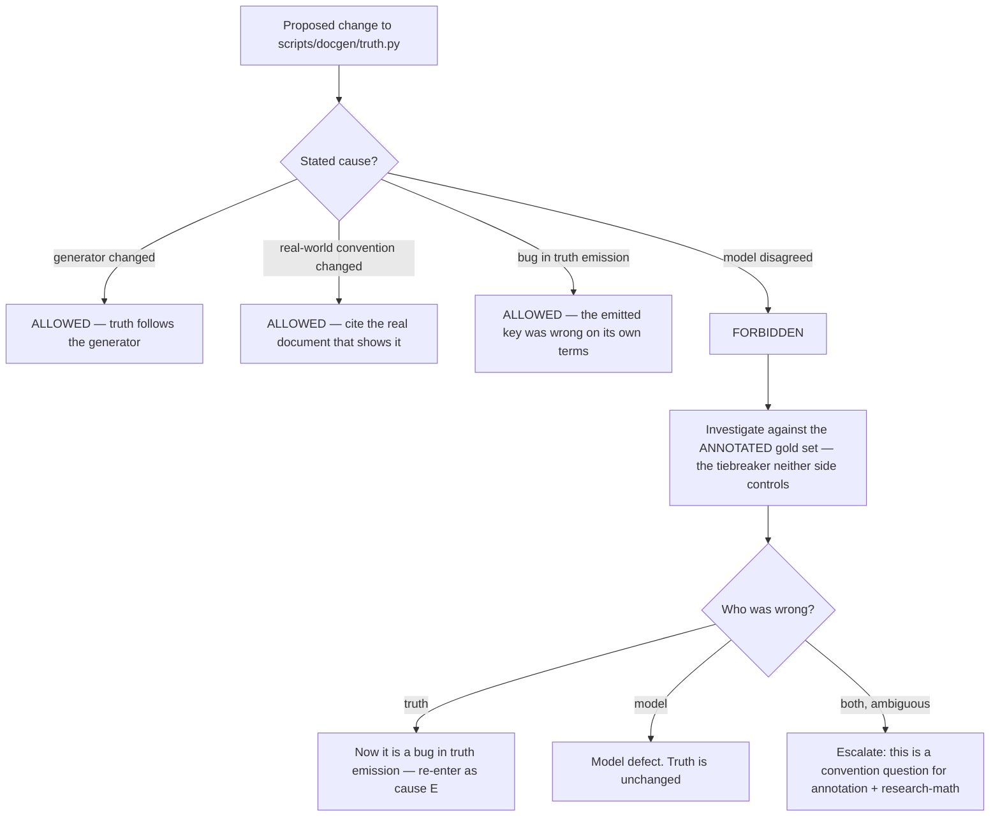
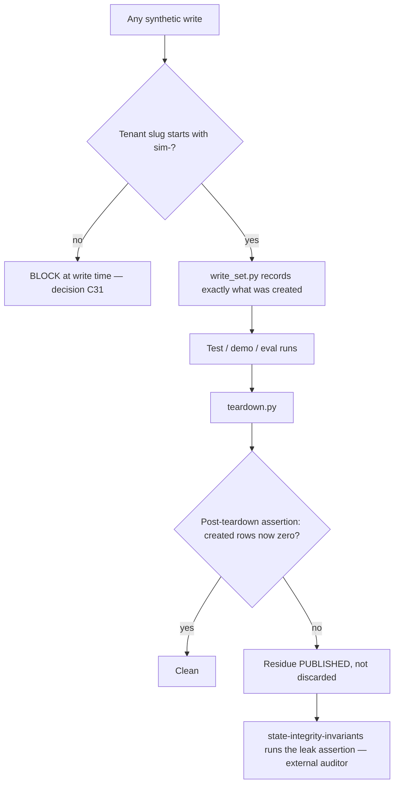

# Synthetic Generation & Simulation — Directive

How *this* team decides. The shape is **two gates guarding two irreversible things**: the
answer key, and the namespace. Everything else here is reversible; those two are not.

## Gate 1 — changing the answer key

**"Model disagreed" is not a permitted cause.** It is the only cause that will ever be
proposed under time pressure and it is the mechanism of
[[synthetic-generation-simulation-premortem]] M5. The rule is enforceable in review because
it lives in the commit message.

## Gate 2 — the sim namespace

Two properties matter more than the diagram: enforcement is **at write time**, not in agent
convention; and the assertion is run by **someone else**
([[state-integrity-invariants-charter]]). This team auditing its own namespace repeats the
author≠auditor failure the department is organised to avoid.

## Decision rights

| Decision | This team | Not this team |
|---|---|---|
| What the answer key says | **Yes** — subject to Gate 1 | Nothing downstream may edit truth to match a model |
| Which degrade profiles exist | Implements | The **set** is defined by real intake documents, not by us |
| Archetype definitions | Proposes and maintains | Re-fit is driven by real customer data as it arrives |
| Sim pack version and contents | Yes — `manifest.json`, sha256-pinned | — |
| Whether the namespace is clean | **No** | [[state-integrity-invariants-charter]] asserts it |
| Whether synthetic data may back an accuracy claim | No | Capped by [[annotation-ground-truth-charter]]'s share limit |
| Whether the fidelity gap is acceptable | Measures it | Founder sets the policy; Research & Math advises on method |
| Whether SimPOS is reachable in production | No | [[platform-api-charter]] owns the route guard |
| Training on synthetic sets | Supplies | Research & Math decides (`technology.md:613-616`) |

**The team's characteristic power is generative and its characteristic restraint is
comparative:** it may invent anything, and it may never be the judge of whether the invention
resembles reality.

## Escalation trigger

Escalate to [[data-directive]] / `OPEN-DECISIONS.md` when:

1. `synthetic.namespace_leak_count` is non-zero — **any value, same day**.
2. A `truth.py` change is proposed with "model disagreed" as its motivation.
3. The fidelity gap widens across two consecutive measurements.
4. A real intake document exhibits a failure mode `degrade.py` cannot produce — that is a
   catalogue gap and it is a finding, not a curiosity.
5. A real customer's menu falls outside the range any archetype generates.
6. Synthetic share of a real-accuracy evaluation set exceeds the cap.
7. Anything grants non-`sim-` access to SimPOS routes — routed to
   [[platform-api-charter]] and [[security-charter]] as well, because at that point it is a
   tenancy question, not a data question.

Backstop: [[red-team-charter]] attacks Gate 1's design specifically. Answer-key drift is a
decision failure, which is precisely its scope ([[ORG_STRUCTURE]] §3).
