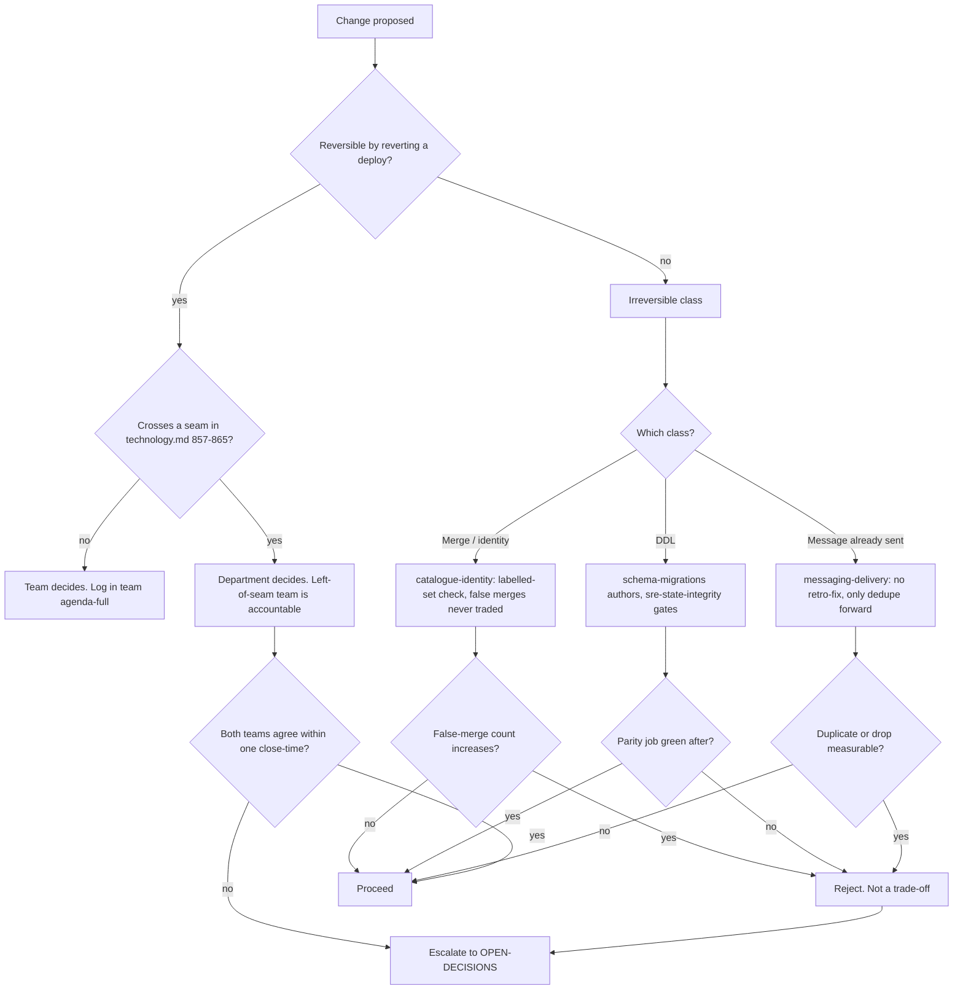

# Engineering — Directive

How *this* department decides. Shape differs per unit by design.

Engineering's decision graph is organised around one question the other departments do
not have to ask: **is this change reversible?** Engineering owns three artifact classes
that a revert does not undo — a merge, a migration, and a message that already left the
building. Everything else can be rolled back with a deploy. The graph splits on that.

## Decision rights

| Level | Decides | Examples |
|---|---|---|
| **Team** | Anything reversible and inside one team's boundary | Endpoint refactor, component rewrite, service extraction, adding a test |
| **Department** | Anything crossing a seam between two Engineering teams; any change to a primary metric's *definition* | A global guard that affects public routes; a schema change that alters a projection |
| **Founder / OPEN-DECISIONS** | Team-layer shape (OD-19, OD-20, OD-23); trading an asymmetric error against an aggregate; anything that makes an irreversible class routine | Merging two teams; permitting hand-applied DDL as a standing practice |

**Seam rule.** When a change crosses a seam, the team on the **left** of the seam table
(`technology.md:857-865`) is accountable for the decision and the right-hand team is
accountable for the objection. Two accountable teams means none — that is premortem M1.

**Asymmetric-error rule.** Where two error types are named as non-summable, they are never
traded. `scripts/eval_merge_policies.py:5-13` states it for merges and splits: "These two
errors are not symmetric and must never be summed into one score." Any proposal whose
justification is an aggregate score improvement is rejected at the team level, not
debated at the department level.

**Measurement-first rule.** A change to a metric that has never been read is not a change,
it is a guess. Four of the eight primary metrics have no first reading
([[engineering-agenda-full]]); work against those is scoped as *measurement* until a
baseline exists.

## Escalation trigger

Escalate to `OPEN-DECISIONS.md` when **any** of these holds:

1. A seam decision has not closed within one close-time from [[engineering-loops]].
2. A change requires trading an explicitly asymmetric error pair.
3. A gate goes red and the proposed remedy is a sentence rather than a file
   (premortem M3).
4. A guard's scope must be narrowed — e.g. adding `@Public()` to a route outside the
   ≈51 known-public set (premortem M2). The **first** such request escalates, not the tenth.
5. An L0–L6 layer-dependency violation is suspected — that is
   [[architecture-review-charter]]'s to find, and the finding lands in `questions.md`.

**Advisory is findings-only** ([[ORG_STRUCTURE]] §3). [[red-team-charter]] and
[[architecture-review-charter]] do not approve or block Engineering changes; they produce
written findings against a named team, and [[decision-office-charter]] is what makes the
resulting decision close rather than drift.
