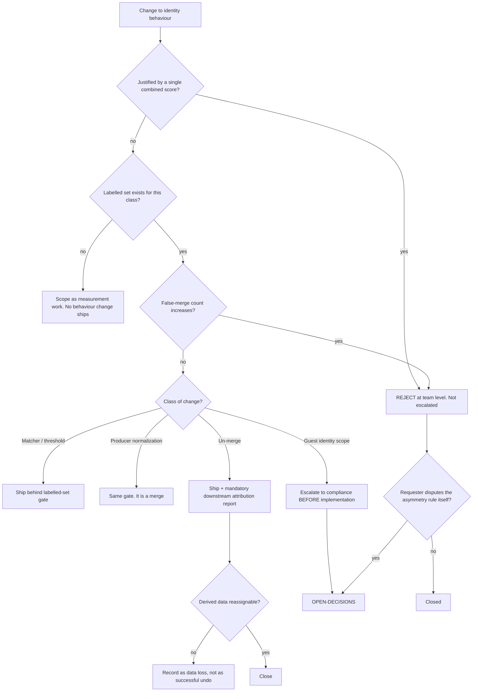

# Catalogue & Identity — Directive

How *this* team decides. Shape differs per unit by design.

This team's decision graph has one unusual property: **it has a branch that never
escalates.** A proposal justified by an aggregate identity score is rejected at team
level and does not go to the department, because there is nothing to arbitrate — the
non-summability rule is already written into the code
(`scripts/eval_merge_policies.py:5-13`).

## Decision rights

| Decision | Who |
|---|---|
| Match-key format, similarity function, thresholds | Team — subject to the labelled-set gate |
| Whether two specific entities are the same thing | **The adjudicator**, not the team (see [[catalogue-identity-agenda-full]] Q1) |
| Producer collapse rules | Team, under merge governance |
| Un-merge execution | Team; the attribution report is not optional |
| Guest identity scope changes | **Not the team's** — [[compliance-charter]] first, then `OPEN-DECISIONS.md` |
| Un-deferring dish identity | Founder — trigger proposed, not set |
| Overriding the asymmetry rule | Founder only, via `OPEN-DECISIONS.md`. Nobody else, ever |

## Escalation trigger

1. **Someone disputes the asymmetry rule itself.** Not a specific rejection — the rule.
   That is a founder decision because the team's whole shape depends on it.
2. **Two consecutive close-times with `identity.false_merge_count` unreadable**
   (premortem M2). Escalates as a resourcing question, not a technical one.
3. **Any guest identity expansion**, including one that "only" reads an existing column.
4. **An un-merge whose derived data cannot be reassigned** — escalates to
   [[engineering-loops]] L-ENG-4 as a recorded, irreversible loss.
5. **A merge affecting a row with accumulated `nf_b.*` guest signal** — these are reviewed
   individually, never batched, because batching is how M1 happens.

## The one rule that is not a judgement call

> These two errors are not symmetric and must never be summed into one score.
> — `scripts/eval_merge_policies.py:5-13`

It is quoted here rather than paraphrased because paraphrase is how it erodes. When
someone proposes a combined metric — and they will, because combined metrics are easier
to put on a dashboard — the answer is this line, and the answer is not negotiable at team
or department level.
