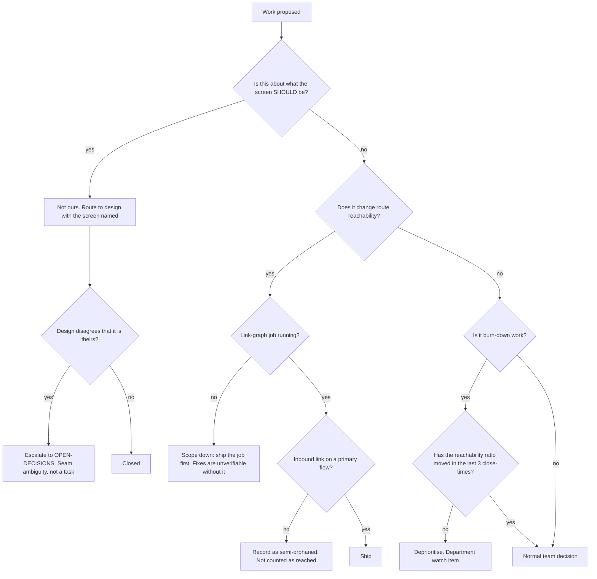

# Client Surfaces — Directive

How *this* team decides. Shape differs per unit by design.

Almost everything this team ships is reversible with a deploy, which makes it the least
constrained Engineering team on risk — and the most constrained on **scope**. Its
decisions turn on: *is this ours to decide, or Design's?* and *does this move the metric,
or just the legible number?*

## Decision rights

| Decision | Who |
|---|---|
| Component implementation, state management, bundle strategy, routing config | Team |
| Accessibility implementation | Team |
| Test and Storybook coverage priorities | Team |
| **What a screen should be, its information architecture, its intent** | **[[design-charter]]** *(Product)* |
| Whether an orphan route is deliberate or accidental | [[design-charter]] or founder — the team cannot know |
| What counts as a legitimate inbound link | Founder — it defines the primary metric |
| Mobile/web split | Department, on a written trigger (premortem M4) |
| Deploy pipeline, hosting, CDN | [[sre-release-engineering]] |
| Data shown on a screen being correct | The owning domain team, not this one |

## The seam with Design, in practice

> Intent vs. implementation — Design *(Product)* | `[[eng-client-surfaces]]` |
> What the screen should be vs. what shipped.
> — `.planning/foundation/teams/technology.md:865`

Practically: a bug report saying *"this screen is confusing"* is a **Design** finding with
an implementation consequence, and a bug report saying *"this screen does not match the
design"* is **ours**. The team's obligation is to name which one it is within one
close-time, and to escalate rather than absorb when it cannot tell. Absorbing ambiguous
work is how implementation teams quietly acquire product authority.

## Two standing rules

**1. The burn-down is an input.** `.planning/UX_PATHS_CATALOG.md` closures are reported,
never led with. If a status update opens with the burn-down count, that is premortem M1
starting and the directive says re-order the update.

**2. No orphan fix ships before the link-graph job.** Not because the fixes are wrong, but
because an unverifiable fix is indistinguishable from no fix, and the team will not be able
to tell the difference in six months either (premortem M2).

## Escalation trigger

1. **Three close-times of burn-down movement with no reachability movement** — escalates
   to the department automatically as a reallocation question ([[engineering-premortem]] M5).
2. **A seam call the team cannot make** — is this Design's or ours? Escalate; do not absorb.
3. **Orphan count falling via index/footer links only** — escalates as a metric-definition
   problem, not as progress (premortem M3).
4. **Mobile route count crossing its stated trigger**, or a close-time with mobile commits
   at zero while web is active (premortem M4).
5. **A comprehension defect with no owner** — a screen a human demonstrably misread, where
   Design says implementation and implementation says Design.
6. **A route added in a PR with no inbound link** — blocked at review, not escalated;
   escalates only if someone argues it should merge anyway.
