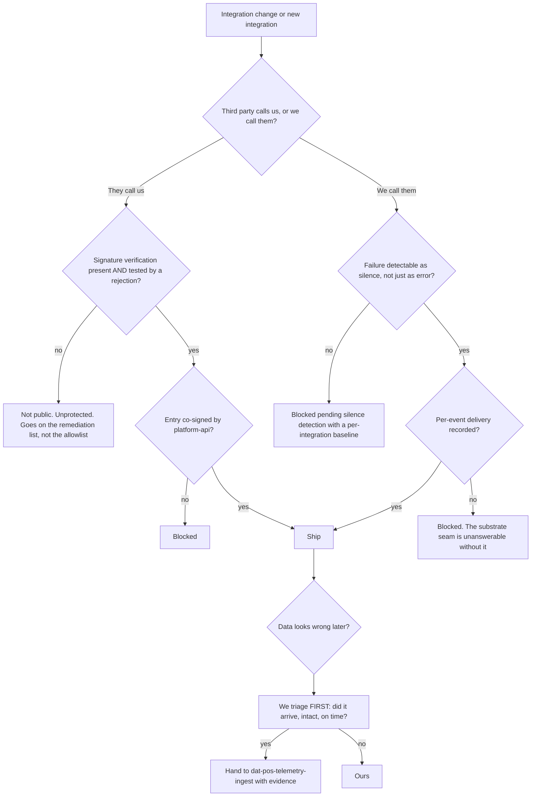

# Integration Engineering — Directive

How *this* team decides. Shape differs per unit by design.

This team decides under a constraint no sibling has: **the other party does not attend the
review.** Toast, SimPOS, and Google change their contracts without a PR. So the graph is
built around two questions — *can we detect it when they change?* and *can we prove this
request is really them?*

## Decision rights

| Decision | Who |
|---|---|
| Adapter design, retry policy, payload mapping, client implementation | Team |
| Signature verification mechanism per provider | Team |
| Silence thresholds — implementation | Team; the **acceptable window** is a product call |
| **Whether to integrate with a partner at all** | [[partnerships-charter]] *(Product)* |
| Allowlist **entries** for public routes | Team proposes; [[platform-api-charter]] co-signs; neither alone |
| The allowlist file's existence and CI enforcement | [[platform-api-charter]] |
| Whether delivered data is fit as L0 | [[dat-pos-telemetry-ingest]] — after we answer the arrival question |
| Placeholder-host findings | Routed to [[security-charter]] as findings, not filed as cleanup |
| Shipping an integration with no signature capability | Founder, via `OPEN-DECISIONS.md` |

## Three standing rules

**1. A secret is not verification.** `POS_HUB_WEBHOOK_SECRET` existing proves someone
intended to verify. The proof is a **test that an unsigned request is rejected**, per route.
Until that test exists, the route counts as unverified in the coverage number
(premortem M2).

**2. "Public" means signature-verified, never merely unauthenticated.** Stated positively
so it cannot be stretched: a third party calls it, **and** authenticity is verified. Not
"internal", not "the agent calls it", not "it 401s in dev". This team is the codebase's
most credible precedent for skipping auth, and the rule exists because that precedent will
be cited (premortem M5).

**3. We triage the arrival question first.** Left of the seam (`technology.md:859`) means
this team picks up every ambiguous data-quality report, answers *did the event arrive,
intact and on time?*, and hands off with evidence. Not because it is usually ours — because
an unowned report ages, and that is [[engineering-premortem]] M1.

## Escalation trigger

1. **A placeholder host found reachable.** Immediate, to [[security-charter]] — inbound
   data from an unowned host is an incident (premortem M3).
2. **Silence past an integration's threshold.** Treated as an incident, not as quiet. The
   escalation is to the restaurant-facing side too: stale data has already reached users.
3. **A provider ships a breaking change.** Escalates jointly with
   [[partnerships-charter]] — we fix the wire, they own the conversation.
4. **An allowlist request from a team that does not speak a third-party protocol**
   (premortem M5). The first one, and the phrasing will be plausible.
5. **A data-quality report unclaimed for one close-time** by both this team and
   [[dat-pos-telemetry-ingest]] — the seam is not holding.
6. **A new integration proposed without signature capability** — founder decision, because
   it permanently widens the unverifiable surface.

## On Friday breakages

The premortem's scenario is a Friday payload change. This directive says: **detection is
this team's obligation, timing is not an excuse, and the fix may be a stop-gap.** An
adapter that rejects a changed payload loudly is better than one that silently drops it —
loud failure is a signal; silence is the thing this whole team exists to prevent.
