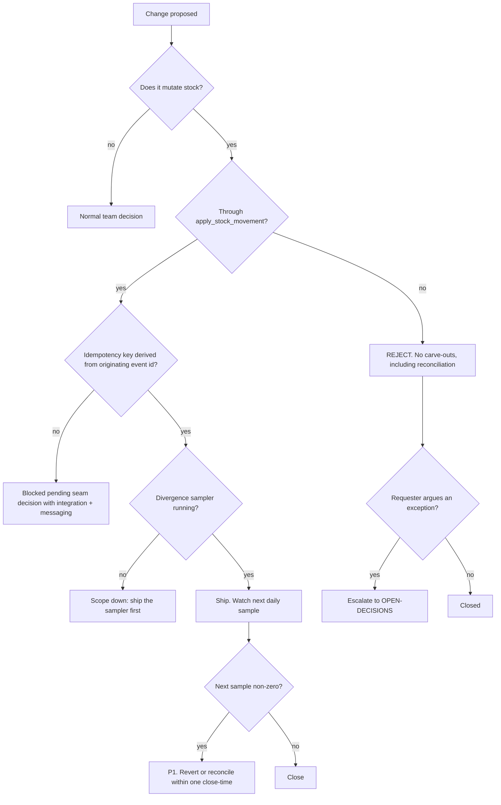

# Inventory & Ledger — Directive

How *this* team decides. Shape differs per unit by design.

The graph is organised around one question no other Engineering team has to ask
constantly: **does this path write stock, and if so, through what?** There is exactly one
correct answer — `apply_stock_movement` — and the directive exists to make every other
answer expensive.

## Decision rights

| Decision | Who |
|---|---|
| Movement semantics, lot model, projection shape | Team |
| Whether a given path counts as a stock write | **Team, and the team's answer is broad by default** — ambiguity resolves toward "yes, it is a write" |
| DDL for ledger tables and `apply_stock_movement` | [[schema-migrations-charter]] authors; this team specifies |
| Running the CI guard and drift gates | [[state-integrity-invariants-charter|sre-state-integrity]] — author ≠ auditor |
| Idempotency key derivation across hops | Department-level seam decision; this team is accountable (left of seam) |
| Ledger v1 removal date | Team proposes, department confirms — it breaks callers outside this team |
| Any exception to the movement-only rule | Founder, via `OPEN-DECISIONS.md`. Not the team, not the department |

## The P1 rule

> Target zero; any non-zero is a P1 **because it is undetectable from the UI**.
> — `.planning/foundation/teams/technology.md:119-120`

This severity is not proportional to row count. One divergent row is a P1 for the same
reason a thousand are: nobody will report it. Severity elsewhere is calibrated by user
impact; here there is no user signal to calibrate against, so the rule is categorical.

**Consequence for triage:** this team never receives a stock-correctness bug from a user.
If it ever does, that means the divergence was large enough to be visible, which means the
sampler failed and the incident is two failures, not one.

## Escalation trigger

1. **Green CI plus non-zero divergence** — the M1 alarm state. Escalates immediately to
   [[engineering-loops]] L-ENG-3, because it proves a guard is blind, not just that data
   is wrong.
2. **A request for a movement-only exception**, including for bulk opening counts or
   reconciliation adjustments (premortem M5).
3. **A new ledger v1 call site** after the deprecation date (premortem M3). One is enough.
4. **Divergence unresolved after one close-time** — a P1 that stays open past its
   close-time is a directive failure, not a bug.
5. **A cross-hop duplicate movement** — escalates as a seam decision, not a bug fix, since
   fixing it inside this team's code cannot close it (premortem M4).

## What this team does *not* decide

It does not decide what was ordered or at what price
([[procurement-vendor-network-charter]]), whether a POS event was delivered correctly
([[integration-engineering-charter]]), or whether the resulting rows are fit as L0
substrate ([[pos-operational-telemetry-ingest-charter|dat-pos-telemetry-ingest]]). It decides only whether the number is right —
which is narrow, and is the whole job.
