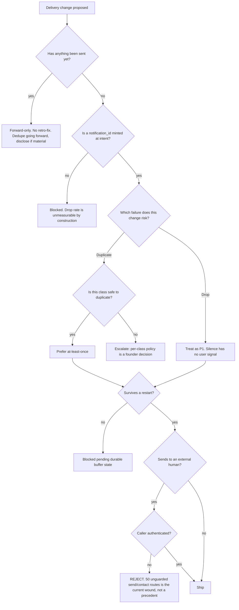

# Messaging & Delivery — Directive

How *this* team decides. Shape differs per unit by design.

This team's decisions turn on a question the others can ignore: **is this message already
irreversible?** A sent message is in the third irreversible class ([[engineering-directive]]
— a merge, a migration, a message that left). There is no un-send. The graph therefore
splits *before* the send, and everything after it is forward-only mitigation.

## Decision rights

| Decision | Who |
|---|---|
| Threading rules, routing, batching windows (implementation) | Team |
| Delivery state model, ledger schema, idempotency keys for delivery | Team |
| **What a message says** | **Not the team** — [[ai-orchestration-charter]] |
| Whether an action in a message may be executed | [[action-safety-the-human-gate-charter|action-safety-the-human-gate]] |
| At-least-once vs at-most-once **per notification class** | Founder — it is a product trade, not a transport one |
| Batch window length as a product promise | Founder; team owns the implementation |
| Restart behaviour of the process | [[runtime-resilience-charter|sre-runtime-resilience]]; team owns message survival across it |
| Open-tracking on email | [[compliance-privacy-charter|compliance-charter]] first — it is a privacy decision |
| Guard mechanism for the ~84 routes | [[platform-api-charter]] builds; team sets priority by consequence |

## Two standing rules

**1. Silence outranks noise in severity.** A duplicate is visible and annoying; a drop is
invisible and consequential. When triage must choose, the drop is the P1. This inverts the
usual instinct — duplicates generate complaints and therefore feel urgent — and the
inversion is the point (premortem M2).

**2. "Delivered" is a claim about the recipient, not the provider.** A provider accept is
`accepted`, not `delivered`. Where a channel cannot report arrival, the board says so
rather than rounding up (premortem M3). A metric that reports 99.9% delivered on
provider-accept data is worse than no metric, because it stops the search.

## Escalation trigger

1. **A restart with no reconciliation record** — buffered, flushed, redelivered, dropped.
   Escalates to [[runtime-resilience-charter|sre-runtime-resilience]] as a joint finding, not as this team's bug.
2. **Any drop-rate reading that cannot be produced.** Two close-times of "unmeasurable"
   escalates as a resourcing question (premortem M2).
3. **An unauthenticated write observed on a send or contacts route** — immediate, to
   [[security-charter]] and [[engineering-loops]] L-ENG-5.
4. **A thread merge that is later found wrong** — escalates jointly with
   [[ai-orchestration-charter]], because the visible damage was a bad draft and the cause
   was transport (premortem M4).
5. **A request to send to an address the system has not verified consent for** —
   [[compliance-privacy-charter|compliance-charter]], before sending.
6. **Any mass-send** (a digest to every contact, a migration announcement) — reviewed as an
   irreversible-class event under [[engineering-loops]] L-ENG-4, every instance, no sampling.
