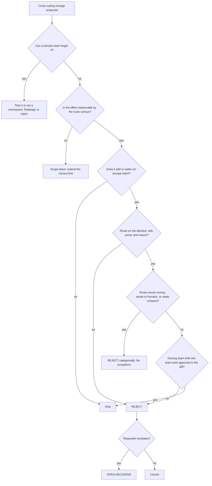

# Platform & API — Directive

How *this* team decides. Shape differs per unit by design.

This team decides for routes it does not own. Its authority is **mechanism, not policy**:
it can make a class of mistake impossible, and it cannot decide whether a given domain
route should exist. The graph reflects that — the recurring question is *does this belong
in a mechanism or in a decorator?*, and the answer is almost always the mechanism.

## Decision rights

| Decision | Who |
|---|---|
| Guard, tenancy, idempotency, cache, rate-limit, crypto mechanisms | Team |
| The default a route gets when it declares nothing | Team — and it must be **published**, not inherited by omission |
| OpenAPI surface, module wiring | Team |
| **Whether a route is legitimately public** | Owning team proposes; **this team co-signs**; the allowlist is the record |
| Which unguarded routes to close first | [[security-charter]] classifies and ranks; consequence-bearing teams weigh in; this team executes |
| Finding and classifying security gaps | **Not ours** — [[security-charter]] *(Intelligence)* |
| RLS policies as DDL | Co-owned with [[schema-migrations-charter]] |
| Signature verification on public routes | [[integration-engineering-charter]] |
| Changing `tenant.guard.ts:38-46` pass-through semantics | Founder — it changes behaviour on all 448 routes at once |

## Two standing rules

**1. A mechanism a domain team can forget is not a mechanism.** It is a convention with
better documentation. The test is simple: if the failure mode is "someone did not add the
decorator", redesign until the failure mode is "someone edited the allowlist and it showed
up in review".

**2. Report the number that can fail.** Routes carrying the guard is a work-done number and
will only ever go up. **Reachable unguarded routes** is the number that can go the wrong
way. Every report shows both; if a surface can only show one, it shows the second
(premortem M1).

## Escalation trigger

1. **The first `@Public()` outside the allowlisted set.** The first, not the tenth —
   after the first, the pattern is precedent (premortem M1).
2. **A request to allowlist a money-moving, message-sending, or contact-reading route.**
   Rejected here; escalates only if pressed, and the escalation is to the founder.
3. **A new controller merged with the census count unchanged** — the census is broken, and
   that is a P1 for this team because everything else depends on it (premortem M2).
4. **A cross-tenant read found in any environment.** Immediate, jointly to
   [[security-charter]] and [[compliance-charter]] — this is disclosure territory, not a bug.
5. **Two modules deriving idempotency keys differently** (premortem M5), or any cross-hop
   duplicate raised by [[inventory-ledger-charter]] — escalates as a seam decision.
6. **[[security-charter]] and this team disagreeing on classification.** The seam says they
   classify; if this team is arguing about classification, the seam is collapsing and
   [[decision-office-charter]] should hear it.

## What this team must never do

Grade its own work. `technology.md:864` puts the finder in another division on purpose. A
protection percentage published by the team that built the protection, with no independent
classification, is the same structural error the org's advisory layer exists to prevent
([[ORG_STRUCTURE]] §3).
