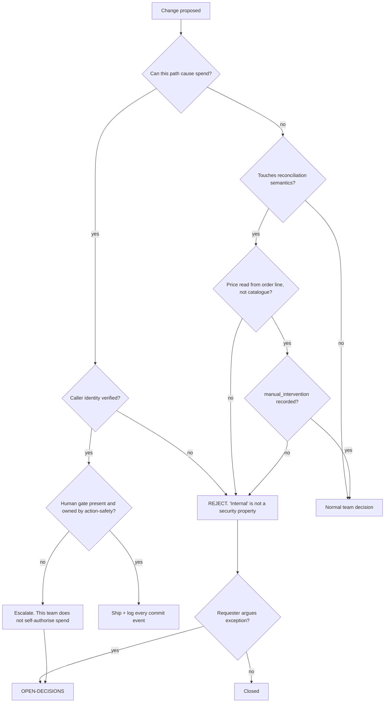

# Procurement & Vendor Network — Directive

How *this* team decides. Shape differs per unit by design.

Every other Engineering team can ask "is this reversible?" and usually answer yes. This
team's first question is different: **does this path cause money to leave the company?**
Once an order reaches a vendor, no deploy retracts it — the remedy is a phone call and a
credit note.

## Decision rights

| Decision | Who |
|---|---|
| Order, RFQ, receiving, credit mechanics | Team |
| Vendor catalogue matching, price observation capture | Team |
| Distributor graph and discovery | Team |
| **Whether a path may commit spend without a human** | **Not the team.** [[action-safety-the-human-gate-charter|action-safety-the-human-gate]] *(Applied AI)* |
| Any spend threshold, and any change to one | Founder, recorded in `OPEN-DECISIONS.md` with the value |
| The guard mechanism protecting these routes | [[platform-api-charter]] builds; this team sets the priority order by consequence |
| Contract terms in a purchase agreement | [[legal-charter]] *(Corporate)* |
| Vendor portal route additions | Team, under an integration-surface criterion (premortem M5) |

## Three standing rejections

These do not go to the department. They are rejected here, because each is a mechanism in
the premortem rather than a judgement call.

1. **"It's internal, so it doesn't need auth."** `TenantGuard` returns `true` with no
   authenticated user by design (`apps/api-gateway/src/common/tenant/tenant.guard.ts:38-46`).
   Nothing enforces "internal". A verified caller identity does.
2. **Reconciliation joining `vendor_catalogue` for price.** The agreed price is on the
   order line, snapshotted and immutable. A live join makes every vendor price rise
   self-approving (premortem M3).
3. **A reconciliation record without `manual_intervention`.** The metric is "without human
   repair"; a record that cannot express repair cannot measure the metric (premortem M2).

## Escalation trigger

1. **Any request to add or raise an auto-commit threshold.** Raising an existing threshold
   escalates more urgently than creating one — it means the ratchet has started.
2. **An unauthenticated write observed on a money-moving route.** Escalates as an
   incident to [[security-charter]] and [[engineering-loops]] L-ENG-5 simultaneously, not
   as a bug.
3. **No-touch reconciliation rate falling for two close-times** while the raw rate holds —
   the system is generating labour and hiding it.
4. **A vendor disputes an order the system placed.** Every instance escalates, regardless
   of amount, because the interesting question is always *how* it was placed.
5. **Vendor portal route count growing without an agenda entry** (premortem M5).

## Note on the two audiences

This team serves restaurants *and* vendors. When their interests conflict — a price
dispute, a credit, a late delivery — the system's job is to make the disagreement
**visible and evidenced**, not to resolve it automatically in either direction. Automatic
resolution in the restaurant's favour is a legal exposure; in the vendor's favour it is
premortem M3.
