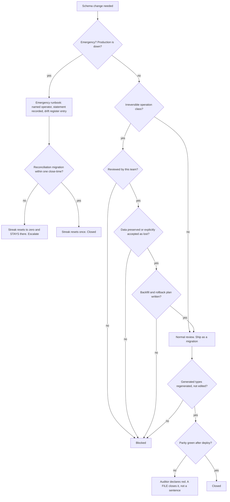

# Schema & Migrations — Directive

How *this* team decides. Shape differs per unit by design.

Every decision here starts from one fact: **a migration cannot be reverted by reverting a
commit.** Dropping a column and re-adding it does not restore what was in it. The graph is
therefore asymmetric — reversible DDL flows through normal review, irreversible DDL takes a
different path entirely, and the emergency path is designed rather than improvised.

## Decision rights

| Decision | Who |
|---|---|
| Migration authorship, ordering, naming | Team, with domain teams |
| RLS policies, Postgres functions as DDL | Team; co-owned with [[platform-api-charter]] for request-layer tenancy |
| Generated type regeneration | Team — **never hand-edited by anyone** |
| **Running the parity gate and declaring red** | **[[sre-state-integrity]]** — author ≠ auditor (`technology.md:296-298`) |
| Whether a red is "expected" | **The auditor, never this team.** This is the load-bearing separation |
| What a domain invariant should be | The domain team; this team authors the DDL |
| Irreversible operations (`DROP COLUMN`, `ALTER TYPE`, unbackfilled `NOT NULL`) | Requires this team's review |
| Routine additive migrations | Normal review — the team is not a gate on everything |
| Hand-applying DDL in an emergency | Per runbook, by a named role; not ad hoc |
| Permitting hand-applied DDL as standing practice | Founder only, via `OPEN-DECISIONS.md` |

## The one rule

> **A red gate is closed by a file, not a sentence.**

A reconciliation migration lands within one close-time, or
`schema.days_since_hand_applied_ddl` publicly resets to zero and stays there. This is the
whole counter-pressure to premortem M1, and it works only because the metric is a
**streak** — a percentage would let a bad month average out; a streak either rebuilds from
zero or it does not.

The corollary matters as much: **this team does not get to declare its own drift
expected.** That authority sits with [[sre-state-integrity]] by design. If it ever moves
here, the author is auditing itself and M1 becomes unstoppable — the same structural error
that [[ORG_STRUCTURE]] §3 builds the whole advisory layer to avoid.

## Escalation trigger

1. **Parity red for two consecutive runs** with no reconciliation migration in flight
   (premortem M1).
2. **A PR description containing "already applied in prod"** — the phrase itself is the
   trigger.
3. **A hand-applied DDL with no drift-register entry** in
   `.planning/SCHEMA_DRIFT_INVENTORY.txt` (premortem M2). The first one.
4. **A production function body that does not match the repo**, including whitespace — a
   re-created function is a rewritten function (premortem M3).
5. **A hand-edit to a generated types file** (premortem M4).
6. **A merged migration with an irreversible operation and no review from this team**
   (premortem M5).
7. **Any request to move "declare a red expected" authority into this team.** Escalates to
   [[decision-office-charter]] as a structural change, not a process tweak.

## Why the review scope is narrow on purpose

A team that reviews all 62-and-growing migrations becomes a bottleneck, and bottlenecks get
routed around — which produces exactly the hand-applied DDL this directive exists to
prevent. So: review the irreversible class, publish the list so it is checkable, keep
`scripts/concat_migrations.py` and `scripts/run_migration.sh` ergonomic, and let routine
additive migrations pass with normal review. The practice survives by staying the path of
least resistance.
