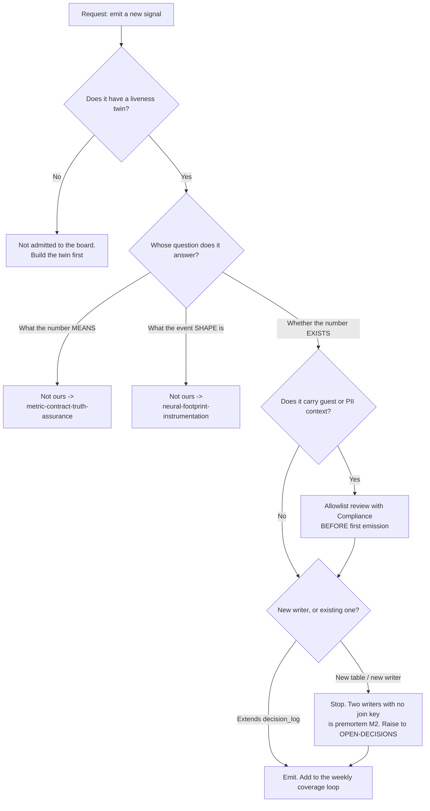

# Observability & Telemetry Plumbing — Directive

How *this* team decides. Its decision graph is shaped by one asymmetry: **adding a signal
is cheap and reversible; adding a signal that lies is neither.** So the gate is not "is
this useful" but "can this be wrong without anyone noticing".

## Decision rights

| Decision | This team decides | This team explicitly does not |
|---|---|---|
| Whether a metric is trustworthy enough to act on | **Yes** — including about other teams' metrics | — |
| Whether a metric is *good news* | — | **No.** We never grade the numbers we emit |
| Instrumentation targets and priority | **Yes** | — |
| The NF-A event schema | — | [[neural-footprint-instrumentation-charter]] |
| Whether a metric's definition is honest to a customer | — | [[metric-contract-truth-assurance-charter]] |
| Admitting a metric to a board | **Yes** — liveness twin is a hard precondition | — |
| Declaring an incident over | — | The owning team, or the department if multi-team |
| Creating a second NF-A writer | — | **Nobody, unilaterally.** Fork → `OPEN-DECISIONS.md` |
| Attributes allowed on traces / Sentry events | Jointly with [[compliance-charter]] | — |

**The team's one refusal:** it will not report a number it cannot show is alive. A metric
whose liveness twin is missing is reported as **"unknown"**, never as its face value. In
this team's vocabulary, `0` and `unknown` are different words, and the whole charter rests
on keeping them different.

## Escalation trigger

Escalate to the department, and to `OPEN-DECISIONS.md`:

1. **A second writer is proposed for any part of the NF-A tuple.** This is
   [[observability-telemetry-plumbing-premortem]] M2 arriving, and it always arrives as a
   reasonable local decision.
2. **Coverage is reported over a denominator other than agent tasks** — anywhere, by
   anyone, including in a slide.
3. **A metric reads exactly zero for a full close-time** while an independent path
   (e.g. `decision_log` writes) says the subsystem is active.
4. **Triage volume moves for three consecutive close-times while `nf_a.emission_coverage`
   does not** — M3. The escalation asks the department to reallocate, and on a second
   occurrence asks the founder whether the Incident Command rejection still holds
   ([[reliability-sre-charter]]).
5. **Guest data is found in a trace or error payload.** Stop emission on that path the same
   day; the remediation design goes to [[compliance-charter]], not to a quick strip.
