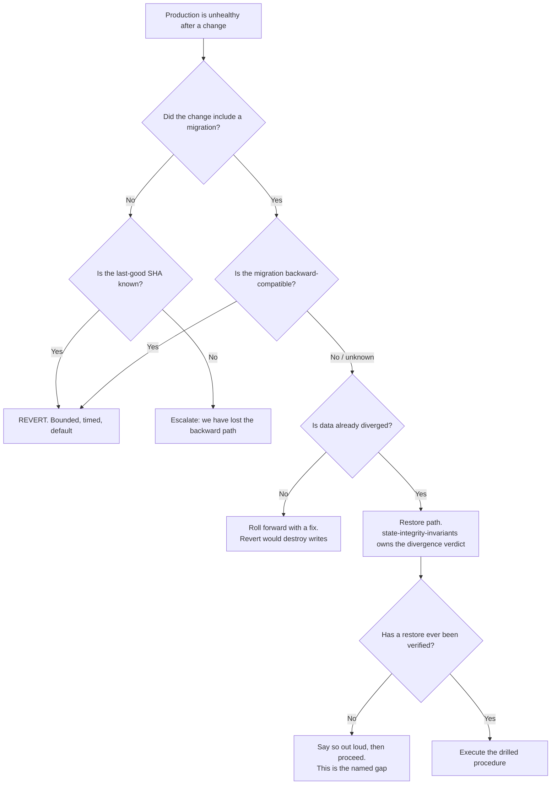

# Release Engineering — Directive

How *this* team decides. Its graph is shaped by one asymmetry the other SRE teams do not
have: **rolling forward is optimistic and rolling back is bounded.** Under uncertainty this
team chooses the bounded option, and the only case where that rule is suspended is a
schema change — because a migration is frequently the thing that cannot be reverted.

The `J → K` branch is the point of drawing this at all. Today the answer at `J` is **no**,
and a directive that hides that behind a confident arrow would be lying about the team's
actual capability.

## Decision rights

| Decision | Who | Notes |
|---|---|---|
| Revert vs. roll forward | **This team** | Not the author of the change. Bounded beats optimistic under uncertainty |
| Whether a deploy is allowed while a gate is red | **This team** | And it is a *recorded* exception, not a habit |
| Whether a gate is deleted | Department (L-SRE-1) | A team may propose; it may not unilaterally delete a signal |
| Whether the parity gate's verdict is red | [[state-integrity-invariants-charter]] | We run the workflow; the auditor grades it (`technology.md:860`) |
| Whether a migration is backward-compatible | [[schema-migrations-charter]] | We ask; they answer; we act on the answer |
| Executing a restore | **This team** | With the divergence verdict from [[state-integrity-invariants-charter]] |
| Adding a production environment variable | **This team**, via the manifest | Console-only changes are not a permitted path |
| Populating `sre.time_to_revert` | **This team**, from an *exercised* revert only | An estimate may never occupy that field |

## Escalation trigger

Escalate to the department and `OPEN-DECISIONS.md`:

1. **The last-good SHA is unknown** — the backward path is gone, which is this team's
   defining failure and not a routine incident.
2. **A gate is red for two consecutive runs** and the proposed close is a sentence rather
   than a commit ([[reliability-sre-directive]] trigger 2). The escalation forces
   fix-or-delete.
3. **A restore is required and none has ever been verified.** Until the first drill, this
   trigger fires **every time** — deliberately, so the gap stays expensive rather than
   quietly absorbed.
4. **A `DEV_AUTH_BYPASS*` variable is found in production configuration.** Same-day
   removal; the incident is filed regardless of whether it was exploited.
5. **Any first-in-anger use of a recovery path** — restore, revert, or the
   `pause_all_writes` kill switch — **including successful ones.** A recovery path that
   worked while unverified worked by luck, and luck is not a measurement
   ([[reliability-sre-directive]] trigger 5).
6. **Pipeline metrics improve for three close-times while both recovery numbers remain
   "unmeasured"** — M5. The escalation asks the department to re-order the team's work.

## The standing exception log

Deploying past a red gate is sometimes correct. It is never *silent*: each exception is a
row with the SHA, the gate, the reason, and the close-time by which the gate will be green
or gone. **A list of exceptions with no expiry dates is the M1 mechanism with better
paperwork** — the expiry date is the only part that matters.
