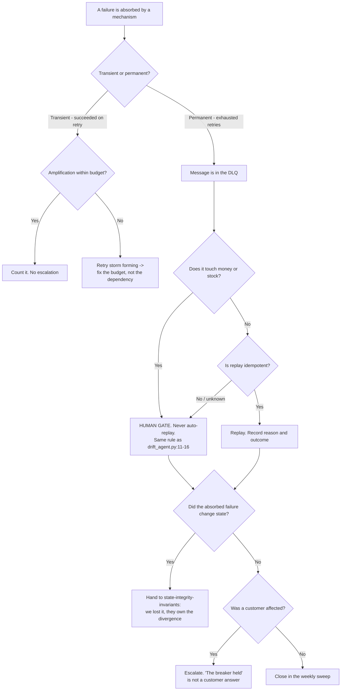

# Runtime Resilience — Directive

How *this* team decides. Its graph is shaped by one rule that sounds backwards and is the
whole point: **absorbing a failure is not resolving it.** Every mechanism this team owns
produces a healthy-looking system as its output, so every decision here ends by asking who
is told.

## Decision rights

| Decision | Who | Notes |
|---|---|---|
| Replay, discard, or escalate a DLQ message | **This team** | Money/stock always human-gated |
| Discard a DLQ message permanently | **This team**, with a recorded reason | A discard with no reason is a silent drop with paperwork |
| Retry budget and which layer owns retry per path | **This team** | Nested retries are the defect; naming the owner is the fix |
| Circuit-breaker thresholds and half-open policy | **This team** | Per dependency, not global |
| Whether an open breaker is acceptable | The **owning feature's team** | An open breaker past one close-time is a product decision, not an infra one |
| Whether lost work corrupted state | [[state-integrity-invariants-charter]] | We own the loss; they own the divergence |
| Whether a customer is told | **Not this team** | Escalates to the department; today nobody owns it, which is itself a finding |
| Which payload classes are non-evictable | **This team**, with [[inventory-ledger-charter]] | Stock and money are non-evictable by default |
| Using `pause_all_writes` | **This team** | Any use is reportable, including a successful one |

**The one rule:** a mechanism that absorbs a failure must **name who was told**. "The
circuit breaker held" closes an infrastructure ticket; it does not close a customer's
missing order.

## Escalation trigger

Escalate to the department and `OPEN-DECISIONS.md`:

1. **The oldest DLQ message exceeds one close-time.** Not depth — age. This is the M1
   tripwire and it fires on a queue that looks calm.
2. **A breaker is open beyond one close-time**, or a breaker's open→closed transition count
   is zero across a full period. Both mean a feature is silently off.
3. **`resilience.retry_amplification_factor` rises while task volume is flat** — outbound
   volume increasing without work increasing is a storm, and it is self-inflicted.
4. **Any eviction of a stock or money payload.** These should be structurally impossible
   once the non-evictable rule lands; before then, each one is an incident.
5. **First-in-anger use of `pause_all_writes` or `emergency_flush_buffer`** — including
   successful uses ([[release-engineering-charter]] L-REL-5).
6. **An absorbed failure with a customer consequence and no owner for telling them.** The
   escalation is not about the failure; it is about the missing owner.
7. **Any proposal to auto-replay a money or stock message.** That is a rule change, not an
   application of a rule — [[reliability-sre-directive]] trigger 1.
