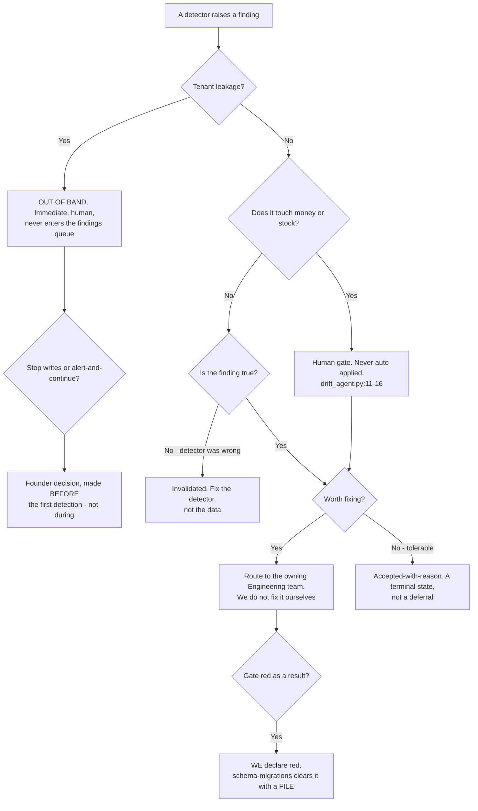

# State Integrity & Invariants — Directive

How *this* team decides. Its graph is shaped by a rule the other three SRE teams do not
need: **severity is structural, not a column.** A queue is the correct shape for drift and
the wrong shape for tenant leakage, so the first branch is about *routing*, not priority.

The `E → F` branch matters as much as the others: a false finding is a **detector defect**,
and fixing the data instead of the detector is how a queue fills with noise until nobody
reads it ([[state-integrity-invariants-premortem]] M1).

## Decision rights

| Decision | Who | Notes |
|---|---|---|
| Whether the parity gate is **red** | **This team** | Not [[schema-migrations-charter]]. Author ≠ auditor is the reason this team exists (`technology.md:860`) |
| What a red gate requires to clear | **This team** | A **file**, never a sentence. A chat explanation does not close a gate |
| Whether a finding is valid | **This team** | An invalid finding is a detector defect and is fixed on the detector side |
| Whether a finding is fixed | The **owning Engineering team** | We raise; they fix. We do not repair stock, identity, or money data |
| Accepting a finding with reason | **This team**, recorded | A terminal state. Without it the queue is undrainable; with it, it is abusable — the record is what keeps it honest |
| Auto-applying any remediation to money or stock | **Nobody.** Human gate, always | `drift_agent.py:11-16` already sets this rule; it is inherited, not invented |
| Tenant-leakage response policy | **Founder**, decided in advance | Stop writes vs. alert-and-continue. Deciding this during the first detection is the failure |
| Whether a stub agent counts as coverage | **This team** | It does not. Stubs are listed as *declared, not owned* |
| Who builds the guardian agents | **Open — OD-24** | [[agent-fleet-charter]] vs. this team (`technology.md:848`) |

## Escalation trigger

Escalate to the department and `OPEN-DECISIONS.md`:

1. **Tenant leakage detected — always, immediately, out of band.** This never waits for a
   cadence, and it never enters the findings queue.
2. **`integrity.open_findings_count` rises for three consecutive close-times** with no
   transitions to a terminal state. The escalation is about **ownership**, not backlog size.
3. **`integrity.open_findings_oldest_age` exceeds one close-time**, even while the count is
   small. Age is the early signal; count is the late one.
4. **A single commit touches both `supabase/migrations/` and a gate script or workflow.**
   Automated, on every push — the M3 tripwire.
5. **A green CI run coincides with a non-zero divergence sample.** Green guard plus wrong
   data means the gate's shape is wrong, not its threshold.
6. **MTTD is reported as one number** anywhere. The aggregation is the failure (M4).
7. **A gate is proposed for relaxation.** Relaxing an invariant is a *rule change*, never a
   fix ([[reliability-sre-directive]] trigger 1) — and it is exactly how
   `.planning/foundation/teams/technology.md:700-702` describes quality substrates
   degrading while the dashboard stays green.

## The standing refusal

This team does not fix the data it finds wrong. It is tempting — the fix is often a
one-line update, and the team that found it understands it best. It is also the fastest
route back to author ≠ auditor collapse, because a team that both detects and repairs has
every incentive to detect less. **We raise; Engineering fixes; the gate grades.**
