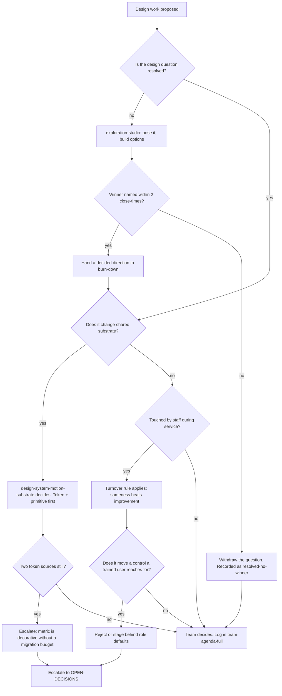

# Design — Directive

How *this* department decides. Shape differs per unit by design.

[[engineering-charter]] splits on **reversibility**, because it owns artifacts a revert
does not undo. Design owns almost nothing irreversible — a layout can be changed back.
Design's decision graph splits on a different question, the one its premortem says it will
get wrong:

> **Is this a question, or is it a row?**

A *question* is unresolved and belongs to [[exploration-studio-charter]], where most
output is correctly thrown away. A *row* is decided and belongs to
[[ux-path-burn-down-charter]], where output must ship. Treating a question as a row means
designing in production. Treating a row as a question means re-opening settled work and
never shipping. Both failures are cheap to make and expensive to notice, so the split is
the first branch in the graph rather than a convention.

The second branch is the department's real constraint, and it is not a design constraint:
**does a staff member touch this during service?** ([[AGENT_NATIVE_UI_DECISION]]:87-95.)

## Decision rights

| Level | Decides | Examples |
|---|---|---|
| **Team** | Anything inside one team's boundary that does not change shared substrate and does not move a control used during service | A modal's copy, an empty state, a sketch's option set, the order of two adjacent catalogue rows |
| **Department** | Anything crossing two Design teams; any change to a primary metric's *definition*; the burn-down **ordering rule** | Promoting a sketch winner into the burn-down queue; a new primitive that replaces three bespoke components; declaring a section deprioritized |
| **Founder / OPEN-DECISIONS** | Commissioning authority; whether the 910 rows are a commitment or an inventory; the migration budget for a single token source; team count | Can Design commission an endpoint? Can a row be closed "will not build"? |

### Rules with teeth

**The turnover rule.** Where a change would move, rename, or re-order a control that a
trained staff member reaches for during service, **sameness outranks improvement** unless
the change is gated behind a role default. This is not conservatism; it is
[[AGENT_NATIVE_UI_DECISION]]:89-95 read literally — training is oral (*"hit the blue
button on the right"*), and an improvement that invalidates that sentence turns 5 seconds
into 30 and creates resentment. The burden of proof is on the change.

**The opposed-metrics rule.** [[exploration-studio-charter]] is measured on *resolved
questions* and [[ux-path-burn-down-charter]] on *shipped rows*. These are never combined
into a "design velocity" number, and no board in this department may display their sum.
Combining them collapses one of the two teams into the other within a quarter — measure
the studio on shipped pixels and it stops exploring; measure the burn-down on options
generated and it stops shipping.

**The unresolved-question rule.** A sketch carrying `Winner: null` for two close-times is
resolved as **"no winner — question withdrawn"**. That is a legitimate outcome and it is
recorded as convergence. What is *not* legitimate is leaving it null: 28 of 43 rows are
null today, and every one of them is a decision that was started and abandoned.

**The measurement-first rule** (inherited from [[engineering-directive]], and it applies
harder here). Four of Design's six metrics have never been read. Work against an unread
metric is scoped as **measurement**, not as improvement — because a redesign with no
before-number cannot be shown to have worked, and design is the discipline most prone to
declaring victory on taste.

**The evidence rule for the ledger.** A deferred row's "Unblocked by" cell is a **claim
about the repository**, and claims about the repository are checked against the
repository, not against memory. `UX_PATHS_CATALOG.md:49` is the standing example of what
happens otherwise.

## Escalation trigger

Escalate to `OPEN-DECISIONS.md` when **any** of these holds:

1. A deferred path's stated blocker is an **endpoint** and the burn-down team's
   commissioning authority is still undecided. Escalate the **first** instance, not the
   tenth — the fork is already open and each unescalated instance makes it easier to leave
   open.
2. A change is proposed that moves a during-service control and cannot be staged behind a
   role default (the turnover rule).
3. `design.token_source_count` is still **2** at the end of a quarter. Either a migration
   budget exists or the metric is decorative, and a decorative metric on a board is worse
   than no metric.
4. Any request to enable `UX_OPTIMIZER_ENABLED`, or any non-zero row count in
   `ux_proposals` / `ux_overrides` / `ux_learnings`. This escalates as a **decision
   incident** to [[decision-office-charter]], not as a feature request:
   [[AGENT_NATIVE_UI_DECISION]]:78 is a closed verdict and reversing it requires a
   supersede-ADR.
5. A Design artifact acquires a **launch date** as its deadline. That is the
   [[media-brand-charter]] boundary collapsing, and the first instance is the cheap one to
   stop.
6. A dispute with [[surface-portfolio-charter]] about **whether a page should exist**.
   That call is theirs; if Design is arguing it, Design is out of its lane and the
   argument belongs in the open queue rather than in a review.
7. An L0–L6 layer violation is suspected in a design proposal — e.g. a surface spec that
   assumes a table that does not exist (the §AA class, `UX_PATHS_CATALOG.md:64`). That is
   [[architecture-review-charter]]'s to find; the finding lands in `questions.md`.

**Advisory is findings-only** ([[ORG_STRUCTURE]] §3). [[red-team-charter]] and
[[architecture-review-charter]] do not approve or block Design work. They produce written
findings against a named team, and [[decision-office-charter]] is what makes the resulting
decision close rather than drift — which is, precisely, the failure mode
`UX_PATHS_CATALOG.md:49` is a monument to.
