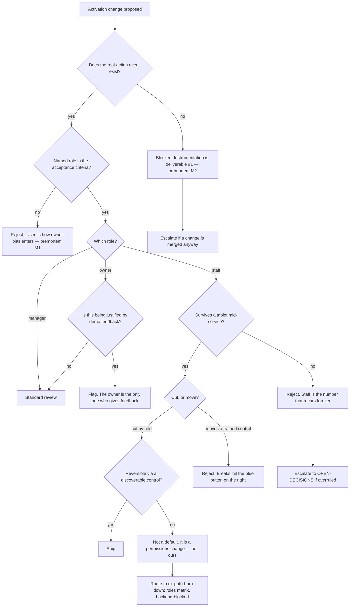

# Activation & In-Product Guidance — Directive

How *this* team decides. Shape differs per unit by design.

Its siblings decide about surfaces. This team decides about **people arriving at a
surface**, and the population is not one population. The graph therefore splits on role
before it splits on anything else:

> **Which role is this for, and does it survive a tablet at 4pm?**

The second half is the constraint the founder's own business review already established
([[AGENT_NATIVE_UI_DECISION]]:87-95): turnover is permanent, training is oral, and muscle
memory during service is a performance budget. A first-run design that works on a laptop in
a sales call and fails on a tablet during service has failed, and it will look successful
in every review it is shown in.

## Decision rights

| Level | Decides | Examples |
|---|---|---|
| **Team** | What a role sees by default; when a tip or tour fires; first-run copy and sequence; whether a change is staff-safe | Hiding Studio from staff by default; per-page first-visit guidance; reordering `/get-started` steps |
| **Department** | The definition of "a real action"; whether activation work outranks burn-down work in a given close-time | Adopting *first non-onboarding mutation* as the event |
| **Founder / OPEN-DECISIONS** | How much surface staff may lose; client-side defaults without a permissions backend; user- vs account-level activation; whether this team belongs in Design at all | The four questions the team cannot answer for itself |

### Rules with teeth

**The role rule.** Every activation change names a role in its acceptance criteria. *"User"*
is not a role. This is the mechanical guard against
[[activation-in-product-guidance-premortem]] M1, because owner-bias never arrives announced
— it arrives as an unqualified noun.

**No averaging.** Three activation numbers, published separately, forever. Averaging will be
proposed as a simplification by someone acting in good faith, and it hides staff behind
owner. If a summary can show only one number, it shows **staff**.

**Instrumentation first.** No first-run change ships before the real-action event exists.
This blocks obviously-good work in week two, which is the point: a change with no
before-number cannot be shown to have worked, and activation is the domain most prone to
declaring victory on a demo.

**Cuts yes, moves no.** Hiding a control by role is a **cut** and is this team's mandate.
Relocating or renaming a control a trained user reaches for is a **move**, and it breaks the
oral-training sentence that spreads the product inside an account. The two feel similar in a
design review and are opposite in a restaurant.

**Every default is reversible.** A role default must leave an explicit, discoverable route
to the full product. That is what *deterministic, with no telemetry*
([[AGENT_NATIVE_UI_DECISION]]:100-103) buys: a cut that is cheap to argue for because it is
cheap to undo. A cut that cannot be undone by the user is not a default — it is a permissions
change, and permissions are not ours.

**Defaults are not permissions.** Role **defaults** are client-side and unblocked. The roles
**matrix** is backend, schema-blocked (§O log, `UX_PATHS_CATALOG.md:62`), and belongs to
[[ux-path-burn-down-charter]]. Conflating them makes a week-sized deliverable inherit a
quarter-sized blocker — [[activation-in-product-guidance-premortem]] M3.

**Execute resolved decisions; do not re-explore them.** Sketch 051 named
*"B — first-visit overrides session cap"*; sketch 050 named *"C — Hybrid"*. Re-opening a
resolved question is how a quarter is spent agreeing with a decision already made. New
questions go to [[exploration-studio-charter]]; resolved ones get built.

**No personalization.** Not adaptive layout, not per-user learning, not
`UX_OPTIMIZER_ENABLED`. [[AGENT_NATIVE_UI_DECISION]]:78 is a closed *"don't build"* verdict.
Deterministic role defaults are the recommended alternative from the same review, and the
distinction is load-bearing: one is decided by a human once, the other by a model
continuously.

## Escalation trigger

Escalate to `OPEN-DECISIONS.md` when **any** of these holds:

1. A first-run change is merged before the real-action event exists. The first instance —
   the rule dies at the first exception or it does not die at all.
2. A proposed cut is softened to *"collapsed by default"* or *"moved lower"* rather than
   accepted or rejected. Softening is how a cut dies without anyone having to reject it
   (premortem M5).
3. `design.role_default_coverage_pct` is still **0** at the end of the first quarter. A
   business review scoped this at *"a week"*; a quarter at zero means the deliverable is
   being blocked by something nobody has named.
4. Role defaults are declared blocked on backend work. They are client-side. If the
   distinction is rejected, say so explicitly — the *"a week"* scoping was then wrong and
   the team's plan needs rebuilding, not adjusting.
5. Activation work is repeatedly deprioritized below burn-down work. Both live in
   [[design-charter]]; a standing preference is a department allocation decision, not a
   sprint-by-sprint outcome.
6. Anyone proposes measuring activation with a single averaged number, including a founder
   or a board deck. Escalating a *reporting* choice looks pedantic and is not: it is the
   exact mechanism of premortem M1.
