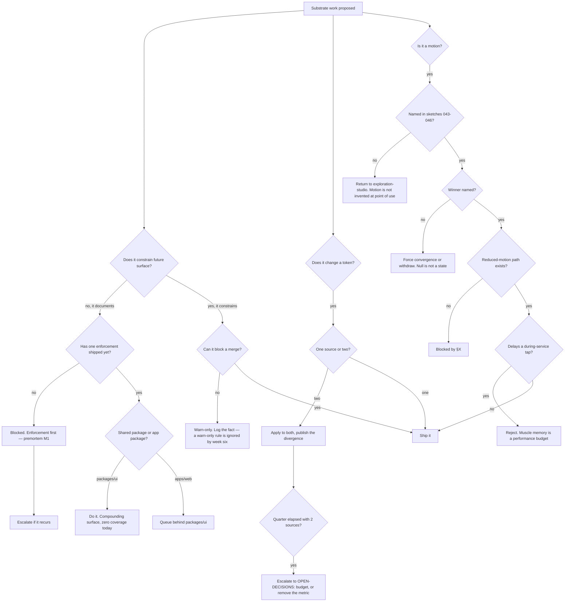

# Design System & Motion Substrate — Directive

How *this* team decides. Shape differs per unit by design.

This team's decision graph splits on a question none of its siblings have to ask, because
none of them ship anything another team is forced to use:

> **Will this constrain the next surface, or only describe the last one?**

Everything downstream follows from that. A story describes. A lint rule constrains. Both
are useful; only one of them changes what happens next, and a team whose customers are
other teams must spend its scarcest quarter on the second.

## Decision rights

| Level | Decides | Examples |
|---|---|---|
| **Team** | Primitive APIs and states; token values within an agreed scale; which §X rule lands next; whether a motion spec is implementable | Adding a `size` variant; picking reduced-motion as the first enforcement; rejecting a bespoke component in review |
| **Department** | The enforcement-before-documentation order; the primitive-request SLA to [[ux-path-burn-down-charter]]; whether a motion language exists at all | Changing the ordering rule; accepting "no signature motion" as the answer |
| **Founder / OPEN-DECISIONS** | Migration budget for one token source; whether this team can **block a merge**; Storybook runner scope for `packages/ui` | The three things the team cannot decide without spending someone else's time |

### Rules with teeth

**Enforcement-before-documentation.** No Storybook page ships before one CI enforcement
does. This is the single rule that prevents [[design-system-motion-substrate-premortem]] M1,
and it will feel wrong — documentation is easier, more visible, and more requested. Ship
the constraint anyway.

**Shared-package-first.** `packages/ui` is documented before `apps/web/src/components/ui/`
is finished, even though the latter is 5/18 done and the former is 0. Gaps in the shared
package compound across two apps; gaps in the app package do not.

**Token parity.** While two sources exist, any token change is applied to **both**, and the
divergence list is published monthly by name. If a change cannot be applied to both, that
is a divergence event and is recorded as one — silently skipping `apps/mobile` is how the
sources drift past the point where unification is a migration.

**Motion is never invented at the point of use.** A motion must be named in sketches
043–046 with its trigger / motion / haptic / anti-gimmick clauses, and must carry a
reduced-motion path from §X. A shipped animation traceable to no spec is
[[design-system-motion-substrate-premortem]] M5 arriving.

**The turnover rule, applied to primitives** ([[AGENT_NATIVE_UI_DECISION]]:87-95). A
"better" control that moves, renames, or slows a during-service interaction is worse than
the current one. Motion that adds latency to a tap a somm makes at 4pm with a driver
waiting is a **cost**, not a delight. The anti-gimmick clauses already in 043–046 were
written in this spirit; they are binding, not decorative.

**No stale brand in code.** `MANIFEST.md`'s "Design Direction" still says *"WineOps AI"*.
Retiring the string belongs to [[media-brand-charter]]; **not propagating it into a token
name, Storybook title, or component comment belongs here**, and a review that lets one
through is a defect.

**No Next.js assumptions.** `apps/web` is a Vite SPA with `react-router-dom`
(`apps/web/package.json:8,55,94`). A primitive that assumes file-system routing, server
components, or `next/image` is rejected in review regardless of quality.

## Escalation trigger

Escalate to `OPEN-DECISIONS.md` when **any** of these holds:

1. **One quarter elapses with `design.token_source_count` still at 2** and no migration
   plan. The escalation asks for exactly one of two things: a budget, or permission to
   delete the metric. A number that never moves while sitting on a board is worse than an
   absent one.
2. A design lint must **block** rather than warn, and blocking has not been authorized.
   A warn-only rule is ignored by week six and then cited as evidence that linting does not
   work.
3. §X has not converted from prose to enforcement by the end of the first quarter. That
   invalidates the department's stated reason for not creating an accessibility team
   ([[design-charter]], non-goals), and the department should be told it has neither.
4. Sketches 043–046 still carry `Winner: null` after two close-times. Either a winner or a
   withdrawal — [[exploration-studio-charter]] owns the mechanism, this team owns the
   consequence.
5. The primitive-request SLA to [[ux-path-burn-down-charter]] is missed twice. At that
   point bespoke components are the rational choice and the compose-don't-invent rule is
   doing harm; say so rather than defending it.
6. A shipped animation is found that is traceable to no motion spec (premortem M5's
   signal).
7. The Storybook runner does not cover `packages/ui`. That makes "0 stories" partly a
   tooling fact owned by [[client-surfaces-charter]], and the split must be established
   before it becomes an excuse in both directions.
