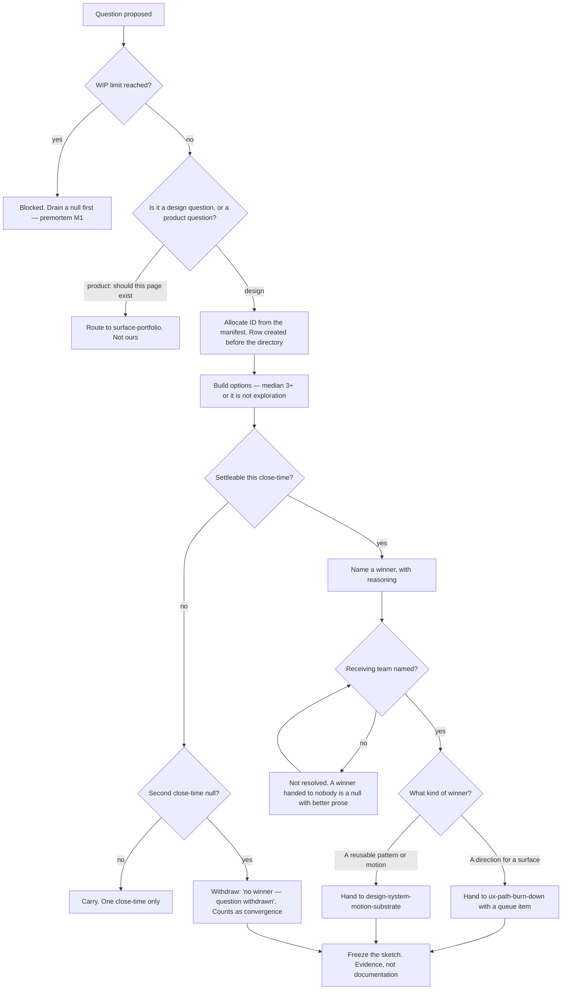

# Exploration Studio — Directive

How *this* team decides. Shape differs per unit by design.

Every other unit in this vault decides whether to **do** something. This team decides
whether a question is **settled** — and its two failure modes point in opposite directions,
so the graph has to guard both ends at once:

> **Can this question be closed — by a winner, or by withdrawal?**

Closing by withdrawal is a real answer. That is the load-bearing rule here, and it is the
one most likely to be quietly abandoned, because withdrawal feels like giving up and a
`null` feels like keeping options open. It is the reverse: 28 nulls are 28 abandoned
decisions, and each one silently transfers a design call to whoever eventually touches the
code.

## Decision rights

| Level | Decides | Examples |
|---|---|---|
| **Team** | Which question to pose; how many options; the winner; whether to withdraw; the ID | Naming *"C — Left rail"* on 048; withdrawing a settings question as low-value |
| **Department** | The WIP limit N; whether a resolved winner is re-opened; tie-breaks the team cannot settle | Reopening 042's stack choice; overriding a withdrawal |
| **Founder / OPEN-DECISIONS** | Whether withdrawal counts as resolution at all; whether the motion corpus is decided or archived | The two questions the mechanism cannot survive being answered wrong |

### Rules with teeth

**The WIP rule.** No new question while more than **N** are open. With 28 open today, the
opening posture is a **freeze**. This rule will be relaxed the first time someone has a
genuinely good idea, and the relaxation will be perfectly justified in that individual
case — which is exactly how the corpus reached 28. Relaxations are recorded on
[[exploration-studio-agenda-board]] with the reason, so the pattern is visible even when
each instance is defensible.

**The two-close-time rule.** A question may carry `Winner: null` for exactly one
close-time. At the second, it is resolved — winner or withdrawal. **Withdrawal is
convergence and is recorded as such**, never as failure. If withdrawal is ever treated as
failure, the nulls return immediately, because a null is what withdrawal looks like when
withdrawal is not allowed.

**The handoff rule.** A winner is **not resolved until it is handed off**. The manifest row
carries the receiving team and the queue item, or the row stays open. Five winners are
decided and unqueued today (050, 051, 048, 042, 033); a winner handed to nobody is a null
with better prose.

**The options-floor rule.** Median options per sketch stays at **three or more**. Two
options is a strawman and a preference. This rule exists to stop the WIP limit from
producing [[exploration-studio-premortem]] M4 — killing exploration in the name of
convergence — and it is published on the same board as the resolution rate for exactly that
reason.

**The ID-authority rule.** The manifest issues IDs, and the row is created **before** the
directory. Duplicates `038` and `048` exist because directories were created first and the
record caught up later, or did not.

**The freeze rule.** A resolved sketch is frozen. There is no legitimate reason to edit a
settled sketch: its question has ended and its HTML is evidence for an argument, not
documentation of a product. Documentation belongs to [[knowledge-documentation-charter]]
and to the code. If a resolved sketch seems to need updating, the honest move is a **new
question**.

**The no-shipping rule.** This team does not ship its winners. Sketch 038 reaching
`apps/web/src/pages/inventory/command/` is a **handoff succeeding**, not the studio
shipping. The moment the studio ships, it is a slower burn-down team and the department has
paid twice for one function.

## Escalation trigger

Escalate to `OPEN-DECISIONS.md` when **any** of these holds:

1. A question hits its second close-time and the team can settle it **neither** way —
   genuinely split, with no authority to break the tie. Today's default in that situation is
   "it stays null", which is how 28 accumulated. **This escalation is the fix for that
   default.**
2. The WIP limit has been relaxed twice in a quarter. Each relaxation is defensible; the
   pattern is not, and only the pattern is visible from outside.
3. `design.options_per_sketch_median` falls below 3 for two close-times — convergence
   pressure is killing exploration (premortem M4).
4. A winner has been unqueued for two close-times. Either the receiving team has no capacity
   — a department allocation question — or the winner is not actually actionable, which
   means the question was not really resolved.
5. Sketches 043–046 remain null after the drain. The motion corpus is the highest-value
   unshipped work in the department and its indefinite null state is a decision failure,
   not a design one.
6. A question arrives that is really *"should this page exist?"*. That is
   [[surface-portfolio-charter]]'s call; exploring it here produces a beautiful answer to a
   question this team does not own.
