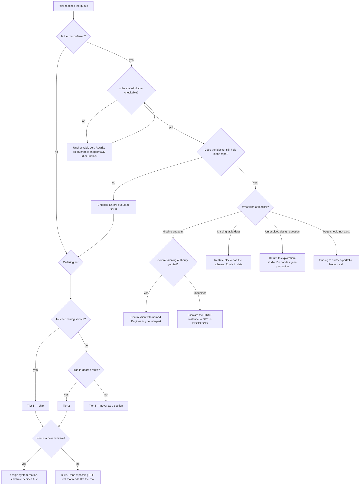

# UX Path Burn-Down — Directive

How *this* team decides. Shape differs per unit by design.

The team's decision graph is a **triage of rows**, because a row arriving at this team is
in one of four states and only one of them is "build it". The department's split
(question-vs-row, [[design-directive]]) happens upstream; here the question is narrower:

> **Is this row's stated blocker true?**

That branch comes first — before priority, before design — because
`UX_PATHS_CATALOG.md:49` proves the ledger can be confidently wrong, and every decision
made downstream of a false blocker is wasted.

## Decision rights

| Level | Decides | Examples |
|---|---|---|
| **Team** | Row priority within a tier; acceptance-criteria wording; whether a blocker cell is checkable; closing a row as done | Reordering two tier-2 rows; rewriting an unblocker cell; declaring a row's E2E test sufficient |
| **Department** | Changes to the **ordering rule itself**; promoting a section out of tier 4; adopting a new definition of done | "Ship §AA now" as a policy rather than a one-off |
| **Founder / OPEN-DECISIONS** | Commissioning authority; adding a **"will not build"** state; whether the honesty ratio outranks the close rate; test ownership | Everything the team cannot decide without changing what the catalogue *is* |

### Rules with teeth

**The false-blocker rule.** A deferred row's blocker is a claim about the repository and is
checked against the repository. `:49` is the standing example. No row is prioritized,
designed, or discussed before its blocker is verified — verification is cheaper than every
conversation downstream of it.

**The machine-checkable-unblocker rule.** An "Unblocked by" cell must name a **path, a
table, an endpoint, or an `OPEN-DECISIONS.md` ID**. Prose like *"further design work"* or
*"prioritization"* is not an unblocker; it is a deferral wearing an unblocker's clothes,
and it is how `design.deferred_unblocker_ratio` reaches 100% while meaning nothing
([[ux-path-burn-down-premortem]] M4). Uncheckable cells are **counted and published**, not
quietly fixed.

**The no-section-completion rule.** A section is never burned down as a unit. This is
counterintuitive — 100 adjacent rows look like the most efficient possible batch — and it
is written down for that exact reason. The efficiency is real and the value is not.

**The turnover rule** (inherited from [[design-directive]]). Where a row would move,
rename, or re-order a control a trained staff member reaches for during service,
**sameness outranks improvement** unless it ships behind a role default. Burden of proof
sits with the row.

**The no-design-in-production rule.** If closing a row requires a decision nobody has made,
the row goes back to [[exploration-studio-charter]] as a question. It does not get
resolved by whoever is holding the keyboard. This is the seam that keeps the two opposed
teams from collapsing into one.

**The compose-don't-invent rule.** A row that needs a new primitive stops at
[[design-system-motion-substrate-charter]] first. Every exception is one more bespoke
component nobody can find — [[design-premortem]] M4, arriving one sprint at a time.

**Definition of done.** A row is closed when there is a **passing end-to-end test that
reads like the row**: *Given I am on page X, When I `<trigger>`, Then `<outcome>`*
(`UX_PATHS_CATALOG.md:70`). Not a screenshot, not a merged PR. The corpus was written in
test shape deliberately; using it is free.

## Escalation trigger

Escalate to `OPEN-DECISIONS.md` when **any** of these holds:

1. A row is blocked on an endpoint and commissioning authority is undecided. **The first
   instance, not the tenth** — an open fork always favours the status quo, and each
   unescalated instance makes it cheaper to leave open.
2. `design.blocked_on_endpoint_count` rises for two close-times with no escalation filed.
   The rise is not the trigger; the silence is.
3. A stale blocker is found whose repair would change a section's whole status — as §AA's
   would. Repairing it silently hides how far the ledger had drifted, and the drift is the
   evidence.
4. A row's correct resolution is **"do not build this"** and the ledger has no state for
   it. Until that state exists, this escalates every time rather than being resolved by
   omission.
5. Ordering is overridden for a reason other than the tier rule — including by this team.
   An override is legitimate; an unrecorded one is [[ux-path-burn-down-premortem]] M2.
6. A row's acceptance criteria cannot be written as a trigger→outcome sentence. That
   usually means it is not a path but a project, and it belongs to
   [[surface-portfolio-charter]] or [[product-vision-charter]] rather than here.
