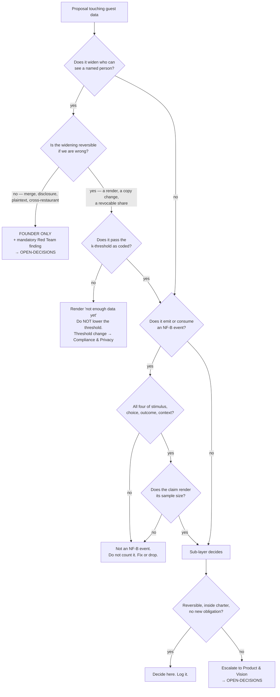

# Guest Experience — Directive

How *this* sub-layer decides. Shape differs per unit by design
([[ORG_STRUCTURE]] §4).

**The shape here is a one-way gate.** Most units decide by weighing cost against
benefit and picking the better expected value. This one cannot, because its
signature error is **irreversible**: a false guest merge is a disclosure of one
person's history to another, and no un-merge reverses a disclosure
(`20260819000000_guest_identity_minimal_slice.sql:31-35`). Expected-value reasoning
is the wrong instrument for an irreversible harm with an unbounded tail. So the
decision graph sorts on **reversibility first**, and only reversible decisions reach
a cost/benefit step at all.

## Decision rights

### This sub-layer decides, alone

- The **NF-B event contract** — what fills `stimulus`, `internal_state`, `choice`,
  `outcome`, `context` for a guest, and what does not qualify as an event at all.
- **Team activation order** and entry triggers within the four staged questions.
- **Refusals.** Declining to compute, render, or model something is always inside
  this sub-layer's authority and never requires an escalation. The asymmetry is
  deliberate: saying no is cheap and reversible, saying yes to a disclosure is not.
- Which guest-derived claims are strong enough to surface, given their n.

### This sub-layer decides, with a named reviewer

| Decision | Reviewer | Why not us alone |
|---|---|---|
| Any k-anonymity threshold value or its enforcement mechanism | [[compliance-privacy-charter]] | The unit that benefits from a personalization feature cannot neutrally assess it ([[ORG_STRUCTURE]] §3). |
| Consent notice wording, purpose strings, capture channels | [[compliance-privacy-charter]] | We own the record's *shape*; they own what it must say. |
| Photo-reuse consent contract | [[compliance-privacy-charter]] + [[legal-charter]] | Reuse of a person's content for a third party's commercial promotion is a licence question. |
| NF-B research-log retention and rollup | [[data-charter]] under OD-11 | The research store is theirs; the guest obligation is ours. |

### This sub-layer **cannot** decide — founder only

1. **Any weakening of the merge rule.** *Exact verified key, a human assertion, or
   nothing.* No threshold, not a high one. A proposal to change this requires a
   [[red-team-charter]] finding attached before it is discussed, and lands in
   [[OPEN-DECISIONS]] regardless of outcome. This is [[guest-experience-premortem]]
   M2 made structural.
2. **Cross-restaurant identity linkage.** Today it is prevented by arithmetic — the
   per-restaurant pepper (`:338-367`) means the same phone number at two restaurants
   produces two different hashes. Undoing that is a deliberate migration, which is
   precisely the moment the legal question must be asked (`:195-201`).
3. **Lowering the k-threshold below its founding value**, for any reason, including
   a pilot.
4. **OD-07 (Beli)** — and this sub-layer explicitly disqualifies itself from
   recommending, because an independent build maximises its own scope.
5. **Advertising as a revenue model**, and its boundary against the promise already
   shipped at `apps/web/src/components/settings/ServicesPermissions.tsx:41,249`.
   Pricing is separately founder-deferred; no pricing model is proposed here.

## Escalation trigger

Escalate **immediately**, without waiting for a review cycle, when any of these is
observed:

- A proposal for guest matching containing the words **"confidence"**,
  **"threshold"**, **"fuzzy"**, or **"just for the pilot"**. The vocabulary is the
  signal; by the time there is a design doc the framing has already won.
- A diff touching any of the four PII guards —
  `scripts/check_no_guest_name_matching.sh`, `scripts/check_no_raw_guest_channels.sh`,
  the `revoke all on public.guest_identifiers` at `:485`, or `guest_pepper()`.
  Each should be rare enough that each one is an event.
- The k-threshold appearing as an env var, a settings row, or a per-restaurant
  override. **Configurability is the mechanism; the lowering is only its first use.**
- A guest-derived claim rendering without its sample size.
- Any NF-B counting change that raises a number without raising the underlying
  event count.
- `nf_b.ops_conversion` at zero for two consecutive quarters → charter returns to
  [[product-vision-charter]] for a **scope decision**, not a funding decision.

Escalations land in this sub-layer's `questions.md` and, where they imply a
decision, in [[OPEN-DECISIONS]] via [[decision-office-charter]]. Advisory functions
produce findings; they do not approve or block ([[ORG_STRUCTURE]] §3).
