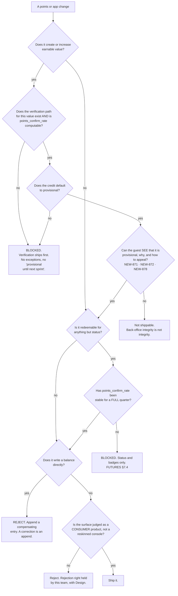

# Consumer App & Points Economy — Directive

How *this* team decides.

**The shape is an ordering constraint plus an adversarial posture.** Two things make
this team's decisions different from its siblings'. First, the **build order is
itself the safety property** — verification before earning — because a points economy
built in the natural order is unsafe no matter how well each part is built. Second,
the opponent **adapts**: every other unit in this sub-layer decides against error, and
error does not read the defence and change.

## Decision rights

### This team decides, alone

- **Earning rules** within [[FUTURES]] §7.2, and their point values.
- **The abuse posture** — rate limits, attribution checks, device signals, thresholds
  for holding a credit, and the appeal path.
- **Holding credits.** Holding is always inside authority and never needs approval;
  `NEW-878` requires held-plus-appeal, never silent zeroing.
- **A rejection right over any consumer surface** that reads as a reskinned operator
  console. Exercised with [[design-charter]]; the judgment is this team's because the
  team that owns a design system should not be asked to rule on whether its own system
  fits a new audience.
- What the guest can see about their own ledger.

### With a named reviewer

| Decision | Reviewer |
|---|---|
| Device fingerprinting technique, fraud tooling | [[security-charter]] |
| Ledger write mechanics, idempotency, durability | [[engineering-charter]] |
| Consumer design language and motion | [[design-charter]] |
| Anything a restaurant sees about guests | [[guest-value-monetization-charter]] |
| Consent capture inside our surfaces | [[guest-identity-consent-charter]] |

### **Founder only**

1. **Shipping earnable points before the verification path exists.** The one rule that
   would end the program if broken ([[consumer-app-points-economy-premortem]] C1).
2. **Any redemption beyond status and badges** before `nf_b.points_confirm_rate` has
   been stable for a full quarter. [[FUTURES]] §7.4.
3. **Cash-value or platform-funded rewards** — currently a [[FUTURES]] §10 non-goal
   (`FUTURES.md:282`).
4. **Starting implementation while OD-07 is open.** The gate is binary and this team
   does not soften it into "provisionally scoped".
5. **Any direct balance write**, including a support tool. Corrections are appends.

## The two rules that do not bend

### 1. Verification before earning

> The confirmation state machine, one verified-visit channel, and the review quality
> gate exist and are **measured** before the first point is earnable.

Not sequencing preference — a safety property. The natural build order is the reverse
because points demo and verification does not, so nothing except an explicit gate
reverses it. And the failure it prevents is not proportional: restaurant-funded perks
are **opt-in per restaurant**, so one perk redeemed by an abuser is a story that
reaches every operator in the city, and the program dies by word of mouth rather than
by metric.

### 2. A control that has never fired is untested, not proven

Abuse defence is a **posture**, reviewed weekly, tuned against **held credits and
appeal outcomes** — the adversary's own feedback channel and the highest-signal data
this team will get. It is never a checklist with a completion date. The corollary is
the escalation below: a stable hold rate under rising volume is a *warning*, not
reassurance.

## Escalation trigger

- **`nf_b.abuse_hold_rate` flat or falling while volume rises.** The
  [[consumer-app-points-economy-premortem]] C2 tell — it means the detector's
  distribution stopped changing while the attacker's did not.
- **Any credit path defaulting to `confirmed`.**
- **Any code path writing a balance** rather than appending a credit event.
- **`nf_b.points_confirm_rate` not computable** — not low, *not computable*. It means
  the confirmation state machine does not exist and points are already earnable.
- **A consumer surface built primarily from staff components**, where the reuse
  decision was made on build speed.
- **Any implementation work while OD-07 is open.**
- **Volume reported without the confirm rate beside it.** They are one number in two
  parts; separating them is how farming reads as engagement.
