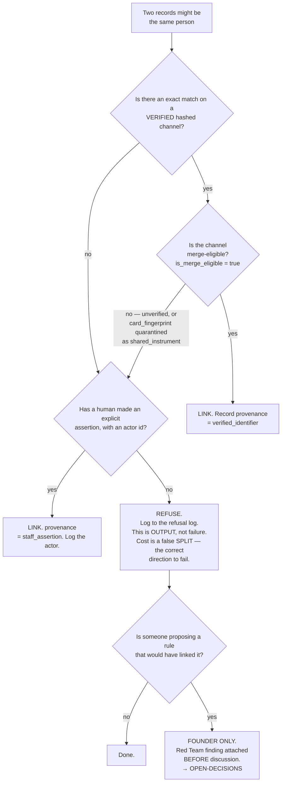

# Guest Identity & Consent — Directive

How *this* team decides.

**The shape is a refusal ladder.** Every other decision graph in the org asks *should
we do this?* This one asks *is there anything that proves it?* — and the default
answer is no. The rule the whole team exists to hold is one sentence from the
migration (`:35`):

> **Exact verified key, a human assertion, or nothing.**

Not a high threshold. **No threshold.** The distinction matters because a high
threshold is a number, and a number is negotiable.

**`inferred_reservation` never reaches the LINK box.** It is a permitted
`link_source` value (`:225-227`) precisely so that inference can be *recorded* — but
the migration is explicit that it *"may never be treated as evidence that two guests
are the same"* (`:223-224`). Generation and decision stay separate. A directive that
allowed inference to promote itself would have re-derived the exact failure the
architecture was built to prevent.

## Decision rights

### This team decides, alone

- **Every refusal.** No approval, no review, no escalation. Refusing is always
  inside authority, and the asymmetry is deliberate: a false split costs a missing
  row, a false merge costs a disclosure.
- Which of the four capture channels (`:61-62`) is live, and where.
- The refusal log's shape and what counts as a reason.
- Whether a proposed integration may persist a personal field, and in what form.
- **A veto on any diff touching the four PII guards.** Not a review — a veto. Held by
  this team and overridable only by the founder.

### With a named reviewer

| Decision | Reviewer |
|---|---|
| Consent notice wording, purposes, capture-channel semantics | [[compliance-privacy-charter]] |
| A new `channel_type` in the CHECK constraint (`:128`) | [[compliance-privacy-charter]] + [[security-charter]] |
| Bumping `guest_canonicaliser_version()` — it re-derives every hash and re-runs the merge gate (`:262-266`) | [[security-charter]] |
| Erasure receipt contents | [[compliance-privacy-charter]] |

### **Founder only** — and this list does not grow

1. **Any weakening of the merge rule.** Including, and especially, anything framed as
   a *high-confidence* match, a *pilot exception*, or a *temporary* threshold.
   **A [[red-team-charter]] finding must be attached before the proposal is
   discussed**, not after it is drafted — the ordering is the control, because a
   proposal that arrives with its rebuttal already written cannot win on framing
   alone. [[guest-identity-consent-premortem]] F1.
2. **Building a merge queue, a resolution UI, or candidate generation.** Listed as
   *"can wait"* at `:22-25`, and the reason is not capacity: a queue needs candidates,
   candidates need a similarity score, and a similarity score is the threshold
   arriving through a side door.
3. **Cross-restaurant identity linkage.** Prevented today by arithmetic, not policy
   (`:338-367`, `:195-201`). Undoing it is a deliberate migration, which is exactly
   the point at which the legal question must be asked.
4. **Adding a `deleted_at` to `guests`.** Structurally wrong here — the app connects
   as `service_role` with `rolbypassrls`, so a soft-deleted guest is still returned by
   every query the application makes (`:71-78`, `:112-117`).
5. **Removing or weakening any of the four PII guards.**

## Escalation trigger

Escalate immediately, without waiting for a cycle:

- **Vocabulary.** *Confidence · threshold · fuzzy · high-confidence · just for the
  pilot · temporarily* — applied to guest matching, in any channel. The words are the
  earliest signal there is; by the time there is a design doc the framing has won.
- **A merge queue proposal**, under any name — reconciliation, review inbox,
  duplicate resolution.
- **A first allowlist entry** in `check_no_guest_name_matching.sh:37-38` or
  `check_no_raw_guest_channels.sh`. Both ship empty. The first entry is the moment the
  property stops being absolute, and it may be perfectly correct — but it is never
  routine.
- **A new inbound integration** (POS, reservation, loyalty, email) landing without a
  declaration of what personal fields it persists.
- **Two consent copy strings sharing one `consent_notice_version`.**
- **A falling `nf_b.unverified_identifier_share`** with no change that explains it —
  it means something started treating unverified identifiers as eligible.

## The standing answer

When asked why coverage is low, this team's answer is not an apology. It is the
refusal count, the reason distribution, and one sentence:

> The cost of a gap is a false split, which is a missing row. The cost of a guess is
> a disclosure, which is permanent. We are failing in the correct direction, on
> purpose, and the direction was chosen before the pressure existed.
