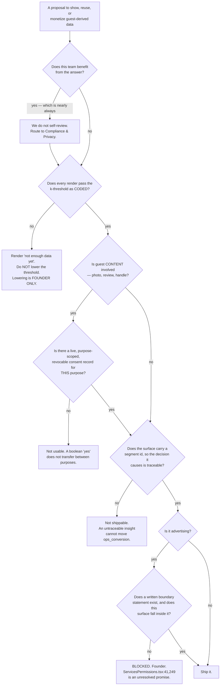

# Guest Value & Monetization — Directive

How *this* team decides.

**The shape is a conflict-of-interest protocol.** Every other unit's directive routes
decisions by risk. This one routes them by **who benefits**. This team's customer is
the restaurant, which inverts every incentive in the rest of the sub-layer, so the
governing question on any decision touching guest data is not *is this safe?* — a
question this team is structurally unqualified to answer about itself — but **who
reviews this, and is it someone who does not profit from the answer?**

## Decision rights

### This team decides, alone

- **Refusing to render.** Always inside authority, never needs approval. Below k, the
  answer is the empty state, and choosing it is not a decision that needs defending.
- Segment **presentation** — what a digest looks like, what an export contains, above
  the threshold.
- Whether an insight is strong enough to surface at all.
- **Traceability requirements** on restaurant-facing recommendations.
- The advertising **product shape** — inventory model, placement rules — within a
  boundary statement that already exists. Never the boundary itself, and never the
  price.

### With a named reviewer — and the list is long on purpose

| Decision | Reviewer | Why not us |
|---|---|---|
| The k-threshold value, and its enforcement mechanism | [[compliance-privacy-charter]] | *The department that benefits from a personalization feature cannot neutrally assess it* ([[ORG_STRUCTURE]] §3) — that sentence describes this team precisely. |
| Photo reuse scope, revocation propagation, licence | [[legal-charter]] + [[compliance-privacy-charter]] | Reuse of a person's content for a third party's commercial promotion is a licence question, not a product one. |
| Segment methodology and defensibility | [[analytics-bi-charter]] | They own how a segment is computed; we own that none renders below k. |
| Anything that changes what a guest sees about their own data | [[consumer-app-points-economy-charter]] | Their customer is the guest. |
| Advertising placement in a guest surface | [[product-vision-charter]] + [[design-charter]] | A revenue surface in a consumer product is a product decision before it is a revenue one. |

### **Founder only**

1. **Lowering the k-threshold below its founding value.** For any reason, including a
   pilot, a demo, a staging environment, or a single customer. This is
   [[guest-value-monetization-premortem]] V1 and it is the reason this directive
   exists.
2. **Any "admin sees raw" path.** There is none, and creating one is not a
   configuration change.
3. **The advertising boundary** against
   `apps/web/src/components/settings/ServicesPermissions.tsx:41,249`.
4. **Pricing, in any form** — and it is separately **founder-deferred**, so this team
   proposes nothing.
5. **PROD-F3** — whether this team sits here or in Commercial.

## The three rules that do not bend

### 1. The k-threshold is a constant in code, not configuration

Not an env var. Not a settings row. Not a per-restaurant override. Not "moved to
config for testability." **Configurability is the mechanism of the failure; the
lowering is only its first use**, and the config change will arrive looking like good
hygiene. Enforced by a CI guard in the shape of the four guest PII guards that already
work in this repo.

And the corollary that makes it survivable: **the sub-k empty state is designed
early**, so *"not enough data yet"* is a normal, shippable, unembarrassing state. Most
of the pressure to lower a threshold is the pressure not to look broken.

### 2. Consent is a purpose, not a boolean

Catalog enrichment, restaurant promotion, and paid placement are **three different
purposes**, and a single "yes" does not transfer between them. Modelled on
`consent_purpose` / `consent_notice_version`
(`20260819000000_guest_identity_minimal_slice.sql:54-64`) for the reason given at
`:55-56`: a boolean cannot answer *what was this person told, on what date, and can we
prove it*. Enforced **at the pipeline**, not at the surface — the pipeline is where a
photo actually gets used, and the surface is where somebody remembers to check.

### 3. We do not review ourselves

Every privacy gate this team operates is reviewed by [[compliance-privacy-charter]].
Structural, not courtesy. If that reviewer proves too thin for this team specifically,
that is **evidence for revisiting the Ethics & Responsible AI advisory decision**
([[ORG_STRUCTURE]] §3, considered and not adopted) — and this team is obliged to say
so out loud rather than quietly self-review into the gap.

## Escalation trigger

- The k-threshold appearing as an **env var, settings row, or per-restaurant
  override**.
- **`nf_b.sub_k_render_attempts` rising.** The pressure is measurable *before* anyone
  proposes anything, which is the only useful time to see it.
- A guest photo reaching the enrichment pipeline before `nf_b.photo_consent_rate` is
  instrumented — the answer to *"did they agree?"* then becomes *unknown*, which is
  worse than *no* in every conversation that follows.
- Photo consent modelled as a boolean.
- **Any guest-facing advertising design referencing `provider_promotions`,
  `/promotions`, or `provider-intelligence.service.ts`.** Supply-side deals. Different
  subject, different table.
- **`nf_b.ops_conversion` replaced by a testimonial** in any review. The substitution
  of a story for a count is how V3 stays invisible.
- Any advertising implementation while the boundary statement is unwritten.
- Two consecutive quarters of `nf_b.ops_conversion` at zero → the sub-layer's charter
  returns to [[product-vision-charter]] for a scope decision.
