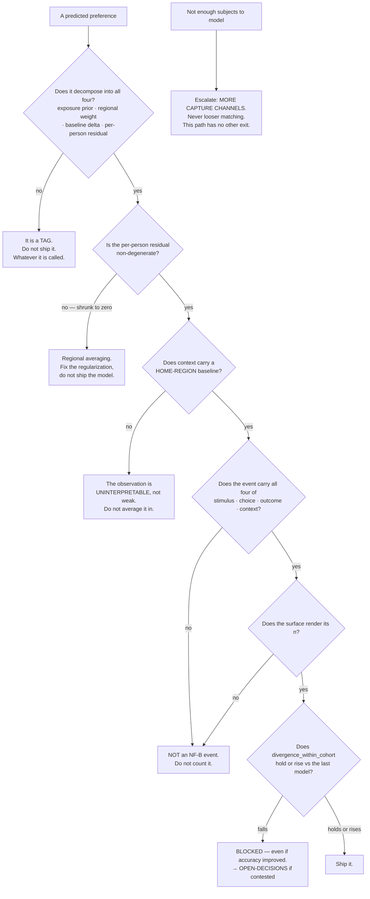

# Taste Fingerprint (NF-B) — Directive

How *this* team decides.

**The shape is a decomposition test.** Other units decide whether to act. This team's
central decision is repeated hundreds of times and is always the same question:
**is this a mechanism or a tag?** A tag summarises the past. A mechanism says why,
predicts an unseen stimulus, and can be wrong in an informative way. The test is not
philosophical — it is structural, and it is applied to every predicted preference
before that prediction is allowed to reach a surface.

## Decision rights

### This team decides, alone

- **The NF-B event contract** — what fills each of the four fields, and what
  disqualifies an event entirely.
- **What does not count.** A rating with no identified dish has no `stimulus` and is
  not an event. Refusing to count is always inside this team's authority and never
  needs approval.
- The mechanism representation: compound-overlap encoding, dose–response shape,
  decay asymmetry, satiation inversion point.
- Whether a model version ships, subject to the divergence gate below.
- The standing statement of what the corpus does and does not support.

### With a named reviewer

| Decision | Reviewer |
|---|---|
| Modelling technique, regularization strategy, evaluation design | [[research-math-charter]] |
| Research-log schema additions, retention, rollup | [[data-charter]] under OD-11 |
| Anything rendered to a restaurant rather than to the guest | [[guest-value-monetization-charter]] |

### **Founder only**

1. **Opening the food track.** Requires A15 reversed **and** a dish-identity referent.
   Corpus depth alone does not open it — a million checks of raw strings is a million
   uncountable events.
2. **Relaxing `nf_b.event_completeness`** — i.e. counting an event missing one of the
   four fields. This is the metric's only failure mode, and it is a definitional
   change, not a tuning decision.
3. **Overriding the divergence gate** (see below).

### ⛔ This team never decides, and never proposes

**A change to the guest merge rule. In any form. For any reason.**

This is the only absolute prohibition in this directive, and it is aimed at this team
specifically because this team is the *origin* of the pressure
([[guest-identity-consent-premortem]] F1, [[taste-fingerprint-premortem]] T3). The
proposal will not arrive as an attack on privacy; it will arrive as unblocking, in a
sentence where every clause is true. So the rule is not "be careful about proposing
it" — it is that the proposal is **out of scope for this team to author**.

The escalation path when subjects are insufficient has exactly one exit:
**more capture channels**, owned by [[guest-identity-consent-charter]]. Never looser
matching. Naming the merge rule as a *constraint* is correct. Naming it as a *cause*
of low coverage has already reframed it as the variable, and is escalated.

## The divergence gate

> **A model version that reduces `nf_b.divergence_within_cohort` relative to its
> predecessor does not ship — even if accuracy improves.**

This is deliberately the most uncomfortable rule this team holds, because the
situation it governs looks exactly like success: better accuracy, better fit, cleaner
demo. What has actually happened is that region explained more variance, individual
residuals were shrunk toward zero as noise, and the system became a lookup table on
region with a personalization label on the button
([[taste-fingerprint-premortem]] T4).

The gate exists because the founder's constraint is a **structural** requirement, not
a quality target: two siblings raised in the same house diverge, so the model must be
able to represent divergence, so the per-person residual must be **protected from
regularization by design** rather than preserved by good intentions. Overriding the
gate is founder-only and lands in [[OPEN-DECISIONS]].

## Escalation trigger

- `nf_b.divergence_within_cohort` falling while accuracy rises. **The T4 tell**, and
  it looks like success on every other metric.
- `nf_b.novel_stimulus_hit_rate` not instrumented, or quietly dropped from reporting.
  A model that declines to be measured on unseen stimuli has already answered the
  mechanism-or-tag question.
- Vocabulary drift: *category*, *label*, *tag*, *bucket* appearing where *weight*,
  *exposure*, *baseline*, *residual* belong.
- Any NF-B claim rendering **without its n**.
- A top recommendation that is also the corpus's modal item.
- Any pressure — from anywhere, including inside this team — to count an incomplete
  event.
- Any request for a food taste graph before A15 reverses.
