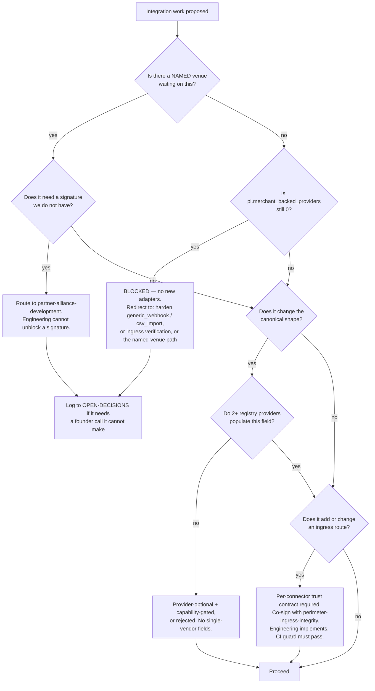

# Partnerships & Integrations — Directive

How *this* department decides. The shape is a **gate, not a funnel**: almost every question
that arrives here is really the question *"does this get us closer to one real merchant, or
does it just get us closer to a complete registry?"*

## The primary gate

## Decision rights

### Decided here, without escalation

| Decision | Held by |
|---|---|
| Provider **sequencing** within the registry — which adapter next, once the gate opens | department, with [[pos-bridge-charter]] |
| Whether a canonical-shape change is provider-neutral | [[pos-bridge-charter]] under the two-provider rule |
| The **content** of a per-connector trust contract — what data flows, under what auth, with what verification | [[connector-platform-trust-charter]] |
| Whether a route is ingress, management, or simulator | [[connector-platform-trust-charter]] |
| Deprecating or downgrading a provider's registry status | department |
| Whether to accept a distributor's data in whatever format they already send | [[supplier-distributor-network-charter]] |

### Decided elsewhere — we supply evidence, not verdicts

| Decision | Owner | Our input |
|---|---|---|
| Whether a control is correctly implemented | [[perimeter-ingress-integrity-charter]] (Security SEC-2) | The per-connector contract it is measured against |
| Runtime code, CI wiring | [[engineering-charter]] | The guard specification |
| Pricing of any integration or partnership | **founder — deferred** | nothing; we do not propose |
| Who to contact first | **founder — deferred** | nothing; we do not propose |
| OD-07 (Beli) | **founder** | the option memo that makes it answerable |
| CM-F3 (distributor connectivity) | **founder**, with Sales | the boundary memo and the proposed seam |

## The three standing rules

These exist because [[partnerships-integrations-premortem]] says the department fails
without them. Each is a rule, not a principle — it can be checked.

1. **No new provider adapter while `pi.merchant_backed_providers == 0`.**
   Permitted instead: finishing an adapter a *named venue* is waiting on; hardening
   `generic_webhook` / `csv_import`; ingress verification work. Counters M1.
2. **Two-provider rule.** No field enters `pos-types.ts` unless ≥2 registry providers
   populate it, or it is provider-optional behind a capability flag
   (`CAP_FULL` / `CAP_NO_TABLES` / `CAP_PULL`, `pos-provider.registry.ts:17-25`).
   Counters M5 (accidental Toast lock-in).
3. **No ingress route ships without a trust contract and a passing CI guard.**
   Counters M2. The guard is the deliverable; the fix alone is not.

## Escalation triggers

Escalate to `OPEN-DECISIONS.md`, and to [[decision-office-charter]] where noted:

| Trigger | Escalate as |
|---|---|
| Work is blocked on a counterparty signature for >30 days | Named blocker, with the provider key and `registry:line` |
| A canonical-shape change is needed that only one provider populates **and** cannot be capability-gated | Shape fork — this is M5 arriving |
| A connector needs a posture weaker than fail-closed | **Never decided here.** Straight to Security + founder |
| **OD-07 untouched for 60 days while guest-experience commits continue** | *Decision-by-drift* finding → [[decision-office-charter]], naming the commits |
| **CM-F3 and OD-21 both open at day 90 with `pi.live_counterparties` = 0** | Team-dissolution proposal for [[supplier-distributor-network-charter]] — see premortem M4 |
| An upstream doc contradicts verified code | Correction, carried back to the source doc in the same week |

## How this department handles being wrong

Three upstream corrections were found in the first session of reading
(see [[partnerships-integrations-charter]] — registry count, the "0 of 32" claim,
vendor-portal's classification). That rate is expected to continue, because this department
sits where docs and code drift apart fastest.

**Standing rule: a correction is carried back to the source document in the same week it is
found, with the `path:line` that disproves it.** A department that finds errors and does not
repair the source is generating private knowledge, which is worse than none.
