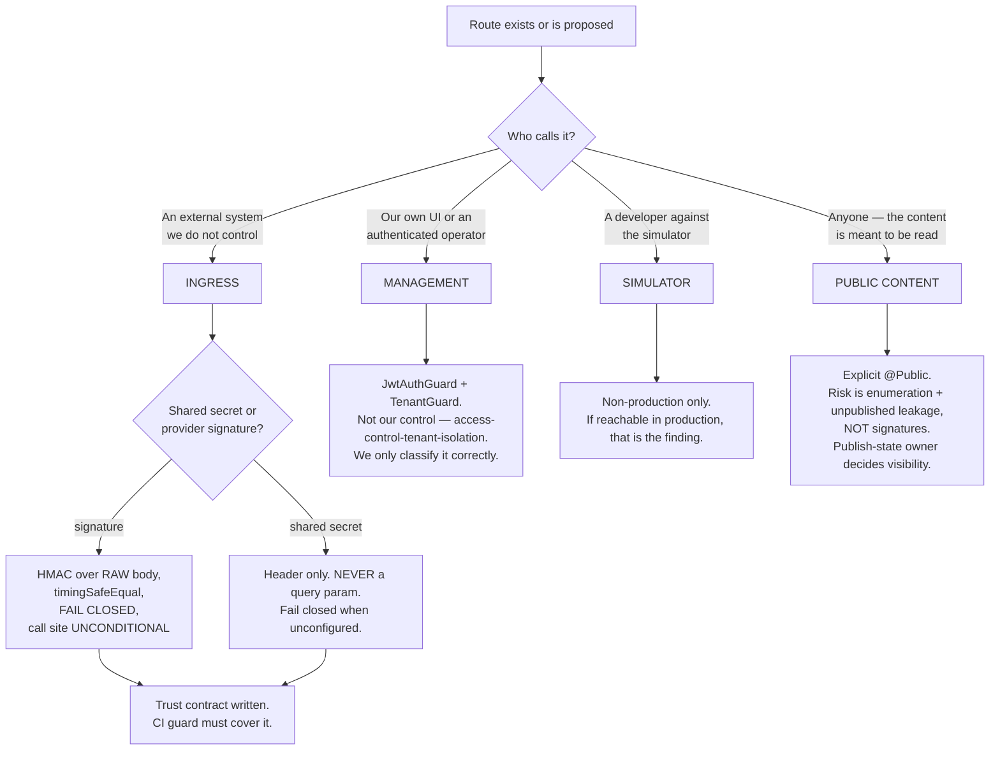
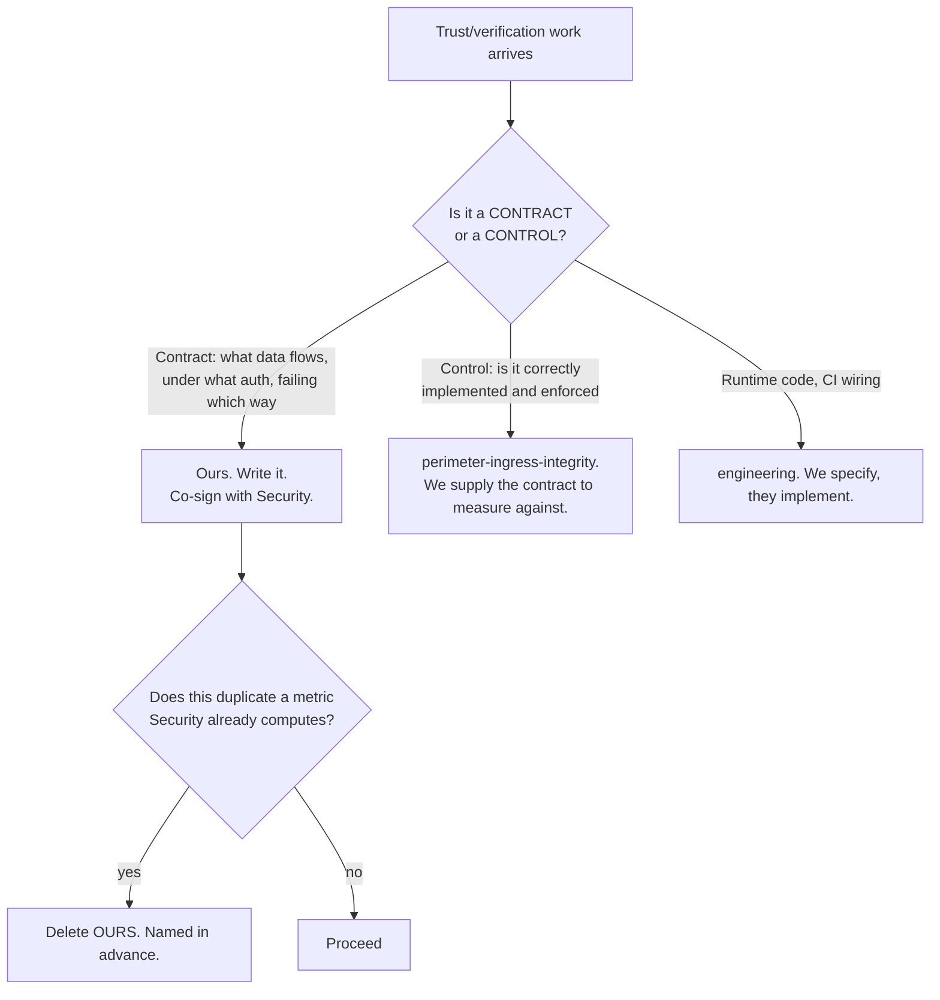

# Connector Platform & Trust — Directive

How *this* team decides. The shape is a **classifier**, because almost every question here
reduces to: *what kind of route is this, and therefore what control does it need?* The
repo's history shows this is exactly the judgment that per-module labelling gets wrong — in
both directions.

## Graph A — what control does this route need?

**Node C2's last clause is the live defect.** `toast.service.ts:189` verifies only
`if (signature && timestamp)` — a fail-closed helper behind a fail-open call site. A correct
verifier that can be skipped is not a control.

**Node F is why per-module labels fail.** `ENDPOINTS.md` originally prescribed signature
verification for `vendor-portal`, a public catalogue page — the wrong control entirely, as
Security's SEC-2 found. It has since been corrected (`:656`). The same file still labels
`simpos` — a local simulator — a webhook module. **Both errors are the same error: a label
applied to a module rather than a judgment applied to a route.**

## Graph B — do we build this, or does someone else?

**The deletion rule is committed in advance and names which side yields.** A boundary where
both units believe they might be the one to concede is not a boundary — it is the setup for
[[connector-platform-trust-premortem]] M2.

## Decision rights

### Held by this team

| Decision | Note |
|---|---|
| **Route classification** — ingress / management / simulator / public content | Graph A. Route-level, never per-module |
| The **per-connector trust contract** | What flows, under what auth, with what verification, failing which way |
| The **CI guard specification** | Engineering implements it |
| Connector catalogue membership and scope declarations | |
| Credential lifecycle policy — issue, encrypt, rotate, revoke | |
| Deprecation policy for a connector | |
| Connection health definition | |

### Not held here

| Decision | Owner |
|---|---|
| Whether a control is correctly implemented | [[perimeter-ingress-integrity-charter]] |
| `JwtAuthGuard` coverage for management routes | [[access-control-tenant-isolation-charter]] (SEC-1) |
| Runtime code and CI infrastructure | [[engineering-charter]] |
| Canonical shape and normalizers | [[pos-bridge-charter]] |
| Publish-state of vendor pages | [[supplier-distributor-network-charter]] — relationship property |
| **OD-23 itself** | **founder** |

## The four standing rules

1. **Fail closed, at the call site.** A verifier that can be skipped by omitting a header is
   not a control. Applies to every ingress route, no exceptions, no per-provider variance.
2. **Secrets never travel in a query string.** They land in access logs, proxies and
   referrers. `inbound-email` accepts `?secret=` today (`:57-58`); that is the standing
   example, not an accepted exception.
3. **The guard is the deliverable; the fix alone is not.** Every repair ships with the CI
   check that prevents its recurrence. This defect class has been described three times in
   this repo without a guard.
4. **The inventory is generated, never hand-maintained.** A hand-written inventory is stale
   within a quarter — that is [[connector-platform-trust-premortem]] M3, and it is what
   produced the incorrect "0 of 32" figure.

## Escalation triggers

| Trigger | Escalate to | As |
|---|---|---|
| A connector requests a posture weaker than fail-closed | **founder + Security. Never decided here.** | Exception request with a written blast radius |
| Our metric and Security's describe the same surface | — | **Delete ours.** No escalation; the rule is pre-decided |
| A merchant credential is proposed outside the existing credential path | [[pos-bridge-charter]] + department | Credential-path fork — premortem M4 |
| A simulator route is reachable from a production code path | Security + Engineering | Immediate finding |
| A scope is added to `integrations-oauth.constants.ts` without the consent surface being reviewed as rendered | department | Consent-drift finding — premortem M5 |
| A route ships in an ingress module with no classification | — | CI failure. Not an escalation — that is the whole point |

## On the one thing this team must not become

The mandate contains the phrase *"webhook signature verification,"* and so does
[[perimeter-ingress-integrity-charter]]'s. If this team drifts into building controls, it
becomes a second security function with 90% overlap and a divergent 10% — and the divergence
will be *where the secret comes from and what happens when it is missing*, which is exactly
where the failure lives.

**The test, applied to every piece of work: are we writing down what must be true, or checking
that it is true?** The first is ours. The second is Security's.
