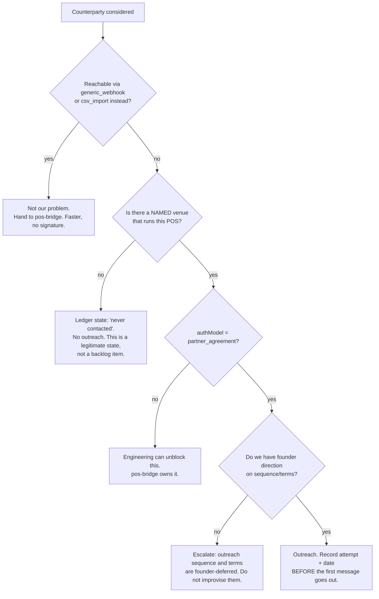
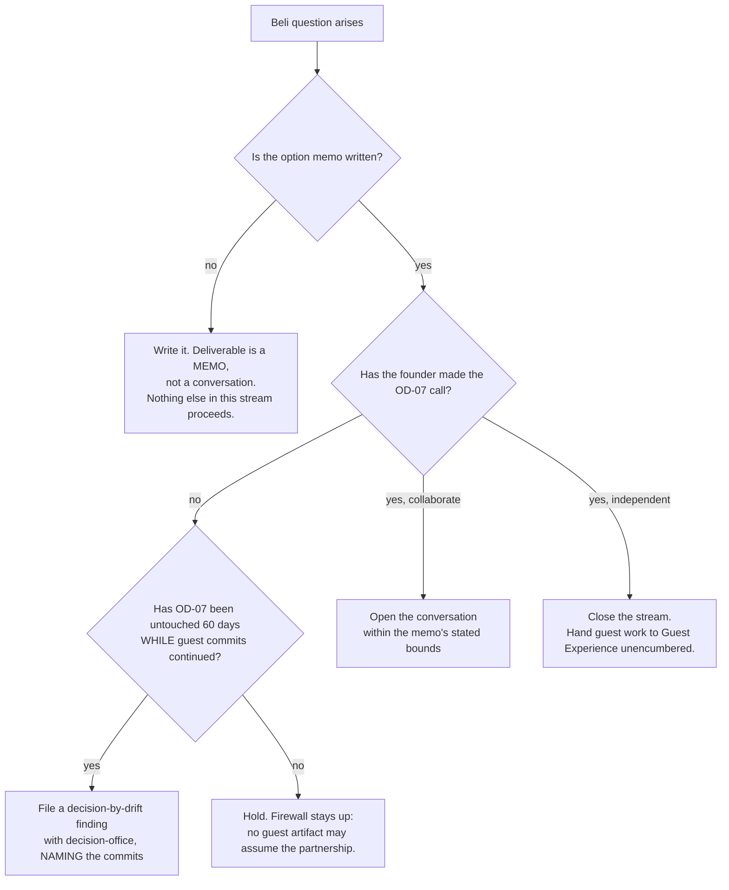

# Partner & Alliance Development — Directive

How *this* team decides. The shape here is a **filter with a hard precondition**, because the
team's characteristic error is starting a conversation that should never have started —
either with a POS vendor no customer runs, or with Beli before the option is written down.

## Graph A — does this counterparty enter the outreach ledger?

**The hard precondition is C.** Nine enumerable providers is a checklist, and a checklist gets
worked. The registry itself places them at *"Tier 2+ — only when selling into chains"*
(`pos-provider.registry.ts:10`) and we have no merchants of any size. Until a real venue names
one, the nine are a ledger, not a queue
([[partner-alliance-development-premortem]] M3).

**Node B is deliberately first**, before anything else is considered. The registry already
demonstrated this reasoning for AKINSOFT Wolvox — *"start with file export → csv_import
bridge"* — and the process exists to generalize that instinct rather than lose it.

## Graph B — the Beli / OD-07 path

**This team never traverses to a decision.** The founder holds OD-07
(`OD-07, OPEN-DECISIONS.md:28`). What this team holds is the obligation to make the drift visible —
which is why node D produces an escalation rather than a nudge.

## Decision rights

### Held by this team

| Decision | Note |
|---|---|
| Whether a counterparty enters the outreach ledger | Under Graph A |
| Ledger state and its accuracy | *never contacted* / *contacted, no reply* / *in conversation* / *declined* / *signed* |
| How the Beli option is framed and what the memo covers | The framing, not the answer |
| Whether a Türkiye entry is a partnership problem or a bridge problem | Triage, node B |
| When to file a decision-by-drift finding | Under Graph B node D |

### Not held here

| Decision | Owner |
|---|---|
| **OD-07 itself** | **founder** |
| **Which counterparty to approach first** | **founder — deferred. Not improvised here.** |
| **Commercial terms, pricing, revenue share** | **founder — deferred**, then [[unit-economics-pricing-charter]] |
| Legal form of any agreement; repository of record | [[legal-charter]] |
| Whether to build an adapter after a signature | [[pos-bridge-charter]] |
| Guest-app scope and build | [[consumer-app-points-economy-charter]] |

## The two standing rules

1. **Never report agreements without attempts.** `pi.unblocking_agreements` and
   `pi.time_to_first_response` are reported as a pair, always, plus raw attempt count. A zero
   with twelve attempts and a 40-day median is a market signal; a zero with zero attempts is a
   staffing fact. Reporting one number lets the two be confused for a year
   ([[partner-alliance-development-premortem]] M2).
2. **Record the attempt before the message goes out.** Not after, not weekly. A ledger
   backfilled from memory is the mechanism by which "we did not try" becomes indistinguishable
   from "they did not reply."

## Escalation triggers

| Trigger | Escalate to | As |
|---|---|---|
| **OD-07 untouched 60 days while guest commits continue** | [[decision-office-charter]] | Decision-by-drift finding, naming the commits |
| A named venue runs a `partner_agreement` provider | department + founder | Outreach request — sequence and terms are the founder's |
| A counterparty proposes terms | founder + [[legal-charter]] | Never negotiated here |
| A guest artifact appears that assumes the partnership | [[consumer-app-points-economy-charter]] + department | Firewall breach — premortem M4 |
| All nine ledger rows still read "never contacted" at 6 months | department | Finding: is this team correctly staffed, or should it be dormant? |

## On being a NEW team

This team is graded **NEW** — the blocker list exists, the function does not
([[partner-alliance-development-charter]]). The directive is written to suit that: every rule
above is designed to make an *absence* of activity legible rather than invisible. A BD function
with nothing to report is normal. A BD function whose nothing cannot be distinguished from
neglect is the failure.
