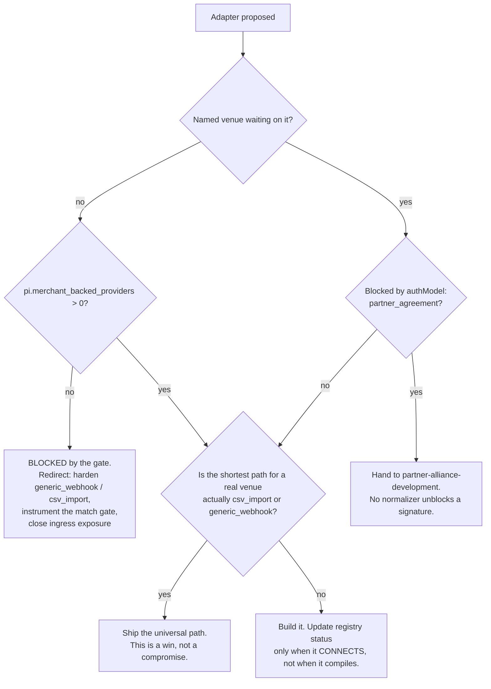
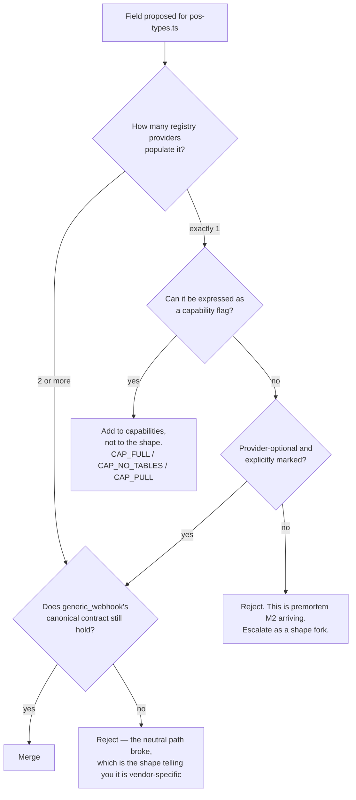

# POS Bridge — Directive

How *this* team decides. Two decision shapes, because this team faces exactly two recurring
questions: **"should we build this adapter?"** and **"does this field belong in the canonical
shape?"** Everything else is execution.

## Graph A — should we build this adapter?

**The status-ladder rule.** A provider moves `planned → scaffolded` when a normalizer exists
and is tested. It moves `scaffolded → available` **only when a real merchant has connected
through it.** Not when the OAuth flow works in sandbox. This is the one rule that keeps
`registrySummary()` (`:328`) honest, and it is why the registry today correctly shows only
`generic_webhook` and `csv_import` as `available`.

## Graph B — does this field belong in the canonical shape?

**Why `generic_webhook` is the test.** It is provider-neutral by construction, so it breaks
loudly the moment the canonical shape acquires vendor semantics. It is a free, mechanical
check that costs nothing to run and does not depend on anyone's judgment.

## Decision rights

### Held by this team

| Decision | Note |
|---|---|
| Adapter implementation approach per provider | |
| Registry status transitions | Under the status-ladder rule above |
| Capability assignment (`CAP_FULL` / `CAP_NO_TABLES` / `CAP_PULL`) | |
| Whether a canonical-shape change is provider-neutral | Under Graph B |
| Catalogue-matcher confidence thresholds and how proposals are batched | |
| SimPOS scope, within the simulator boundary | |

### Not held here

| Decision | Owner |
|---|---|
| Which counterparty to approach; any partner agreement | [[partner-alliance-development-charter]] |
| Whether a route's verification is correctly implemented | [[perimeter-ingress-integrity-charter]] |
| Runtime route guards | [[engineering-charter]] |
| Which venue is first | founder / Sales |
| Any pricing attached to an integration | **founder — deferred; not proposed here** |
| Whether SimPOS ever becomes a product | **founder, via supersede-ADR** — not a sprint decision |

## Escalation triggers

| Trigger | Escalate to | As |
|---|---|---|
| A shape change is needed that only one provider populates and cannot be capability-gated | [[architecture-review-charter]] + `OPEN-DECISIONS.md` | Shape fork — premortem M2 arriving |
| An adapter is blocked >30 days on a counterparty | [[partner-alliance-development-charter]] | Named blocker with provider key + `registry:line` |
| Catalogue-match approval rate exceeds a ceiling with falling dwell time | department | Gate-fatigue finding — premortem M4 |
| A request arrives to run SimPOS in real service | founder | Bridge-thesis change, not a scope change — premortem M5 |
| A provider's `scaffolded` claim no longer builds | — | Demote in registry the same week; no escalation needed |

## The standing bias

When the shortest path to a real `pos_checks` row is a CSV, **take the CSV.** The registry's
own header says so (`:12-15`), the two universal providers are the only ones `available`
today, and every alternative reading of this team's mandate ends in
[[pos-bridge-premortem]] M1.
