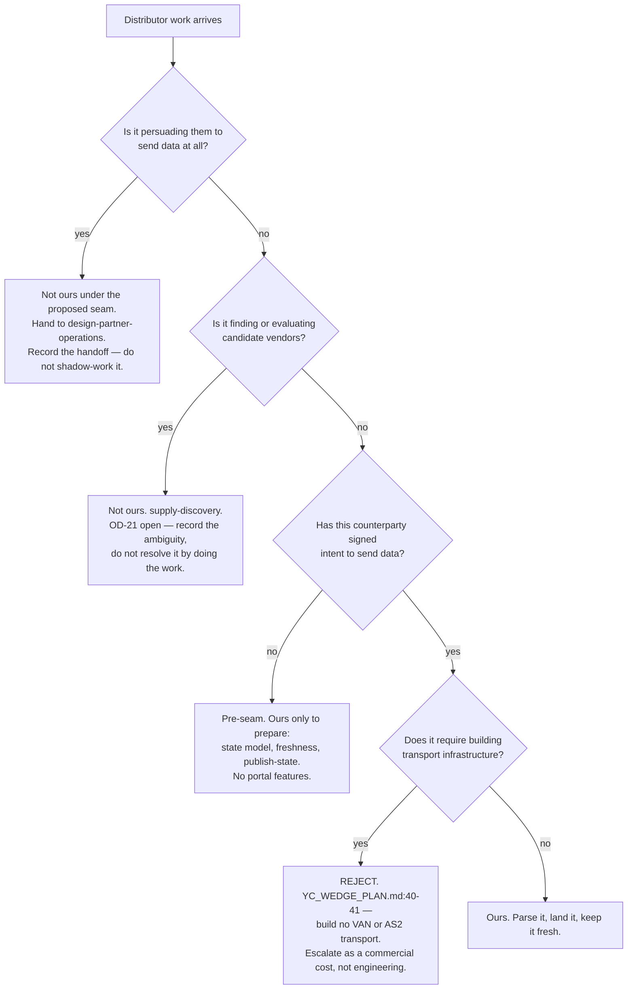
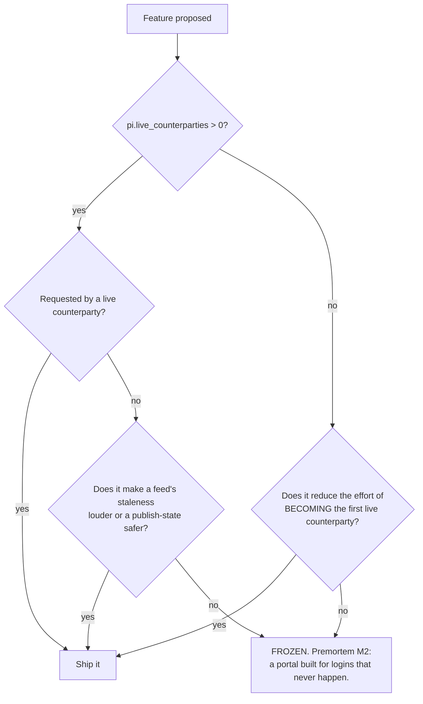

# Supplier & Distributor Network — Directive

How *this* team decides. The dominant shape is a **boundary test**, because this team's
characteristic error is doing work that belongs to another unit — and doing it well enough
that nobody notices until the fork is finally decided.

## Graph A — is this work ours?

**The seam is node D: signed intent to send data.** It is proposed, not decided (CM-F3). Until
the founder rules, this team works the post-seam half and **records** the pre-seam work it is
declining rather than quietly absorbing it. Shadow-working the contested half is how a fork
gets decided by fait accompli, which is the same failure shape as
[[partner-alliance-development-premortem]] M1 in a different department.

## Graph B — should this feature ship?

**The freeze is the point.** Building is the only activity fully inside this team's control
while its boundaries are contested, which makes it the default drift direction. The freeze
converts that pressure into the fork-independent work in
[[supplier-distributor-network-agenda-full]] steps 2–4.

## Decision rights

### Held by this team

| Decision | Note |
|---|---|
| Counterparty state model and its transitions | prospective / agreed / live / stale / lapsed |
| What counts as a **live** counterparty | Refreshing feed or active login — not presence in a table |
| Feed format acceptance — what we will parse | Accept what they already send |
| Feed refresh cadence expectations and staleness thresholds | |
| **Publish-state of a vendor page** | It is a relationship property, hence ours, not Security's |
| Portal scope, subject to Graph B | |

### Not held here

| Decision | Owner |
|---|---|
| **CM-F3 — who owns distributor connectivity** | **founder**, with Sales. We supply the memo and the proposed seam. |
| **OD-21 — Vendor Finder boundary** | **founder** |
| Persuading a distributor to participate (pre-seam) | [[design-partner-operations-charter]], under the proposal |
| Vendor discovery and catalogue coverage | [[supply-discovery-charter]] |
| Route-level auth and verification controls | [[perimeter-ingress-integrity-charter]] |
| Supply terms as commercial terms, and pricing | **founder — deferred** |

## The four standing rules

1. **No portal feature while `pi.live_counterparties` == 0**, except features that reduce the
   effort of becoming the first one. Counters M2.
2. **Build no VAN or AS2 transport.** Parse X12 (810/856/812; read 850/855) and accept it
   however it arrives (`YC_WEDGE_PLAN.md:40-41`). Counters M3.
3. **Freshness before features.** Every feed carries `last_refreshed_at` and an expected
   cadence; past-cadence is a loud state. Without this, `pi.live_counterparties` cannot be
   computed at all — the definition says *refreshing*. Counters M5.
4. **Record declined work.** Pre-seam work we hand to Sales is logged as handed off, not
   silently done. Counters M1.

## Escalation triggers

| Trigger | Escalate to | As |
|---|---|---|
| A distributor requires true EDI transport | founder + department | **Commercial cost with a number attached**, never absorbed as engineering |
| A blocker is another unit's action | department | Boundary evidence, feeding the day-90 review |
| A vendor page exists before its relationship does | [[connector-platform-trust-charter]] + department | Publish-state gap — premortem M4 |
| A feed goes past cadence | — | Handled in-team; it is the normal operating case, not an escalation |
| **Day 90: CM-F3 and OD-21 both open, `pi.live_counterparties` still 0** | founder + [[decision-office-charter]] | **This team's own merge proposal** — see below |

## The day-90 dissolution clause

Written into the founding directive deliberately, because a team is far more able to propose
its own merge before it has spent a year defending its existence.

**Condition:** at day 90, if CM-F3 and OD-21 are both still open **and**
`pi.live_counterparties` is still 0.

**Action:** this team writes a proposal to merge itself into [[pos-bridge-charter]] — same
connector failure mode, same substrate, same freshness discipline — and to hand the
relationship half to [[design-partner-operations-charter]].

**Why this is a rule and not a sentiment.** A team measured on a number produced by two other
units' actions will generate activity to justify itself, and that activity will be portal
features. The clause converts an unresolved boundary from a slow drift into a dated decision.
It is the honest response to [[supplier-distributor-network-premortem]] M1 and to
`product.md:828`'s own flag that this is *"the most likely duplication in the division."*

**It is a proposal, not a self-execution.** The founder may keep the team, resolve the forks,
or merge it. What the clause forbids is month thirteen with nothing decided.
