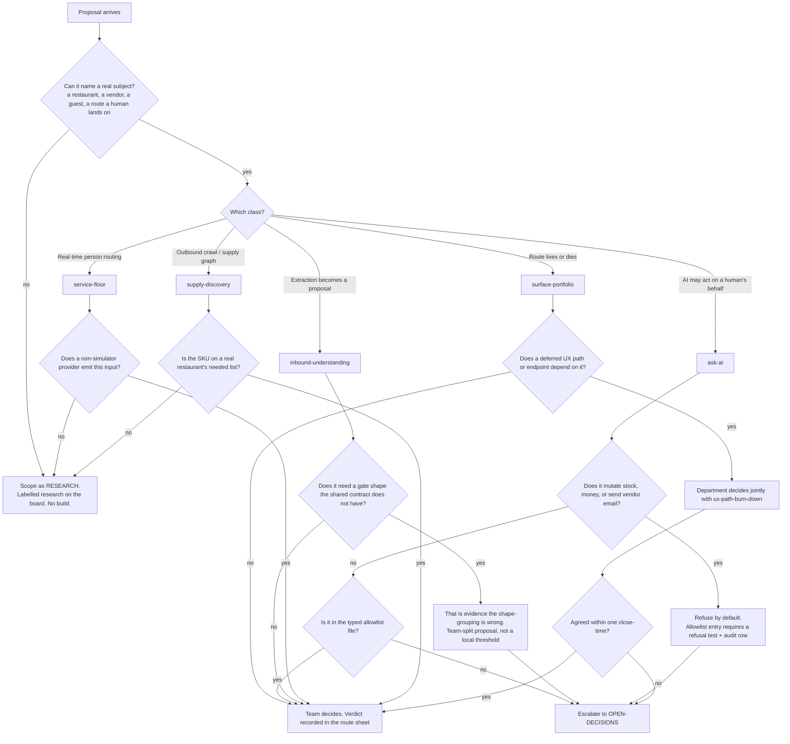

# Product & Vision — Directive

How *this* department decides. Shape differs per unit by design.

Product & Vision's decision graph is organised around one question the building departments
do not have to ask: **does a real subject exist for this?** Engineering can be right about
code with no users. A definition department cannot — a module boundary drawn against zero
traffic is a guess wearing a spec's clothes. `pos_checks` = 0, `procurement_orders` = 1,
`recommendation_actions` = 0 ([[AGENT_NATIVE_UI_DECISION]] §2). So the graph splits on
subject first, then on reversibility.

## Decision rights

| Level | Decides | Examples |
|---|---|---|
| **Team** | Any definition inside one team's boundary that names a real subject and is reversible | A module's doneability criteria; a route verdict with no downstream dependency; a confidence threshold *as a parameter of the shared contract* |
| **Department** | Anything crossing two Product & Vision teams; any change to a primary metric's **definition**; any route verdict a Design path depends on | Killing `/wineagent`; whether Floor Checker's v0 includes the food-up alert; who owns the confirm card |
| **Founder / `OPEN-DECISIONS.md`** | Team-layer shape; the Vendor Finder boundary; adding an allowlist family that touches stock, money, or outbound email; anything that supersedes a locked verdict | 17-teams-vs-fewer; [[supply-discovery-charter]] → Partnerships; auto-execute without confirm |

**Subject rule.** *Name the restaurant this changes.* A proposal that cannot is not
rejected — it is **relabelled research** and stays visible on
[[product-vision-agenda-board]] as such. This is the counter-pressure to
[[product-vision-premortem]] M1, and the point is that research is legitimate as long as it
is not mistaken for product.

**Refusal-first rule (Ask AI).** The allowlist is a **closed set**. An intent not on it is
refused, not attempted-and-caught. Adding a family that mutates stock, money, or outbound
vendor email is a founder decision, and it lands with three things or not at all: a typed
schema, a refusal test, and an audit row (`NEW-902`). [[FUTURES]] §8.1 is the constraint,
and it is not tradeable against convenience.

**One-contract rule (Inbound).** Email, Order, and Invoice share one confidence/gate
standard and one approval primitive
(`apps/api-gateway/src/one-tap-actions/`). A module that needs a *different shape* of gate
does not get a local exception; it triggers a team-split proposal. This is what keeps the
shape-grouping honest ([[product-vision-premortem]] M5).

**Null-input rule (Floor).** No build against simulator-only inputs. `simpos` is a
development target, not evidence. The gate is: does at least one non-simulator provider in
`apps/api-gateway/src/pos-hub/pos-provider.registry.ts` emit this field, and how.

**Settled-decision rule.** [[AGENT_NATIVE_UI_DECISION]] §3's *don't build* verdict on the
agent-native UI rewrite is **not reopened by a charter, an agenda, or a sprint**. Any
proposal whose effect is a chat-surface rewrite or per-user adaptive layout is routed
straight to `OPEN-DECISIONS.md` as a supersede-ADR request. Staffing a team is not a way to
relitigate a decision (`teams/product.md:820`).

## Escalation trigger

Escalate to `OPEN-DECISIONS.md` when **any** of these holds:

1. A department-level decision has not closed within one close-time from
   [[product-vision-loops]].
2. An Ask AI action family is proposed that touches stock, money, or outbound vendor
   email — the **first** such request, not the tenth.
3. An inbound module needs a gate shape the shared contract does not have.
4. A route verdict would delete surface that a deferred UX path depends on, and
   [[ux-path-burn-down-charter]] disagrees.
5. A team's primary metric is proposed to be replaced by a proxy that can move without the
   subject existing (e.g. "distributors crawled" for "SKUs covered", "providers scaffolded"
   for "providers with a merchant").
6. A proposal's effect is to supersede a locked verdict — including
   [[AGENT_NATIVE_UI_DECISION]] §3 and the dish-identity deferral (A15).

**Advisory is findings-only** ([[ORG_STRUCTURE]] §3). [[red-team-charter]] and
[[architecture-review-charter]] do not approve or block; they produce written findings
against a named team, and [[decision-office-charter]] is what makes the resulting decision
close rather than drift. [[decision-office-charter]] also delivered this department's
renumbering: `teams/product.md` §6 filed its forks as OD-20…OD-24, IDs already in use;
they are now **PROD-F1…PROD-F5** ([[FORK-REGISTRY]]).
