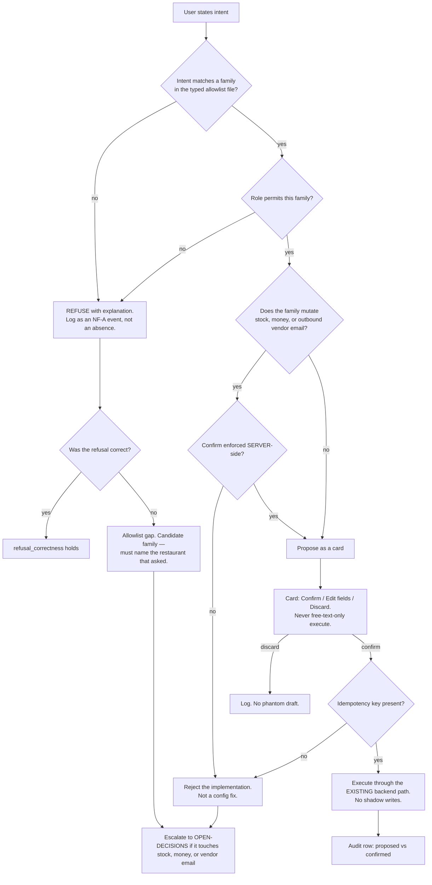

# Ask AI — Action Composer — Directive

How *this* team decides. Shape differs per unit by design.

This team's graph is a **refusal-first classifier**. Every other unit's directive asks
"should we do this?"; this one asks "is this in the closed set, and if not, is it refused
cleanly?" The asymmetry is deliberate: an intent wrongly refused costs a user thirty seconds
and a support question. An intent wrongly executed can mutate stock, move money, or send a
vendor an email in the restaurant's name. Those two errors are not commensurable and are
never summed.

## Decision rights

| Level | Decides | Examples |
|---|---|---|
| **Team** | Refusal wording and behaviour; role gates within an approved family; card field ordering; adding a **non-mutating** family (navigation assist, read-only insight) | `NEW-897` deep-link coach; which fields are editable on a draft-PO card |
| **Department** ([[product-vision-charter]]) | The confirm-card contract shared with [[inbound-understanding-charter]]; entry-point unification sequencing; whether `/sommelier` is absorbed | One card, two callers; which surface migrates first |
| **Founder / `OPEN-DECISIONS.md`** | **Any family that mutates stock, money, or outbound vendor email**; auto-execute of any kind; anything with the effect of a chat surface | Inventory transfers in v0; multi-turn conversation without cards |

**Closed-set rule.** The allowlist is a **closed set in one CI-diffed file**. An intent
outside it is *refused*, never attempted-and-caught. Adding a family requires three artifacts
or it does not land: a **typed schema**, a **refusal test**, and an **audit row**. This is
the structural counter to [[ask-ai-premortem]] M1 — the failure mode is not one bad decision
but forty reasonable ones, so the cost has to sit in the mechanism rather than in reviewer
vigilance.

**Non-negotiable rule.** [[FUTURES]] §8.1: *AI never silently mutates stock, money, or
outbound vendor email.* Confirm is enforced **server-side**. A family whose confirm gate
lives in the client is rejected as an implementation, not patched as a configuration. Naming
matters here and is where the boundary actually gets crossed: *"inventory transfer"* and
*"stock mutation"* are the same operation under two names.

**Refusals-are-events rule.** A refusal is logged with the same NF-A shape as a confirm:
`stimulus → internal_state → choice(refuse) → outcome`. Refusals counted as absences make
`askai.refusal_correctness` permanently unmeasurable, which is
[[ask-ai-premortem]] M2 — and the metric would then be missing precisely when it mattered.

**Pairing rule.** `askai.confirm_without_edit_rate` is **never published without**
`askai.refusal_correctness`. If the pair cannot be produced, neither number is reported.
Same discipline as [[inbound-understanding-directive]], same reason.

**One-schema rule.** A new AI entry surface is permitted **only if it calls the shared action
schema**. This is a team-level rejection, not a debate. [[FUTURES]] §8.3 is explicit:
*not three incompatible chatbots.*

**Card-termination rule.** Every interaction terminates in a card the user confirms, edits,
or discards. A turn producing no card is Q&A, and Q&A is not this team's product. This is
the practical mechanism that keeps [[AGENT_NATIVE_UI_DECISION]] §3's *don't build* verdict
intact under increment — the verdict is not defended by memory, it is defended by a
structural property of every interaction ([[ask-ai-premortem]] M4).

**Existing-executor rule.** Actions execute through **existing** backend paths — orders,
inventory, communications, calendar, one-tap. **No shadow writes.** A family requiring a new
write path is a request to the owning module team, not a feature this team builds.

**Subject rule (inherited).** A new action family should name the restaurant that asked for
it. [[FUTURES]] §8.2's families are plausible and entirely untested —
`recommendation_actions` = 0 rows, so nobody has ever acted on a recommendation
([[AGENT_NATIVE_UI_DECISION]] §2). Intent logging is what converts guesses into an observed
distribution ([[ask-ai-premortem]] M5).

## Escalation trigger

Escalate to `OPEN-DECISIONS.md` when **any** of these holds:

1. An action family touching stock, money, or outbound vendor email is proposed — the
   **first** time, not the tenth.
2. An allowlist entry is proposed without a paired refusal test or without an audit row.
3. A confirm gate is found enforced client-side.
4. `askai.entry_point_count` rises above 4 — a fifth surface has appeared.
5. Confirm rate must be published without refusal correctness.
6. A feature's value proposition is conversational continuity rather than a completed
   action — persistent threads, cardless follow-ups, or Ask AI as a default landing surface.
   That is a supersede-ADR request against [[AGENT_NATIVE_UI_DECISION]] §3, not a sprint
   item.
7. An action family requires a new backend write path.
8. Auto-execute is proposed at any confidence level, for any family.

**Advisory is findings-only** ([[ORG_STRUCTURE]] §3). [[red-team-charter]] should attack the
**allowlist family boundaries** above all — the non-negotiable does not get crossed by
someone deciding to cross it, it gets crossed because two names described the same
operation. [[security-charter]] owns whether the endpoints an allowlisted action calls are
themselves guarded; that is this team's dependency, not its remit.
[[decision-office-charter]] owns whether these escalations close.
