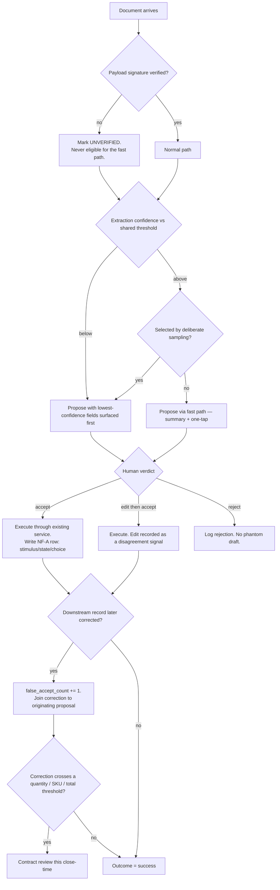

# Inbound Understanding — Directive

How *this* team decides. Shape differs per unit by design.

This team's decision graph is a **gate specification**, because that is literally its
deliverable. Every question reduces to: *given this extraction, what may the system show a
human, and what may the human's approval cause?* The graph is written once and all three
modules run it — that is what "one guardrail contract" means in practice.

## Decision rights

| Level | Decides | Examples |
|---|---|---|
| **Team** | Anything that is a *parameter* of the shared contract, and any per-module doneability criterion | Per-document-type threshold values; which fields are "lowest confidence"; sampling rate; what "done" means for Order Watcher |
| **Department** ([[product-vision-charter]]) | The **shape** of the gate; the confirm primitive; the definition of `inbound.false_accept_count`; anything shared with [[ask-ai-charter]] | One confirm card for both teams; whether unverified payloads may be shown at all |
| **Founder / `OPEN-DECISIONS.md`** | Anything that makes a proposal execute without a human; the materiality threshold for a false accept; a module needing a *different gate shape* | Auto-accept above a confidence level; splitting this team into three |

**One-contract rule.** A per-module *value* is a team decision. A per-module *shape* is not
a decision this team may make — it is evidence the shape-grouping is wrong, and it
escalates as a team-split proposal. This is the mechanism that keeps
[[inbound-understanding-premortem]] M2 from happening quietly.

**Pairing rule.** `inbound.proposal_accept_without_edit_rate` is **never published without**
`inbound.false_accept_count`. If the pair cannot be produced, neither number is reported.
This is not a reporting convention; it is the team's core safety property, because
acceptance alone rises fastest when the reviewer has stopped reading.

**Fast-path rule.** The fast path (summary + one-tap, no field-level review) requires all
three: verified payload, confidence above the shared threshold, and not selected by
sampling. Any one missing routes to full review. Nothing else may grant fast-path
eligibility — not vendor familiarity, not document age, not user preference.

**Asymmetric-error rule.** A missed extraction (we propose nothing, a human does it
manually) and a wrong extraction accepted (a cost basis is corrupted) are **not
commensurable and are never summed into one accuracy score**. A change justified by an
aggregate improvement that increases false accepts is rejected at team level, not debated.
The house precedent is `scripts/eval_merge_policies.py:5-13` for identity merges; the same
logic holds here.

**Rejection rule.** A rejected proposal leaves no phantom draft and no partial write. The
rejection itself is logged as an NF-A outcome — a rejection is signal, not an absence.

## Escalation trigger

Escalate to `OPEN-DECISIONS.md` when **any** of these holds:

1. A module needs a gate **shape** the shared contract does not have.
2. A proposal would execute without a human verdict, for any reason.
3. Acceptance rate must be published without a false-accept figure to accompany it — the
   **first** time, not the tenth.
4. `inbound.false_accept_count` rises for two consecutive close-times with no threshold or
   contract change proposed.
5. p50 time-to-approve falls below plausible reading time for a document type
   ([[inbound-understanding-premortem]] M3) — that is a rubber-stamp finding, and the remedy
   is a product decision, not a nudge.
6. The 0-of-32 signature-verification figure is unchanged at a close-time. This escalates
   **every time** until it moves; it is not this team's to fix
   ([[connector-platform-trust-charter]]) but it is this team's to keep loud.

**Advisory is findings-only** ([[ORG_STRUCTURE]] §3). [[red-team-charter]] should attack the
sampling design and the materiality threshold specifically — both are places where a
reasonable-looking parameter quietly turns the gate off. [[decision-office-charter]] owns
whether these escalations close.
