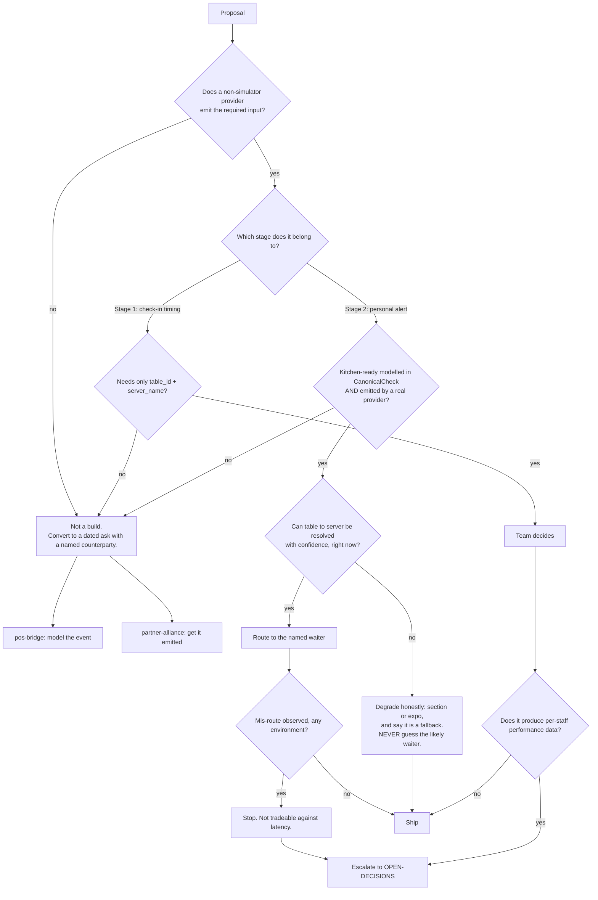

# Service Floor (Floor Checker) — Directive

How *this* team decides. Shape differs per unit by design.

Two questions govern everything here, and they are asked in this order: **does the input
exist outside the simulator?** and **can this alert reach the wrong person?** The first is
a stage gate; the second is a hard gate. Every other decision is downstream.

## Decision rights

| Level | Decides | Examples |
|---|---|---|
| **Team** | The check-in window; the engagement signal's shape; the ambiguity fallback; the latency measurement boundary and its segments; the audit's format | What counts as "timely"; whether the fallback is section or expo; how staleness is defined for `server → device` |
| **Department** ([[product-vision-charter]]) | Stage triggers; whether Stage 1 ships alone as a product; the person-routing contract as a shared shape | "Is check-in timing a product without the alert?" |
| **Founder / `OPEN-DECISIONS.md`** | Reversing the no-performance-data non-goal; accepting a non-zero mis-route rate; changing the latency promise from acknowledgment to dispatch; an in-venue hardware path | A per-waiter ranking export; a floor-mounted screen instead of personal push |

**Null-input rule.** `simpos` is a **development target, never evidence**. A capability
demonstrated only against `apps/api-gateway/src/simpos/` does not satisfy any stage trigger.
The 47 rows in the corpus are simulator output with `server_name`, `covers`, `table_id`,
`total` all null (`20260819000000_guest_identity_minimal_slice.sql:11-14`); building against
them produces a module that demos and cannot run.

**Zero-mis-route rule.** `floor.misroute_rate` has a target of zero **during service** and is
never traded against `floor.kitchen_ready_to_waiter_p95_seconds`. The two errors are not
commensurable: latency costs seconds, a mis-route costs trust, and once trust is gone the
latency number measures nothing. A proposal justified by "faster on average, occasionally
wrong" is rejected at team level, not debated at department level.

**Honest-degradation rule.** When `table → server` cannot be resolved with confidence, the
system **does not pick the most likely waiter**. It routes to the section or the expo screen
and marks itself as a fallback. A degraded honest alert preserves trust; a confident wrong
one spends it ([[service-floor-premortem]] M3).

**Fresh-join rule.** `table → server` is re-read at alert time, never cached from
check-open. Mid-service section changes, splits, and breaks are the normal case, not the
edge case.

**Blocked-with-a-name rule.** "Blocked" is only a valid status when accompanied by a **named
counterparty and a dated ask**. Two close-times of unaccompanied *blocked* escalates. This
is the specific counter-pressure to [[service-floor-premortem]] M4.

**Not-a-monitoring-product rule.** No decision inside this team may produce per-staff
performance scores, rankings, or disciplinary exports. The commercial purpose is more sales
and better service. Reversing this is a founder decision recorded in `OPEN-DECISIONS.md`,
because the consequence — staff defeating the measurement and the data becoming confidently
false — is a product failure, not a policy disagreement
([[service-floor-premortem]] M2).

## Escalation trigger

Escalate to `OPEN-DECISIONS.md` when **any** of these holds:

1. A mis-route is observed in **any** environment, including staging.
2. A per-staff performance view, ranking, or export is requested — the **first** request,
   not the tenth.
3. A stage trigger is proposed to be satisfied by simulator evidence.
4. Two consecutive close-times report *blocked* without a named counterparty and a dated ask.
5. The latency promise is proposed to change from device-acknowledgment to dispatch.
6. Push latency's final segment (push-accepted → acknowledged) dominates the p95, implying a
   hardware or in-venue-transport answer rather than a software one.

**Advisory is findings-only** ([[ORG_STRUCTURE]] §3). [[red-team-charter]] should attack the
**"real engagement" definition** above all — it is the single design choice that decides
whether this is a service product or a surveillance product, and it will look reasonable
either way. [[decision-office-charter]] owns whether these escalations close rather than
drift, which for a NEW team with null inputs is the difference between *gated* and
*abandoned*.
