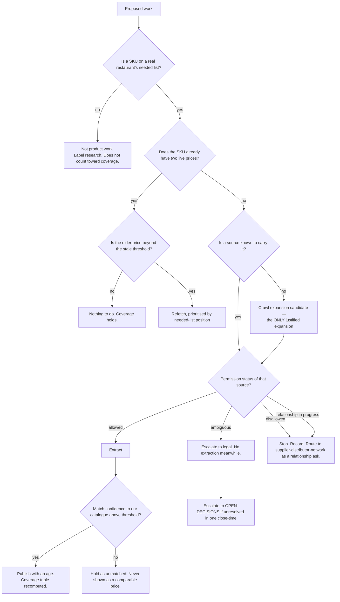

# Supply Discovery (Vendor Finder) — Directive

How *this* team decides. Shape differs per unit by design.

This team's graph is organised around one question that keeps it from becoming a crawling
project: **is there a restaurant that needs this SKU?** Supply is infinite and cheap to
add; demand is the scarce thing. Every decision starts on the demand side, then checks
permission, then checks freshness — in that order, because a fast, well-extracted price for
a SKU nobody buys, taken from a site we were not permitted to read, is a negative
deliverable.

## Decision rights

| Level | Decides | Examples |
|---|---|---|
| **Team** | Match confidence threshold; refetch priority; stale/hide thresholds within an agreed policy shape; which known source to extract next from the needed list | "A vendor line matches this SKU at ≥ X confidence"; "produce refetches weekly, wine monthly" |
| **Department** ([[product-vision-charter]]) | The definition of "needed SKU"; the definition of coverage; whether the comparison surfaces should exist in their current shape (jointly with [[surface-portfolio-charter]]) | Par-levels vs menu vs purchase history as the denominator |
| **Founder / `OPEN-DECISIONS.md`** | The Vendor Finder boundary with [[supplier-distributor-network-charter]]; crawl permission posture; extracting from an *ambiguous* target | Merge the two teams; extract from a distributor currently in a signing conversation |

**Denominator rule.** `supply.sku_dual_price_coverage_pct` is **undefined until a needed-SKU
list exists** — and *undefined* is what gets published. It is never approximated by
"SKUs priced ÷ SKUs seen", which measures crawler throughput and rises whenever the crawler
works ([[supply-discovery-premortem]] M2). The denominator's **size** is published beside
the percentage every time, so 90% of 12 SKUs cannot read like 90% of 400.

**Triple rule.** Coverage, denominator size, and freshness p50 are published **together or
not at all**. Coverage rises when stale rows are included, so an unpaired coverage number is
structurally optimistic.

**Two-price rule.** A SKU counts as covered at **two** live prices, not one. One price is a
quote. The product is comparison, so the metric measures comparison.

**Permission-before-extraction rule.** Every crawl target carries a recorded status —
*allowed* / *ambiguous* / *disallowed* / *relationship-in-progress* — **before** any
extraction. *Ambiguous* escalates to [[legal-charter]] and blocks meanwhile.
*Relationship-in-progress* is a hard stop owned by
[[supplier-distributor-network-charter]]: scraping a distributor during the conversation
where we are asking them to sign is a self-inflicted wound. A block or rate-limit response
from a target is **escalated, never evaded** ([[supply-discovery-premortem]] M5).

**One-stage rule.** Every distributor has exactly one current stage on the shared state list
(*discovered → extracted → priced → live feed → active relationship*) and exactly one owning
team at that stage. A distributor appearing in two teams' work at the same stage is a
finding, not a coincidence ([[supply-discovery-premortem]] M4).

**No-proxy rule.** Distributors crawled, pages extracted, and SKUs in the database are
**not** metrics and are not reported as progress. Each can rise while the product gets no
better — the exact class of proxy [[product-vision-directive]] forbids.

## Escalation trigger

Escalate to `OPEN-DECISIONS.md` when **any** of these holds:

1. A coverage percentage is proposed for publication with no denominator, or without
   freshness — the **first** time.
2. A crawl target's permission status is *ambiguous* and unresolved after one close-time.
3. A target returns a block or rate-limit and the proposed response is to route around it.
4. A distributor appears at the same stage in both this team's and
   [[supplier-distributor-network-charter]]'s work.
5. `supply.price_freshness_p50_days` and coverage both rise for two consecutive close-times
   — the signature of coverage propped up by stale rows.
6. Crawl expansion is proposed that cannot name a needed SKU with zero prices.
7. The Vendor Finder boundary fork is still open after two close-times. It has already been
   filed with a colliding OD id; [[decision-office-charter]] owes a renumbering.

**Advisory is findings-only** ([[ORG_STRUCTURE]] §3). [[red-team-charter]] should attack the
**coverage definition** specifically — it is the one place where a reasonable-sounding
denominator turns this team's headline metric into a measure of how hard the crawler ran.
