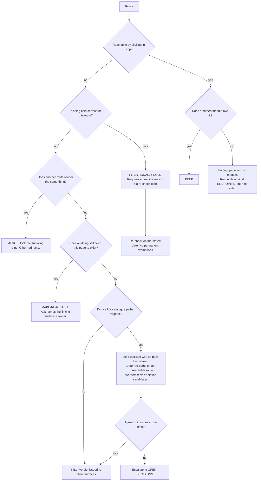

# Surface Portfolio — Directive

How *this* team decides. Shape differs per unit by design.

This team's graph is a **classifier**: every route enters and leaves with exactly one
verdict. That is the whole shape, and it is deliberately unglamorous — the failure mode here
is not a bad decision, it is *no decision*, repeated monthly while a document regenerates
([[surface-portfolio-premortem]] M1). So the graph has no "revisit next cycle" exit.

## Decision rights

| Level | Decides | Examples |
|---|---|---|
| **Team** | Any verdict on a route with no live catalogue path and no cross-team dependency; the *intentionally-cold* classification and its re-check date; the reconciliation findings | Killing `/wineagent`; declaring `/v/:slug` correctly cold; filing "page with no module" |
| **Department** ([[product-vision-charter]]) | Kills touching live UX paths (joint with [[ux-path-burn-down-charter]]); killing the last remaining page of a live module; the committed target number | Retiring `/inventory-legacy` on a date; whether a module without a page should exist at all |
| **Founder / `OPEN-DECISIONS.md`** | Whether this team holds kill authority at all; whether mobile gets a portfolio and who owns it | Propose-only vs decide-and-issue |

**Verdict rule.** Every route leaves with a verdict. **"Revisit next cycle" is not a
verdict**, and neither is "under review". A route with no verdict after one full
classification pass is reported as *unclassified* on the board, by name — the point being
that the absence is visible rather than absorbed.

**Decomposition rule.** `surface.unowned_surface_count` is **never reported as a single
number**. It is reported as five buckets — killed / merged / made-reachable /
newly-intentionally-cold / still-unowned — so that movement produced entirely by
reclassification is visible on sight. This is the specific counter to
[[surface-portfolio-premortem]] M2.

**Cold-with-a-reason rule.** *Intentionally-cold* requires a one-line reason and a re-check
date. `/v/:slug` (a deliberately crawlable vendor portal) and `/dev-sandbox` (a developer
surface) are both cold and are **not** the same verdict. There are no permanent exemptions,
only dated ones.

**Cross-reference rule.** A **kill** verdict requires a `UX_PATHS_CATALOG.md` cross-reference
naming which paths target the route and their state (deferred / shipped / dead). A deferred
path is **not** an automatic veto — a deferred path on a route nobody can reach is itself a
deletion candidate, and this team is the one that says so. Kills touching *live* paths are
joint decisions.

**Ask-with-a-name rule.** The 13 untraceable route components are a **dated ask** to
[[client-surfaces-charter]], not a standing observation. They are tracked on a separate
board line from the cold-entry count, because "unreachable" and "unmapped" have different
owners and different fixes — and because 11 routes are both, so summing them double-counts.

**No-proxy rule.** Regenerating [[PAGE_MAP]] is measurement, not progress. A close-time whose
only output is a regenerated map is reported as producing no verdicts.

## Escalation trigger

Escalate to `OPEN-DECISIONS.md` when **any** of these holds:

1. A kill verdict is blocked by a live UX path and [[ux-path-burn-down-charter]] and this
   team do not agree within one close-time.
2. Three consecutive close-times produce fewer than 2 verdicts. That is
   [[surface-portfolio-premortem]] M1 in progress, and the escalation is the intervention.
3. The count falls in a close-time where killed + merged + made-reachable = 0 —
   reclassification-only movement.
4. The 13 untraceable components are unchanged across two regenerations with no filed ask.
5. A verdict requires deleting the last page of a module that is still live in
   [[ENDPOINTS]].
6. A *intentionally-cold* re-check date passes without a re-check.
7. A new mobile screen ships and there is still no mobile inventory to record it in.

**Advisory is findings-only** ([[ORG_STRUCTURE]] §3). [[red-team-charter]] should attack the
**intentionally-cold category** above all — it is the one classification that can make work
disappear while nothing changes for any user. [[decision-office-charter]] owns whether these
escalations close rather than drift, which for a team whose failure mode is inaction is the
difference between governance and a monthly report.
