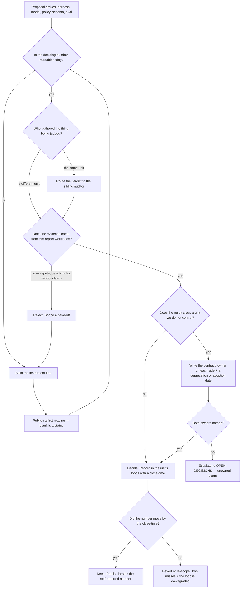

# Research & Math — Directive

How *this* unit decides. The shape is a **falsification gate**: nothing here is decided by
preference, seniority, or reputation. Three rules do all the work.

## The three rules

1. **No pick from repute.** Any choice between candidates — harness, model, framework,
   policy — is decided by a measurement taken on *this repo's own workloads*. Already
   written into `OPEN-DECISIONS.md:24` for OD-03; generalized here to everything this
   department decides.
2. **The instrument precedes the decision.** If the number that should decide a question
   has never been read, the department builds the instrument and does **not** hold the
   decision meeting. A decision taken on an unread number is a preference wearing a table.
3. **Author ≠ auditor.** The unit that produced an output never grades it. Pass conditions
   are committed before results exist. A disagreement escalates; it never resolves in
   favour of the author by default.

## Decision graph

## Decision rights

**Decides alone (no escalation needed):**

- Doneability criteria per task type, and the pass condition of any golden set — even when
  a sibling team disagrees. This is the independence rule in force.
- The NF-A event contract: fields, join keys, `subject_type` vocabulary, retention shape.
  Physical DDL is [[data-charter]]'s; the *contract* is ours ([[research-math-charter]]).
- Whether a measurement is admissible evidence for a fork.
- Marking an eval set `imagination-only` — i.e. excluding it from any blocking gate
  because it names no source of free negatives.
- Declaring a metric **unmeasured**. Nobody outside the department may overwrite a blank
  with an estimate.

**Decides with a named counterpart:**

| Decision | Counterpart | Form the agreement takes |
|---|---|---|
| NF physical table + migration | [[data-charter]] | OD-11 names **both** owners or the schema gets implemented twice |
| Model wrapper adoption in the 7 NestJS callsites | [[engineering-charter]] | A deprecation date in the same PR as the wrapper |
| Running eval gates in CI/production | [[agent-evaluation-gates-charter|aio-evaluation-gates]] | Methodology here, operations there — **or a merge**, per `technology.md:406` |
| Routing policy | `[[harness-model-routing-charter|aio-model-routing]]` | Currently **unresolved**; see the routing seam fork |
| Cost telemetry for unauthenticated inference | [[security-charter]] SEC-3 | We emit; they interpret. Hard dependency (`intelligence.md:488`) |

**Cannot decide (escalates to the founder via [[decision-office-charter]]):**

- OD-03 (harness), OD-04 (model roster), OD-11 (schema columns) — founder-level forks.
- Preempting the non-preemptible lane in [[research-math-schedule]]. Anyone may propose
  it; nobody in the department may grant it. It is a recorded decision or it did not
  happen ([[research-math-premortem]] M1).
- Turning off a CI eval on cost grounds. The cap is a founder number
  ([[research-math-agenda-full]] Q6); spending past it escalates, it does not
  self-resolve.
- Whether a failing verdict may block a **product** release, as opposed to a sibling's
  work.

## Escalation trigger

Escalate — same day, into `questions.md` and, if it implies a decision,
`OPEN-DECISIONS.md`:

1. **A decision is scheduled whose deciding number has no reading.** Rule 2 violated.
   This is the OD-03 tell in [[research-math-premortem]] M3.
2. **An author disputes a verdict and the dispute is settled inside the authoring unit.**
   Rule 3 violated — the most serious escalation this department has, because it is
   invisible from outside.
3. **A second table appears holding token counts.** There is one today (`api_spend`).
   Premortem M5's earliest signal.
4. **A long-horizon item slips with a product reason attached.** The first one, not the
   third.
5. **A seam has two owners or none** — including the routing seam, which currently has
   two.
6. **The gap between verified and self-reported success narrows for two close-times with
   no change to harness or criteria.** Premortem M4: the auditor is drifting toward the
   author.

## What this department does with a finding against it

Advisory is findings-only ([[ORG_STRUCTURE]] §3), and this department is unusually exposed
to [[red-team-charter]] because its output *is* decisions. A Red Team finding against an
RM decision is answered **in writing, in the same close-time**, with one of exactly three
responses: *accepted and reverted*, *accepted and scheduled*, or *rejected with the
measurement that rejects it*. "Noted" is not one of the three — a department whose own
rule is "no pick from repute" cannot dismiss a finding by preference either.
