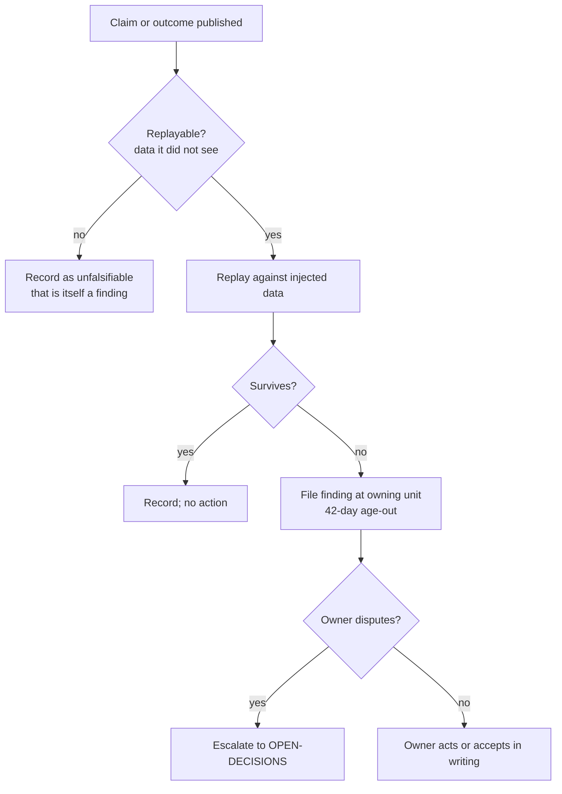

# Backtests — Directive

How this team decides what to replay.

## Decision rights
Backtests decides **what to replay and how to score it**. It does not decide what ships.

## Escalation trigger
A falsified claim that is republished unchanged goes to `OPEN-DECISIONS.md`, not to a
second finding.

## The rule that protects the team from itself
An unfalsifiable claim is a finding. Otherwise the easy path is to only replay what is
comfortably replayable (premortem M1).
