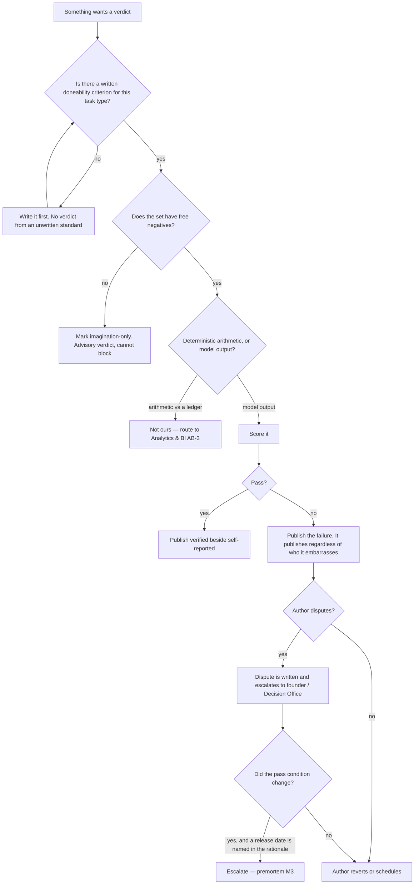

# Evaluation & Doneability (RM-2) — Directive

Inherits the department's three rules ([[research-math-directive]]). This team is the one
that **executes** the third — *author ≠ auditor* — so its directive is mostly about what it
refuses to do, and who is allowed to make it change its mind.

## The three local rules

1. **A set with no free negative may not block a merge.** Every golden set carries
   `provenance: free-negatives | imagination-only` in its manifest. Imagination sets are
   useful and permitted; they carry no authority. A *free* negative is a label that falls
   out of the world rather than out of a session — *two entries on one menu are different
   products* (732,874 pairs), *two guests on one check are different people*
   (`guest_copresence_negatives`).
2. **Pass conditions are committed before results exist**, and changing one is a reviewed
   change to a single file — never a parameter moved inside a large PR.
3. **Verified never publishes alone.** It publishes beside `base_agent.py:144`'s
   self-reported rate. The gap is the output.

## Decision graph

## Decision rights

**Decides alone — and these are the rights that make the team real:**

- **What "done" means** for a task type. Not negotiable with the producing team.
- **The pass condition** of any set or gate, including RM-1's bake-off.
- **The provenance grade** of a set, and therefore whether it may block.
- **Publishing a failing verdict.** No embargo, no pre-briefing, no "hold it until after
  the demo".
- **Marking a metric unmeasured** rather than estimating it.
- Which three task types come first — chosen for **spread, not tractability**.

**Decides with a counterpart:**

| Decision | Counterpart | Form |
|---|---|---|
| The verdict field in the NF-A event | [[neural-footprint-instrumentation-charter]] | We specify the semantics; they own the column |
| Where gates run in CI/production | [[agent-evaluation-gates-charter|aio-evaluation-gates]] | Methodology here, operations there — or **merge** (`technology.md:406`) |
| Injection probes for the vendor-reply set | [[security-charter]] SEC-3 | They supply the adversarial corpus; we own scoring |
| Exact-equality checks on KPIs | [[analytics-bi-charter]] AB-3 | Different technique, different pass condition; we do not overlap |

**Cannot decide — escalates to the founder:**

- **Whether a verdict may block a product release**, as opposed to a sibling's work. Open
  today; it determines whether this team is a gate or advisory in fact.
- **The eval suite's cost cap.** §44.11 requires one and names none.
- **Who adjudicates vendor-reply quality** when no free negative exists.
- **Turning a suite off on cost grounds.** Overrun escalates; it never self-resolves into
  a switch-off ([[evaluation-doneability-premortem]] M2).
- Relaxing `identity.false_merge_count = 0`. `scripts/eval_merge_policies.py:5-13` forbids
  summing merges with splits; a false *guest* merge is a disclosure and no un-merge
  reverses it (`eval_guest_merge_policies.py:28-32`). Founder-only, and the charter
  recommends never.

## Escalation trigger

Same day:

1. **A pass condition is edited and the rationale names a date, a launch, or a release.**
   The first one, not the second. This is the independence rule being tested.
2. **RM-1 (or anyone) edits a golden set, threshold, or pass condition.** Structurally
   forbidden; escalates automatically.
3. **A third golden set is proposed and all three are extraction.**
4. **The verified/self-reported gap narrows for two close-times with no change to harness
   or criteria.** The auditor is drifting toward the author.
5. **A corpus or threshold appears in both this team's docs and
   [[agent-evaluation-gates-charter|aio-evaluation-gates]]'.** We file the merge proposal ourselves.
6. **The weekly suite's spend is questioned without a cap existing.**

## What this team does when it is wrong

RM-2 grades others, so its own errors are the most expensive kind. A verdict later shown
to be wrong is **corrected in public, with the set's provenance re-graded**, and
[[red-team-charter]] is invited to attack the set that produced it. An auditor that
quietly amends a bad verdict has taught every producing team that verdicts are negotiable
— which costs more than the original error.
